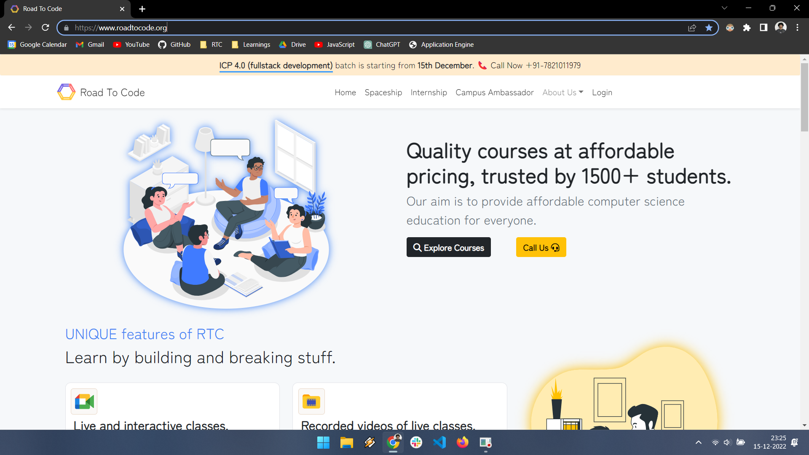
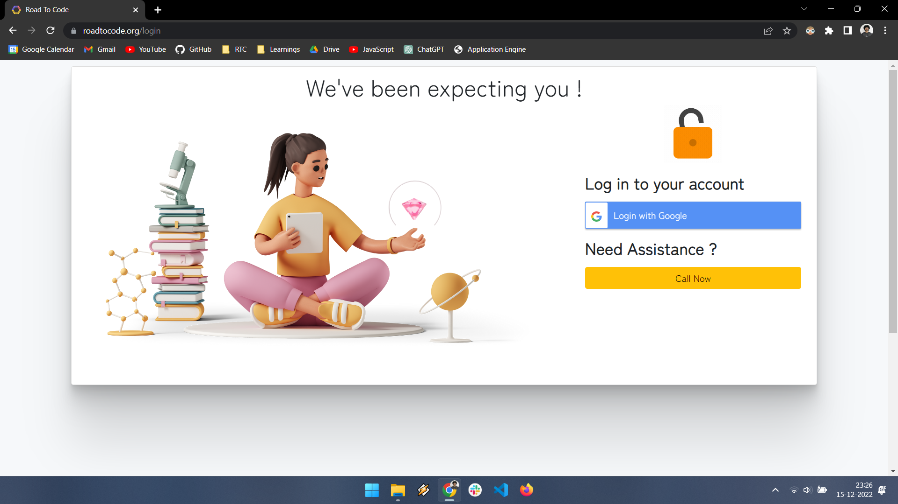
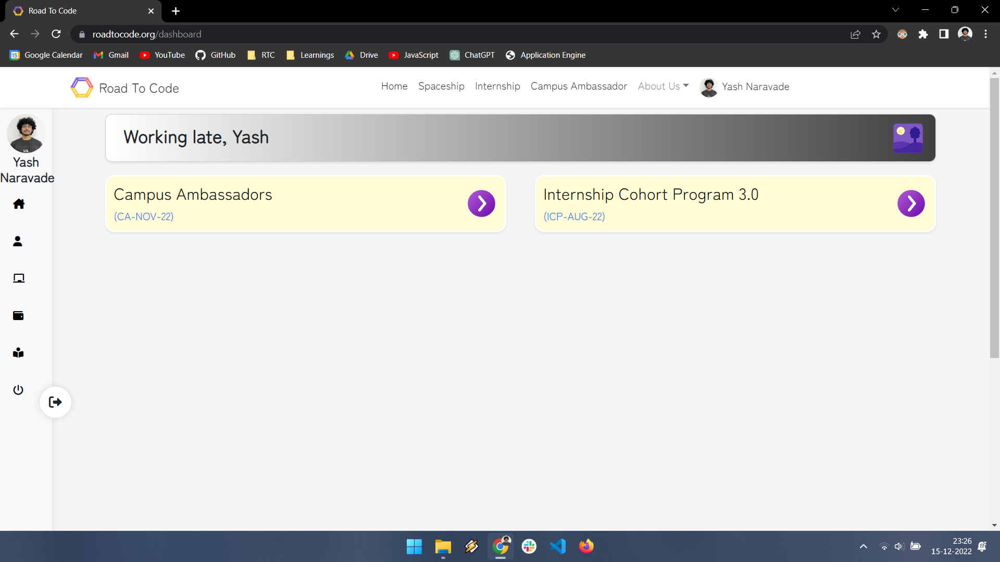
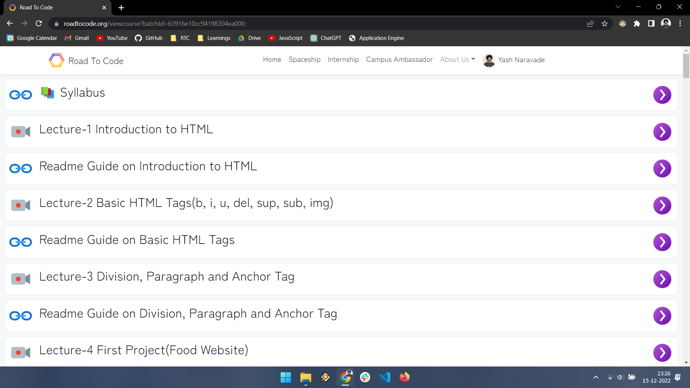
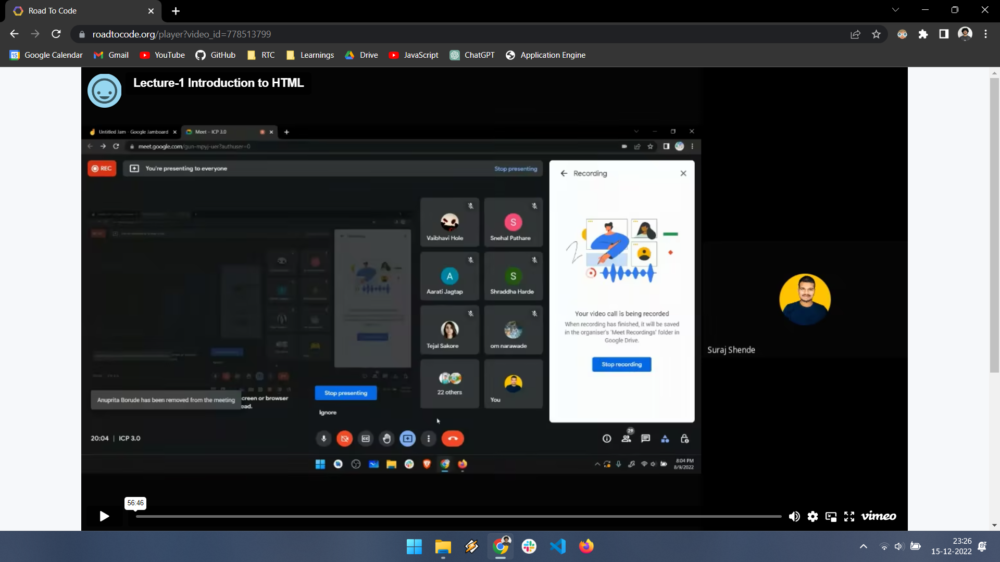
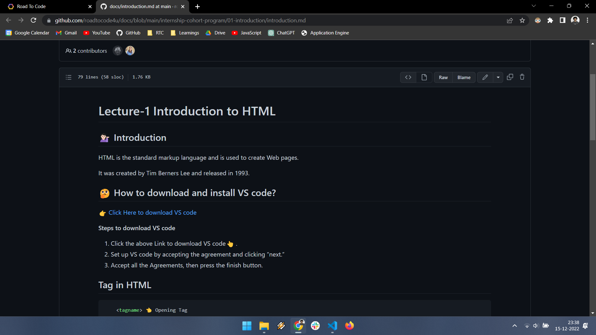

# Welcome to the **Internship Cohort Program 4.0!** 

In this tutorial, you will learn how to access the recorded videos of the Internship Cohort Program 4.0.

## How to access the videos?

1. Go to the www.roadtocode.org website.
   

2. Click on the "Login" button in the top right corner.

3. Then, click on the "Login" button in the top right corner and login with your google account.
      

   
4. You will see the "Internship Cohort Program 4.0" course in your dashboard.
      

 5. Click on the "Internship Cohort Program 4.0" course to access the videos.
        

5. Start watching the videos and enjoy the course!
      

## How to access the readme guides?

1. You can access the readme guides by clicking on the "Readme Guides" button in of the respective video.

      

2. Start reading the readme guides and enjoy the course!
      

   
   