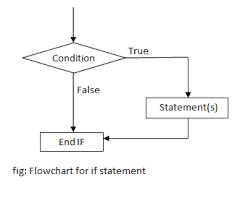

# Conditional Statements C Programming 

**💻Example:**
```c
//Example of Ternary operator  
#include <stdio.h>

int main() {
    
    int days=1;
    
    (days>1)?printf("%d days to go",days):printf("%d day to go",days);
    
    return 0;
}
```
**⚙️ Output :**
>1 day to go 


 ## Conditional Statement 

 ### if conditional statement 

if statement to specify a block of code to be executed if a condition is true.

**Syntax :**
```c
if (condition) 
{ 
  // block of code to be executed if the condition is true
}
```
**Flow Chart :**



**💻Example:**
```c
#include <stdio.h>

int main() {
    
    int a=5;
    
    if(a==5)
    {
        printf("Both are Equal");
    }
    
    return 0;
}
```
**⚙️ Output :**
>Both are Equal

 
**💻Example:**
```c

#include <stdio.h>

int main() {
    
    int a=5;
    
    if(a==5)
    {
        printf("Both are Equal");
    }
    
    printf("\n This is a normal Line");
    
    return 0;
}
```
**⚙️ Output :**
>Both are Equal    
 This is a normal Line

 
**💻Example:**
```c
#include <stdio.h>

int main() {
    
    int a=10;
    
    if(a%2==0)
    {
        printf("Given number is Even ");
    }
    
    return 0;
}
```
**⚙️ Output :**
>Given number is Even

### If-else Conditional Statement

If else statement is used to perform an action if a single condition is true and to perform another action if that condition is false.
 
**Syntax :**
```c
if (condition)

{

block of code to be executed the condition is true;

}

else

{

block of code to be executed the condition is false;

}
```
**Flow Chart:**


**💻Example:  WAP to find whether given number is even or odd**
```c
#include <stdio.h>

int main() {
    
    int num;
    
    printf("Enter Number :");
    scanf("%d",&num);
    
    if(num%2==0)
    {
        printf("Given number is Even ");
    }
    
    else
    {
        printf("Given number is odd");
    }
    return 0;
}
```
**⚙️ Output :**
>Enter Number :5   
Given number is odd


**💻Example:  WAP to find out your age is eligible for  voting or not**
```c
#include <stdio.h>

int main() {
    
    int age;
    
    printf("Enter your age :");
    scanf("%d",&age);
    
    if(age>=18)
    {
        printf("Your are eligible for voting ");
    }
    
    else
    {
        printf("Your are not eligible for voting");
    }
    return 0;
}
```
**⚙️ Output :**
>Enter your age :18  
Your are eligible for voting 

