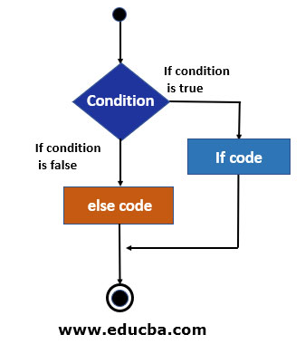

# Conditional Statements C Programming 

**💻Example:**
```c
//Example of Ternary operator  
#include <stdio.h>

int main() {
    
    int days=1;
    
    (days>1)?printf("%d days to go",days):printf("%d day to go",days);
    
    return 0;
}
```
**⚙️ Output :**
>1 day to go 


 ## Conditional Statement 

 ### if conditional statement 

if statement to specify a block of code to be executed if a condition is true.

**Syntax :**
```c
if (condition) 
{ 
  // block of code to be executed if the condition is true
}
```
**Flow Chart :**


**💻Example:**
```c
#include <stdio.h>

int main() {
    
    int a=5;
    
    if(a==5)
    {
        printf("Both are Equal");
    }
    
    return 0;
}
```
**⚙️ Output :**
>Both are Equal

 
**💻Example:**
```c

#include <stdio.h>

int main() {
    
    int a=5;
    
    if(a==5)
    {
        printf("Both are Equal");
    }
    
    printf("\n This is a normal Line");
    
    return 0;
}
```
**⚙️ Output :**
>Both are Equal    
 This is a normal Line

 
**💻Example:**
```c
#include <stdio.h>

int main() {
    
    int a=10;
    
    if(a%2==0)
    {
        printf("Given number is Even ");
    }
    
    return 0;
}
```
**⚙️ Output :**
>Given number is Even

### If-else Conditional Statement

If else statement is used to perform an action if a single condition is true and to perform another action if that condition is false.
 
**Syntax :**
```c
if (condition)

{

block of code to be executed the condition is true;

}

else

{

block of code to be executed the condition is false;

}
```
**Flow Chart:**



**💻Example:**
```c
#include <stdio.h>

int main() {
    
    int num;
    
    printf("Enter Number :");
    scanf("%d",&num);
    
    if(num%2==0)
    {
        printf("Given number is Even ");
    }
    
    else
    {
        printf("Given number is odd");
    }
    return 0;
}
```
**⚙️ Output :**
>Enter Number :5   
Given number is odd


**💻Example:**
```c
#include <stdio.h>

int main() {
    
    int age;
    
    printf("Enter your age :");
    scanf("%d",&age);
    
    if(age>=18)
    {
        printf("Your are eligible for voting ");
    }
    
    else
    {
        printf("Your are not eligible for voting");
    }
    return 0;
}
```
**⚙️ Output :**
>Enter your age :18  
Your are eligible for voting 

# Logical Operators C Programming 

## Logical Operators 

Logical operator are used to chaining condition.

* Logical AND (&&)
* Logical OR (||)
* Logical Not (!)

### Logical AND (&&) 
  
  Result True, if both operand condition are true otherwise false.

**💻Example:**
```c

#include <stdio.h>

int main() {
 int physics=95;
 int maths=98;
 
   if (physics>=80 && maths>=80)
 {
     printf("Admission Granted ...");
 }
 else
 {
     printf("Admission Rejected ...");
 }
    
    return 0;
}
```
**⚙️ Output :**
>Admission Granted ..

**💻Example:**
```c

#include <stdio.h>

int main() {
 int physics=50;
 int maths=98;
 
   if (physics>=80 && maths>=80)
 {
     printf("Admission Granted ...");
 }
 else
 {
     printf("Admission Rejected ...");
 }
    
    return 0;
}
```
**⚙️ Output :**
>Admission Rejected ...

**💻Example:**
```c

#include <stdio.h>

int main() {
 int physics=95;
 int maths=45;
 
   if (physics>=80 && maths>=80)
 {
     printf("Admission Granted ...");
 }
 else
 {
     printf("Admission Rejected ...");
 }
    
    return 0;
}
```
**⚙️ Output :**
>Admission Rejected ...

 ###  Logical OR (||)

 Result True if both operand condition are true and one of the condition is true otherwise result False.

**💻Example:**
```c
#include <stdio.h>

int main()
{
 int physics=90;
 int maths=98;
 
   if (physics>=80 || maths>=80)
 {
     printf("Admission Granted ...");
 }
 else
 {
     printf("Admission Rejected ...");
 }
    
    return 0;
}
```
**⚙️ Output :**
>Admission Granted ...

**💻Example:**
```c

#include <stdio.h>

int main()
{
 int physics=0;
 int maths=98;
 
   if (physics>=80 || maths>=80)
 {
     printf("Admission Granted ...");
 }
 else
 {
     printf("Admission Rejected ...");
 }
    
    return 0;
}
```
**⚙️ Output :**
>Admission Granted ...

**💻Example:**
```c
#include <stdio.h>

int main()
{
 int physics=90;
 int maths=0;
 
   if (physics>=80 || maths>=80)
 {
     printf("Admission Granted ...");
 }
 else
 {
     printf("Admission Rejected ...");
 }
    
    return 0;
}
```
**⚙️ Output :**
>Admission Granted ...
 
**💻Example:**
```c
#include <stdio.h>

int main()
{
 int physics=0;
 int maths=0;
 
   if (physics>=80 || maths>=80)
 {
     printf("Admission Granted ...");
 }
 else
 {
     printf("Admission Rejected ...");
 }
    
    return 0;
}
```
**⚙️ Output :**
>Admission Rejected ...


### Logical Not (!)

**💻Example:**
```c
#include <stdio.h>

int main() 
{
    
    int physics=70;
   
    
    int result=!(physics>=80);
    printf("Result=%d",result);
    
    return 0;
}
```
**⚙️ Output :**
>Result=1

# If-Else Ladder in C Programming 

## If-Else Ladder

**Syntax :**
```c
if(condition1)
{
   //block of statement
}
else if(condition 2)
{
  //block of statement
}
else if(condition 3)
{
  //block of statement
}
else
{
  //block of statement  
}
```

**💻Example:**
```c
#include <stdio.h>

int main() {
  
   int marks = 95;
   
   if (marks>95)
   {
       printf("Grade A ");
   }
   else if(marks>80)
   {
       printf("Grade B");
   }
   else if(marks>70)
   {
       printf("Grade c");
   }
   else
   {
       printf("FAIl");
   }

    return 0;
}
```
**⚙️ Output :**
>Grade B

**💻Example:**
```c
#include <stdio.h>

int main() {
  
   int marks = 61;
   
   if (marks>60)
   {
       printf("Grade D");
   }
   else if(marks>70)
   {
       printf("Grade C");
   }
   else if(marks>80)
   {
       printf("Grade B");
   }
   else if(marks>90)
   {
       printf("Grade A");
   }
   else
   {
       printf("FAIl");
   }

    return 0;
}
```
**⚙️ Output :**
>Grade D

**💻Example:**
```c
#include <stdio.h>

int main() {
  
   int marks = 95;
   
   if (marks>90 && marks<=100)
   {
       printf("Grade A ");
   }
   else if(marks>80 && marks<=90)
   {
       printf("Grade B");
   }
   else if(marks>70 && marks<=80)
   {
       printf("Grade B");
   }
   else if (marks>60 && marks<=70)
   {
       printf(" Grade D")
   }
   else
   {
       printf("FAIl");
   }

    return 0;
}
```
**⚙️ Output :**
>Grade A

# Nested-If in C Programming 

## Nested-If

Nested If in C Programming is placing If Statement inside another IF Statement. Nested If in C is helpful if you want to check the condition inside a condition. 

**Syntax :**
```c
if(condition 1)
{
   if(condition 2) {
      //Statement block Executes when the boolean test expression two is true.
   }
}
else
{
    //else statement block
}
```

**💻Example:**
```c

#include <stdio.h>

int main() {
    int hsc=80;
    int jee=130;
    
    if(hsc>=60)
    {
        printf("You cleared HSC");
        
        if(jee>=120)
        {
            printf("\nYou cleared JEE");
        }
        else
        {
            printf("\n You did not cleared JEE");
        }
    }
    else
    {
        printf("You did not cleared HSC");
    }
    
    return 0;
}
```
**⚙️ Output :**
>You cleared HSC   
You cleared JEE

**💻Example:**
```c
#include <stdio.h>

int main() {
    int a,b,c;
    printf("Enter the values of a,b,c");
    scanf("%d%d%d",&a,&b,&c);
    
    if(a>b)
    {
        if(a>c)
        {
            printf("%d is greatest",a);
        }
        else
        {
            printf("%d is greatest",c);
        }
    }
    else
    {
       if(b>c)
        {
            printf("%d is greatest",b);
        }
        else
        {
            printf("%d is greatest",c);
        }
    }
    
    return 0;
}
```
**⚙️ Output :**
>Enter the values of a,b,c 300 200 100   
300 200 100  
300 is greatest

**💻Example:**
```c

#include <stdio.h>

int main() {
    int a,b,c;
    printf("Enter the values of a,b,c");
    scanf("%d%d%d",&a,&b,&c);
    
    if(a>b && a>c)
    {
        printf("%d is greatest",a);
    }
    else if(b>a && b>c )
        {
            printf("%d is greatest",b);
        }
    
    else
        {
            printf("%d is greatest",c);
        }
    return 0;
}
```
**⚙️ Output :**
>Enter the values of a,b,c 20 10 30  
20 10 30   
30 is greatest
