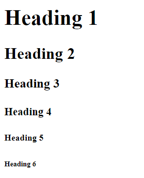
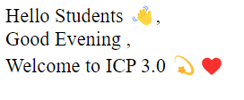

# Lecture-1 Introduction to HTML

## 💁🏻‍♀️ Introduction

HTML is the standard markup language and is used to create Web pages.

It was created by Tim Berners Lee and released in 1993.


## 🤔 How to download and install VS code?

  👉 [Click Here to download VS code ](https://code.visualstudio.com/download#)

  **Steps to download VS code**

  1. Click the above Link to download VS code👆 . 
  2. Set up VS code by accepting the agreement and clicking “next.”
  3. Accept all the Agreements, then press the finish button.

## Tag in HTML

```html
    <tagname> 👈 Opening Tag 

    </tagname> 👈 Closing Tag 
```
```HTML
    <br> 👈 This tag is used for break line.
```

## Heading tag in HTML

 In HTML, headings are titles or subtitles used to display on a webpage. There are six heading elements. These elements are h1,h2,h3,h4,h5,h6. h1 is the biggest, and h6 is the smallest.

```HTML
    <h1> Heading 1 </h1>
    <h2> Heading 2 </h2>
    <h3> Heading 3 </h3>
    <h4> Heading 4 </h4>
    <h5> Heading 5 </h5>
    <h6> Heading 6 </h6>
```

 

## 💻 Code Blocks

```HTML
 <!DOCTYPE html>
<html>
    <head>
        <title>
            My Frist Webpage
        </title>
    </head>
    <body>
        Hello Students 👋, <br>
        Good Evening, <br>
        Welcome to ICP 3.0 💫❤️
    </body>
</html>
```
**Example Explanation**

```HTML
<!DOCTYPE html> Defines The Document type is HTML
<html> Define HTML document 
<head> Information of Html page
<title> This element specifies a title for the HTML page
<body> Define the Program body 
<br> This tag for break line
```
**⚙️Output**

 

## 🏠 HomeWork

>1️⃣ Create a Webpage For Showing Your basic details Like the full name, College name, etc. 
