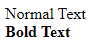
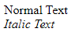
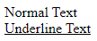
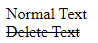
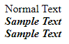
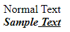
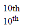
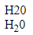
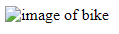

# Lecture-1 Basic Tags of HTML

## 💁🏻‍♀️ Types of Tags

### Based on closing tag

1. Empty Tag :- Tags with no closing tag
```
for e.g. :- <br> , <br/>
```
2. Container Tag :- Tags with both opening and closing tag
```
for e.g. :- <h1> </h1>
```

### Based on Names

1. Semantic Tags :- Semantic tag have meaningful name of the information in webpage.
```
for e.g. :- <form> , <table>
```

2. Non Semantic Tags :- Non Semantic tag don't tell anything about the content.
```
for e.g. :- <div> , <a>
```

## Bold Tag

Defines bold text

```
<b>Bold Text</b>
```
**💻Example :**
```html
<!Doctype html>
<html>
    <head>
        <title>Basic Tags</title>
    </head>
    <body>
        Normal Text <br/>
        <b>Bold Text</b>
    </body>

</html>
```
**⚙️ Output :**

 

## Italic Tag

Defines italic text

```
<i>Text</i>
```
**💻Example :**
```html
<body>
    Normal Text <br/>
    <i>Italic Text</i>
</body>
```
**⚙️ Output :**



## Underline Tag

Use to underline a text in HTML

```
<u>Underline Text</u>
```
**💻Example :**
```html
<body>
    Normal Text <br/>
    <u>Underline Text</u>
</body>
```
**⚙️ Output :**



## Delete Tag

It is used to mark a portion of text which has been deleted from the document.

```
<del>Delete Text</del>
```
**💻Example :**
```html
<body>
    Normal Text <br/>
    <del>Delete Text</del>
</body>
```
**⚙️ Output :**



## Bold & Italic Tag

Defines bold & italic text

```
<i><b>Sample Text</b></i>
OR
<b><i>Sample Text</i></b>
```
**💻Example :**
```html
<body>
    Normal Text <br/>
    <i><b>Sample Text</b></i><br/>
    <b><i>Sample Text</i></b>
</body>
```
**⚙️ Output :**



#### If you want to underline text

**💻Example :**
```html
<body>
    Normal Text <br/>
    <i><b>Sample<u> Text</u></b></i>
</body>
```
**⚙️ Output :**



## Superscript

Superscript is a number or letter that written above the normal text.

```
10<sup>th</sup>

```
**💻Example :**
```html
<body>
    10th<br/>
    10<sup>th</sup><br/>
</body>
```
**⚙️ Output :**



## Subscript

Subscript is a number or letter that written below the normal text.

```
H<sub>2</sub>O

```
**💻Example :**
```html
<body>
    H20<br/>
    H<sub>2</sub>0
</body>
```
**⚙️ Output :**



## 🤔 How to add image in webpage ?

```

```
### Attribute

It provide extra information about tag
  
```
src = source
key = src
value = url
```
**💻Example :**
```html
<body>
    
</body>
```
**⚙️ Output :**


```
alt = alternative text
```
**💻Example :**
```html
<body>
    
</body>
```
**⚙️ Output :**



  
## 🤔 How to add width & height to image in html ?

**💻Example :**
```html
<body>
    
</body>
```
**⚙️ Output :**


**💻Example :**
```html
<body>
    
</body>
```
**⚙️ Output :**


## 🏠 HomeWork

>1️⃣ Create a Webpage using basic html tags and image tag where all the info is shown about you.
