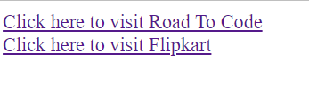
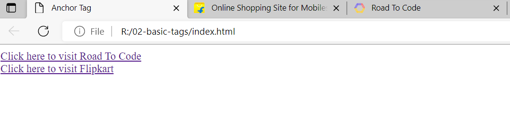
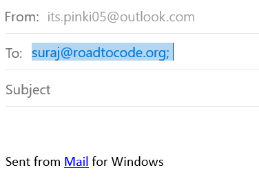
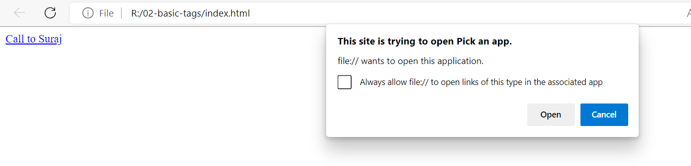

# Lecture-03 Tags of HTML

## 💁🏻‍♀️ Types of Tags

## Div Tag

Div tag is used for create division, Seperate block or a section in an HTML document.


## Paragraph Tag 

Paragraph tag is used to define a block of text in paragraph. 

**💻Example :**
```html
<!Doctype html>
<html>

<head>
    <title>Div $ Paragraph </title>
</head>

<body>
    <h1> Student's Info </h1>

    <div>
        <h2>Name: Shraddha</h2>
        <p><b> Hobbies: </b>Shraddha likes to read books 📚</p>
        <p><b>College: </b>RSMDP</p>
    </div>

    <div>
        <h2>Name: Ankit</h2>
        <p><b>Hobbies: </b>Ankit like to travel 🚘</p>
        <p><b>College: </b>Kamla Neharu College,Nagpur</p>
    </div>

</body>
</html>
```
**⚙️ Output :**

 

## Anchor Tag

**Syntax**

 ```html
 <a href = "url">
    Visit RTC Website 
 </a>
 ```
 **href** 👉 hyperlink reference


**💻Example :**
```html
<!Doctype html>
<html>

<head>
    <title>Anchor Tag </title>
</head>

<body>
    <a href="https://www.roadtocode.org/">
        Click here to visit Road To Code
    </a>

    <br/>

    <a href="https://www.flipkart.com/"> 
        Click here to visit Flipkart
    </a>
</body>
</html>
```
**⚙️ Output :**



## Target blank Attribute

**Syntax:**
```html
target="_blank"
```
**💻Example :**
```html
<!Doctype html>
<html>

<head>
    <title>Anchor Tag </title>
</head>

<body>
    <a href="https://www.roadtocode.org/" target="_blank">
        Click here to visit Road To Code
    </a>

    <br/>

    <a href="https://www.flipkart.com/" target="_blank"> 
        Click here to visit Flipkart
    </a>
</body>
</html>
```
**⚙️ Output :**




**💻Example :**
```html
<!Doctype html>
<html>

<head>
    <title>Anchor Tag </title>
</head>

<body>
    <a href="mailto:suraj@roadtocode.org">
        Send mail to Suraj
    </a>
</body>
</html>
```
**⚙️ Output :**





**💻Example :**
```html
<!Doctype html>
<html>

<head>
    <title>Anchor Tag </title>
</head>

<body>
    <a href="tel:+918805803087">
        Call to Suraj
    </a>
</body>
</html>
```
**⚙️ Output :**




**💻Example :**

**File Name: Homepage.html**
```html
<!Doctype html>
<html>

<head>
    <title>Home page </title>
</head>

<body>
   <h2> This is the home Page</h2>

   <a href="aboutpage.html"> 
    Go to about page
   </a>
</body>
</html>
```
**File Name: Homepage.html**
```html
<!Doctype html>
<html>

<head>
    <title>About page</title>
</head>

<body>
   <h2> This is the about Page</h2>

   <a href="homepage.html"> 
    Go to homepage page
   </a>
</body>
</html>
```

## 🏠 HomeWork

>1️⃣ Create a Webpage that are linked with each other using anchor tag also provide meaningful navigation.
