# Lecture-4 Forms Tags in HTML

## 💁🏻‍♀️ Forms

Form is an HTML element which is used to take input from user.

```html
<form> => form start
</form> => form end

<input type = "text"/> =>input field

type => attribute

```
## How to take input from user

**💻Example :**
```html
<!DOCTYPE html>
<html>
<head>
    <title>Forms</title>
</head>
<body>
    <form>
        <input type="text" />
    </form>
</body>
</html>
```
**⚙️ Output :**

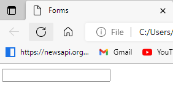 

**💻Example :**
```html
<!DOCTYPE html>
<html>
<head>
    <title>Forms</title>
</head>
<body>
    <form>
        Enter Name : <input type="text" />
    </form>
</body>
</html>
```
**⚙️ Output :**

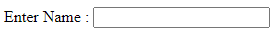 


## Placeholder

Placeholder is a attribute which is used to set a short hint that describes the value of an input field. 

**💻Example :**
```html
<!DOCTYPE html>
<html>
<head>
    <title>Forms</title>
</head>
<body>
    <form>
        Enter Name : <input type="text" placeholder="Enter your name"/>
    </form>
</body>
</html>
```
**⚙️ Output :**

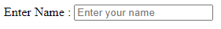 

## Password

Password is attribute which is invisible to the user in password field.

**💻Example :**
```html
<!DOCTYPE html>
<html>
<head>
    <title>Forms</title>
</head>
<body>
    <form>
        <input type="password" placeholder="Enter password"  />
    </form>
</body>
</html>
```
**⚙️ Output :**

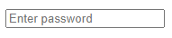 

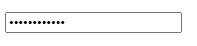 

## Button

There are two type of button <br>
1. Submit button :- it is used to submit form data.
2. Button :- it is used to trigger action.

**💻Example :**
```html
<body>
<form>
    <button type="submit">Login Now</button>
</form>
</body>
```

**⚙️ Output :**

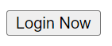 


### required 

It is specifies that the element is mandatory to filled out before submitting the form.

**💻Example :**
```html
<!DOCTYPE html>
<html>
<head>
    <title>Forms</title>
</head>
<body>
    <form>
        Enter Name : <input type="text" placeholder="Enter your name" required/>
        <br/><br/>
        Enter Email : <input type="email" placeholder="Enter Email" required/>
        <br/><br/>
        <button type="submit">Login Now</button>
    </form>
</body>
</html>
```

**⚙️ Output :**

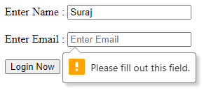 


## Email

The email Attribute is used to validates the text for correct email address. You must use `@` and `.` in this field.


**💻Example :**
```html
<!DOCTYPE html>
<html>
<head>
    <title>Forms</title>
</head>
<body>
    <form>
        Enter Email : <input type="email" placeholder="Enter Email" required/>
    </form>
</body>
</html>
```
**⚙️ Output :**

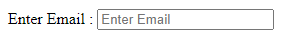 

📝Note:-  If we do not enter the proper email address then  it will display error like this

 

## Date

**💻Example :**
```html
<!DOCTYPE html>
<html>
<head>
    <title>Forms</title>
</head>
<body>
    <form>
        <input type="date"/>
    </form>
</body>
</html>
```
**⚙️ Output :**

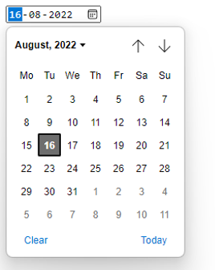 

## Time

**💻Example :**
```html
<!DOCTYPE html>
<html>
<head>
    <title>Forms</title>
</head>
<body>
    <form>
        <input type="time"/>
    </form>
</body>
</html>
```
**⚙️ Output :**

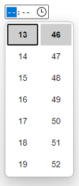 

## Range

**💻Example :**
```html
<!DOCTYPE html>
<html>
<head>
    <title>Forms</title>
</head>
<body>
    <form>
        <input type="range"/>
    </form>
</body>
</html>
```
**⚙️ Output :**

 

## File

**💻Example :**
```html
<!DOCTYPE html>
<html>
<head>
    <title>Forms</title>
</head>
<body>
    <form>
        <input type="file"/>
    </form>
</body>
</html>
```
**⚙️ Output :**

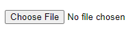 

## Number

**💻Example :**
```html
<!DOCTYPE html>
<html>
<head>
    <title>Forms</title>
</head>
<body>
    <form>
        <input type="number"/>
    </form>
</body>
</html>
```
**⚙️ Output :**

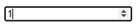 

## Textarea

**💻Example :**
```html
<!DOCTYPE html>
<html>
<head>
    <title>Forms</title>
</head>
<body>
    <form>
        <textarea></textarea>
    </form>
</body>
</html>
```
**⚙️ Output :**

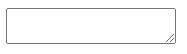 

How to provide size in textarea

**💻Example :**
```html
<!DOCTYPE html>
<html>
<head>
    <title>Forms</title>
</head>
<body>
    <form>
        <textarea rows="6" cols="20"></textarea>
    </form>
</body>
</html>
```
**⚙️ Output :**

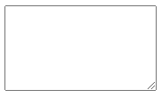 

## Checkbox 
Checkbox is used to multiple selection.

**💻Example :**
```html
<!DOCTYPE html>
<html >
<head>
    <title> Checkbox </title>
</head>
<body>
    <form>
        <input type="checkbox" value=" Soan Papadi"/> Soan Papadi <br/>
        <input type="checkbox" value="Kaju Katli"/> Kaju Katli <br/>
        <input type="checkbox" value="Gulab Jamun"/> Gulab Jamun 
    </form>
</body>
</html>
```
**⚙️ Output :**

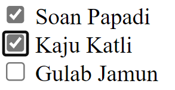 

## Radio Button

Radio Button is used to Single selection.

**💻Example :**
```html
<!DOCTYPE html>
<html >
<head>
    <title> Checkbox </title>
</head>
<body>
    <form>
        <input type="radio" name="gender"/> Female <br/>
        <input type="radio" name="gender"/> Male
    </form>
</body>
</html>
```
**⚙️ Output :**

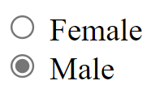

**💻Example :**
```html
<!DOCTYPE html>
<html >
<head>
    <title> Checkbox </title>
</head>
<body>
    <form>
        <h4> Please Select Gender :</h4>
        <input type="radio" name="gender" value="female"/> Female <br/>
        <input type="radio" name="gender" value="male"/> Male
 
        <h4> Please select Board </h4>
        <input type="radio" name="board" value="State"/> State <br/>
        <input type="radio" name="board" value="CBSE"/> CBSE
    </form>
</body>
</html>
```
**⚙️ Output :**

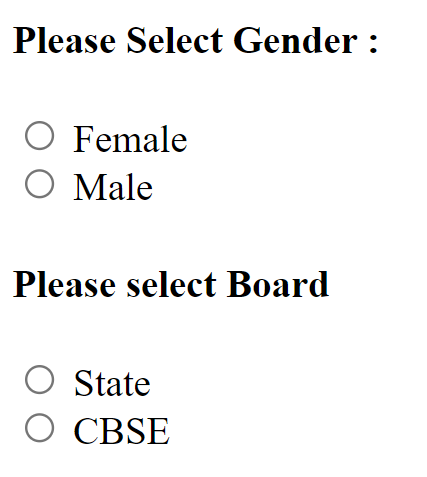

## Dropdown 

**💻Example :**
```html
<!DOCTYPE html>
<html >
<head>
    <title> Checkbox </title>
</head>
<body>
    <form>
        <select>
            <option> Select Your City :  </option>
            <option value="Bangalore"> Bangalore </option>
            <option value="Chennai"> Chennai </option>
            <option value="Kolkata"> Kolkata </option>
            <option value="Delhi"> Delhi </option>
        </select>
    </form>
</body>
</html>
```
**⚙️ Output :**

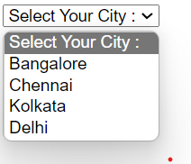

## Unique id 

Id attribute give unique id for an HTML element.

**💻Example :**
```html
<!DOCTYPE html>
<html >
<head>
    <title> Checkbox </title>
</head>
<body>
    <form>
        <label for="inputname"> Name: </label>
       <input type="text" id="inputname"/>
    </form>
</body>
</html>
```
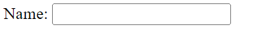

## 🏠 HomeWork

>1️⃣ Create a indian railway Webpage using input field tags and add indian railway image, source, destination, date, time, number etc where all the info is shown about.
