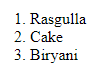
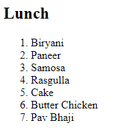
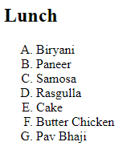
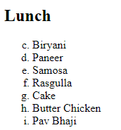
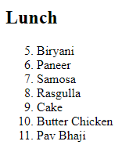
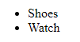
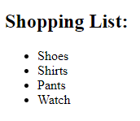
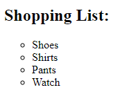
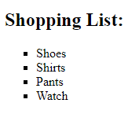

# Lecture-7 Ordered List, Unordered List and Video Tag in HTML

### There are two types of list in HTML
1. Ordered List

```html
<ol> => stands for ordered list

example:-1. 1, 2, 3, 4,....,
2. a, b, c, d,....,
3. A, B, C, D,....,
4. I, II, III, IV,....,
5. i, ii, iii, iv,.....
```
**💻Syntax :**
```html
<ol></ol>
```
2. Unordered List
```html
<ul> => stands for unordered list

example:- Bullet points
1. Disc
2. Square
3. circle
```
**💻Syntax :**
```html
<ul></ul>
```

List Item

```html
<li> stands for list item
```
**💻Syntax :**
```html
<li></li>
```

## 💁🏻‍♀️ Ordered List

ordered list used to create a list of related items which have specific order or sequence.


**💻Example :**
```html
<ol>
    <li>Rasgulla</li>
    <li>Cake</li>
    <li>Biryani</li>
</ol>

```
**⚙️ Output :**

 

**💻Example :**
```html
<!DOCTYPE html>
<html>
<head>
    <title>Ordered List</title>
</head>
<body>
    <h2>Lunch</h2>
    <ol>
        <li>Biryani</li>
        <li>Paneer</li>
        <li>Samosa</li>
        <li>Rasgulla</li>
        <li>Cake</li>
        <li>Butter Chicken</li>
        <li>Pav Bhaji</li>
    </ol>
</body>
</html>
```
**⚙️ Output :**

 


### Types 

**type="1" :**	This type will be numbered as  numbers which is default value.

**💻Example :**
```html
<ol type="1">
    <li>Rasgulla</li>
    <li>Cake</li>
    <li>Biryani</li>
</ol>

```
**⚙️ Output :**

 

**type="A":** This type will be numbered as  uppercase letters.

**💻Example :**
```html
<!DOCTYPE html>
<html>
<head>
    <title>Ordered List</title>
</head>
<body>
    <h2>Lunch</h2>
    <ol type="A">
        <li>Biryani</li>
        <li>Paneer</li>
        <li>Samosa</li>
        <li>Rasgulla</li>
        <li>Cake</li>
        <li>Butter Chicken</li>
        <li>Pav Bhaji</li>
    </ol>
</body>
</html>
```
**⚙️ Output :**

 

**type="a":** This type will be numbered as  lowercase letters.

**type="I":** This type will be numbered as  lowercase uppercase roman numbers.

**type="i":** This type will be numbered as lowercase roman numbers.

## Start

```html
<ol type="a" start="3">
```

**💻Example :**
```html
<!DOCTYPE html>
<html>
<head>
    <title>Ordered List</title>
</head>
<body>
    <h2>Lunch</h2>
    <ol type="a" start="3">
        <li>Biryani</li>
        <li>Paneer</li>
        <li>Samosa</li>
        <li>Rasgulla</li>
        <li>Cake</li>
        <li>Butter Chicken</li>
        <li>Pav Bhaji</li>
    </ol>
</body>
</html>
```
**⚙️ Output :**

 

```html
<ol type="1" start="5">
```
**💻Example :**
```html
<!DOCTYPE html>
<html>
<head>
    <title>Ordered List</title>
</head>
<body>
    <h2>Lunch</h2>
    <ol type="1" start="5">
        <li>Biryani</li>
        <li>Paneer</li>
        <li>Samosa</li>
        <li>Rasgulla</li>
        <li>Cake</li>
        <li>Butter Chicken</li>
        <li>Pav Bhaji</li>
    </ol>
</body>
</html>
```
**⚙️ Output :**



## 💁🏻‍♀️ Unordered List

Unordered list used to create a list of related items which have no specific order or sequence.

**💻Example :**
```html
<ul>
    <li>Shoes</li>
    <li>Watch</li>
</ul>
```

**⚙️ Output :**

 

**💻Example :**
```html
<!DOCTYPE html>
<html>
<head>
    <title>Unordered List</title>
</head>
<body>
    <h2>Shopping List:</h2>
    
    <ul>
        <li>Shoes</li>
        <li>Shirts</li>
        <li>Pants</li>
        <li>Watch</li>
    </ul>
</body>
</html>
```

**⚙️ Output :**

 

### Types

1. **disc:** This list item will be marked as bullet small black circles (default).

2. **circle:** This list item will be marked to a circle.

3. **square:**	This list item will be marked as square.


**💻Example :**
```html
<!DOCTYPE html>
<html>
<head>
    <title>Unordered List</title>
</head>
<body>
    <h2>Shopping List:</h2>
    
    <ul type="circle">
        <li>Shoes</li>
        <li>Shirts</li>
        <li>Pants</li>
        <li>Watch</li>
    </ul>
</body>
</html>
```
**⚙️ Output :**

 

**💻Example :**
```html
<!DOCTYPE html>
<html>
<head>
    <title>Unordered List</title>
</head>
<body>
    <h2>Shopping List:</h2>
    
    <ul type="square">
        <li>Shoes</li>
        <li>Shirts</li>
        <li>Pants</li>
        <li>Watch</li>
    </ul>
</body>
</html>
```
**⚙️ Output :**

 

## Video Tag

Video tag is used to show a video on web page in html.

**💻Example :**
```html

```
**⚙️ Output :**

 

## Controls

Controls provide options to control video player.

**💻Example :**
```html

```
**⚙️ Output :**

 

## 🤔 How to provide height ?

**💻Example :**
```html

```
**⚙️ Output :**

 

## Auto play

**💻Example :**
```html

```
**⚙️ Output :**

 

## Muted

**💻Example :**
```html

```
**⚙️ Output :**

 

## 🤔 How to add poster ?

**💻Example :**
```html

```
**⚙️ Output :**

 


## 🏠 HomeWork

>1️⃣ Create a Webpage using ordered list, unordered list, video tag and also research on audio tag where all the info is shown about.
