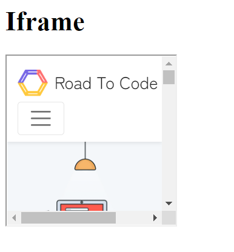
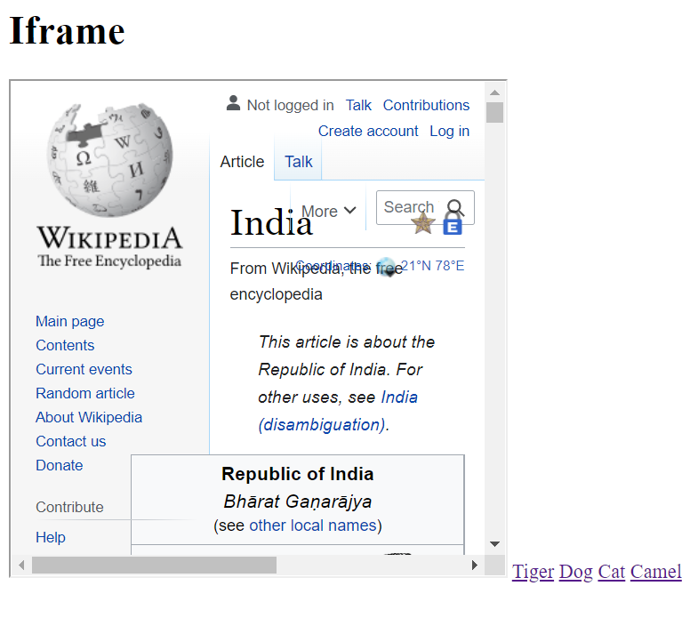
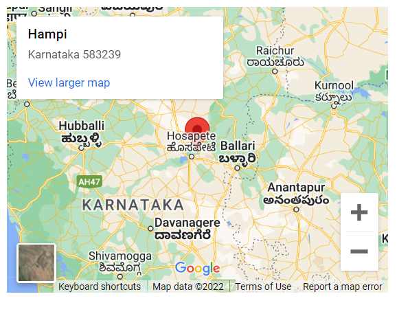

# Lecture-08 Iframe 

## Iframe 

**💻Example :**
```html
<!DOCTYPE html>
<html >
<head>
    <title> iframe </title>
</head>
<body>
    <h1> Iframe</h1>
   <iframe src="https://www.roadtocode.org/" height="200px" width="200px">

   </iframe>
</body>
</html>
```
**⚙️ Output :**

 

**💻Example :**
```html
<!DOCTYPE html>
<html >
<head>
    <title> iframe </title>
</head>
<body>
    <h1> Iframe</h1>
   <iframe src="http://en.wikipedia.org/wiki/India" height="400px" width="400px" name="myscreen">

   </iframe>

   <a href = "http://en.wikipedia.org/wiki/tiger" target="myscreen" > Tiger</a>
   <a href = "http://en.wikipedia.org/wiki/dog" target="myscreen"> Dog</a>
   <a href = "http://en.wikipedia.org/wiki/cat" target="myscreen"> Cat</a>
   <a href = "http://en.wikipedia.org/wiki/camel" target="myscreen"> Camel</a>
</body>
</html>
```
**⚙️ Output :**




## Map 

**💻Example :**
```html
<!DOCTYPE html>
<html >
<head>
    <title> iframe </title>
</head>
<body>
    <iframe src="https://www.google.com/maps/embed?pb=!1m18!1m12!1m3!1d1980777.5606954987!2d75.94750721102605!3d14.153364207152547!2m3!1f0!2f0!3f0!3m2!1i1024!2i768!4f13.1!3m3!1m2!1s0x3bb77fd95d4be823%3A0x6e52e05076df36b8!2sHampi%2C%20Karnataka%20583239!5e0!3m2!1sen!2sin!4v1660835732262!5m2!1sen!2sin" width="400" height="300" style="border:0;" allowfullscreen="" loading="lazy" referrerpolicy="no-referrer-when-downgrade"></iframe>
</body>
</html>
```
**⚙️ Output :**



## Vedio

**💻Example :**
```html
<!DOCTYPE html>
<html >
<head>
    <title> iframe </title>
</head>
<body>
    <iframe width="560" height="315" src="https://www.youtube.com/embed/BddP6PYo2gs?start=2" title="YouTube video player" frameborder="0" allow="accelerometer; autoplay; clipboard-write; encrypted-media; gyroscope; picture-in-picture" allowfullscreen></iframe>
</body>
</html>
```
**⚙️ Output :**

