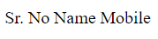
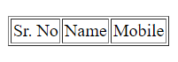
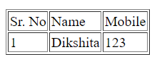
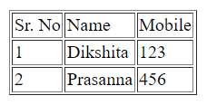
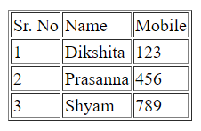
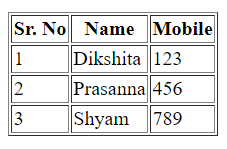
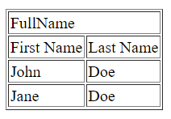
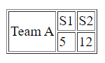

# Lecture-8 Table Tag in HTML

## Table Tag

### table tag allow us to arrange data into rows and columns.


```html
<table> => Represents a table
<th> =>	Defines a header cell in a table
```
**💻Syntax :**
```html
<!DOCTYPE html>
<html>
<head>
    <title>Table</title>
</head>
<body>
    <table>

    </table>
</body>
</html>
```

## Table Row

```html
<tr> =>	Represents a row in a table
```
## Table Cell

```html
<td> =>	Represents a cell in a table
```
**💻Example :**
```html
<!DOCTYPE html>
<html>
<head>
    <title>Table</title>
</head>
<body>
    <table>
        <tr>
            <td>Sr. No</td> <td>Name</td> <td>Mobile</td>
        </tr>
    </table>
</body>
</html>
```
**⚙️ Output :**

 

## 🤔 How to provide border ?

**💻Example :**
```html
<!DOCTYPE html>
<html>
<head>
    <title>Table</title>
</head>
<body>
    <table border="1">
        <tr>
            <td>Sr. No</td> <td>Name</td> <td>Mobile</td>
        </tr>
    </table>
</body>
</html>
```
**⚙️ Output :**

 

**💻Example :**
```html
<!DOCTYPE html>
<html>
<head>
    <title>Table</title>
</head>
<body>
    <table border="1">
        <tr>
            <td>Sr. No</td> <td>Name</td> <td>Mobile</td>
        </tr>
        <tr>
            <td>1</td> <td>Dikshita</td> <td>123</td>
        </tr>
    </table>
</body>
</html>
```
**⚙️ Output :**

 

**💻Example :**
```html
<!DOCTYPE html>
<html>
<head>
    <title>Table</title>
</head>
<body>
    <table border="1">
        <tr>
            <td>Sr. No</td> <td>Name</td> <td>Mobile</td>
        </tr>
        <tr>
            <td>1</td> <td>Dikshita</td> <td>123</td>
        </tr>
        <tr>
            <td>2</td> <td>Prasanna</td> <td>456</td>
        </tr>
    </table>
</body>
</html>
```
**⚙️ Output :**

 

**💻Example :**
```html
<!DOCTYPE html>
<html>
<head>
    <title>Table</title>
</head>
<body>
    <table border="1">
        <tr>
            <td>Sr. No</td> <td>Name</td> <td>Mobile</td>
        </tr>
        <tr>
            <td>1</td> <td>Dikshita</td> <td>123</td>
        </tr>
        <tr>
            <td>2</td> <td>Prasanna</td> <td>456</td>
        </tr>
        <tr>
            <td>3</td> <td>Shyam</td> <td>789</td>
        </tr>
    </table>
</body>
</html>
```
**⚙️ Output :**

 

## Table Heading

```html
<th> =>	Represents a header cell in a table
```

**💻Example :**
```html
<!DOCTYPE html>
<html>
<head>
    <title>Table</title>
</head>
<body>
    <table border="1">
        <thead>
            <tr>
                <th>Sr. No</th> <th>Name</th> <th>Mobile</th>
            </tr>
        </thead>
        <tr>
            <td>1</td> <td>Dikshita</td> <td>123</td>
        </tr>
        <tr>
            <td>2</td> <td>Prasanna</td> <td>456</td>
        </tr>
        <tr>
            <td>3</td> <td>Shyam</td> <td>789</td>
        </tr>
    </table>
</body>
</html>

```
**⚙️ Output :**



## 💁🏻‍♀️ Colspan 

Colspan attribute we use for represents the number of columns in cell span.

**💻Example :**
```html
<!DOCTYPE html>
<html>
<head>
    <title>Table</title>
</head>
<body>
    <table border="1">
        <tr>
            <td colspan="2">FullName</td>
        </tr>
        <tr>
            <td>First Name</td> <td>Last Name</td>
        </tr>
        <tr>
            <td>John</td> <td>Doe</td>
        </tr>
        <tr>
            <td>Jane</td> <td>Doe</td>
        </tr>
    </table>
</body>
</html>
```

**⚙️ Output :**

 

## 💁🏻‍♀️ Rowspan
 

Rowspan attribute we use for represents the number of rows in cell span.


**💻Example :**
```html
<!DOCTYPE html>
<html>
<head>
    <title>Table</title>
</head>
<body>
    <table border="1">
        <tr>
            <td rowspan="2">Team A</td> <td>S1</td> <td>S2</td>
        </tr>
        <tr>
            <td>5</td> <td>12</td>
        </tr>
    </table>
</body>
</html>

```

**⚙️ Output :**

 


## 🏠 HomeWork

>1️⃣
