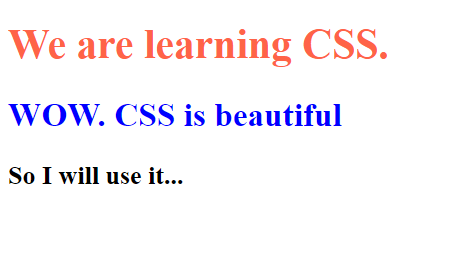
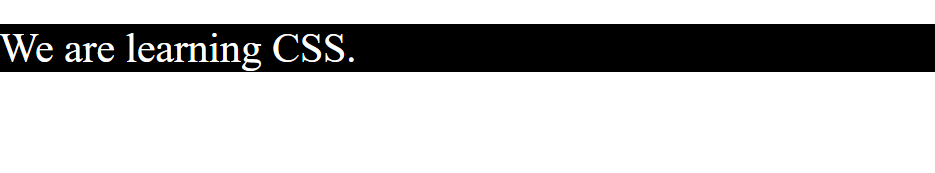
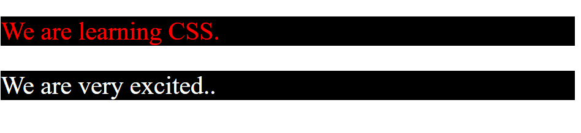
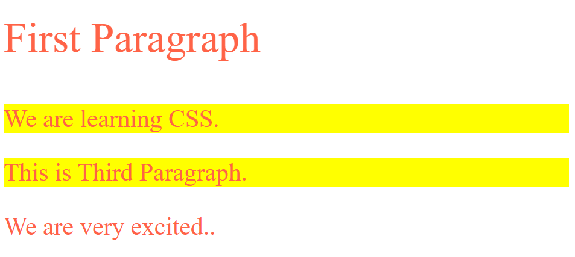

# Introduction To CSS 

## CSS means 👉  Cascading Style Sheets

CSS are Used to Design Your Webpage.
CSS are used to describes how HTML elements are to be displayed on Desktop, laptop, Tablet,screen or in other media.

You can Add CSS in Html elements then use this style tag. 👇

```html
 <style>

 </style>
```

**💻Example :**
```html
<!DOCTYPE html>
<html >
<head>
    <title> CSS  </title>
    <style>
        h1{
            color : tomato;
            font-size: 30px;
        }

        h2{
            color: blue;
        }
    </style>
</head>
<body> 
    <h1> We are learning CSS. </h1>

    <h2> WOW. CSS is beautiful </h2>

    <h3>So I will use it...</h3>
</body>
</html>
```
**⚙️ Output :**

 

**💻Example :**
```html
<!DOCTYPE html>
<html >
<head>
    <title> CSS  </title>
    <style>
      p{
        color: white;
        font-size: 30px;
        background-color: black;
      }
    </style>
</head>
<body> 
    <p>We are learning CSS. </p>
</body>
</html>
```
**⚙️ Output :**



## Selectors in CSS 

1. **Tagname**

    By tag name 
     ```html
     <h1> Hii </h1>

     CSS of h1 tag 👉
     
     <style>
     h1{
         color : red
     }
     </style>
     ```
2. **ID**

   By ID 
    ```html
     <h1 id="myheading"> Hii </h1>

     CSS of myheading id 👉
     
     <style>
     #myheading{
         color : red
     }
     </style>
     ```
3. **Classname**

  By Classname

  ```html
    <p class="highlight"> Hii </p>
    <h1 class="highlight"> Hii  </p>

     CSS of class 👉
     <style>
        .highlight{
            background-color : yellow
        }
    </style>
  ```

**💻Example :**
```html
<!DOCTYPE html>
<html >
<head>
    <title> CSS  </title>
    <style>
      p{
        color: white;
        font-size: 30px;
        background-color: black;
      }
      
      #description{
        color: red;
        font-size: 30px;
        background-color: black;
      }
    </style>
</head>
<body> 
    <p id="description">We are learning CSS. </p>
    <p>We are very excited..</p>
</body>
</html>
```
**⚙️ Output :**



## Dropdown 

**💻Example :**
```html
<!DOCTYPE html>
<html >
<head>
    <title> CSS  </title>
    <style>
     #firstpara{
            font-size: 50px;
        }

     .highlight{
        background-color: yellow;
      }

      p{
        color: tomato;
        font-size: 30px;
      }
    </style>
</head>
<body> 
    <p id="firstpara">First Paragraph  </p>
    <p class="highlight">We are learning CSS. </p>
    <p class="highlight">This is Third Paragraph.</p>
    <p>We are very excited..</p>
</body>
</html>
```
**⚙️ Output :**

