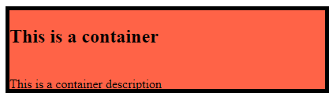

# Introduction To CSS Height, Width, Border, Radius

## Height, Width  

**💻Example :**
```html
<!DOCTYPE html>
<html>
<head>
    <title>CSS</title>
    <style>
        .img-house{
            height: 100px;
        }
    </style>
</head>
<body>
    
</body>
</html>
```
**⚙️ Output :**

 

**💻Example :**
```html
<!DOCTYPE html>
<html>
<head>
    <title>CSS</title>
    <style>
        .img-house{
            width: 300px;
        }
    </style>
</head>
<body>
    
</body>
</html>
```
**⚙️ Output :**


## 🤔 How to provide height and width to div tag ?

**💻Example :**

```html
<!DOCTYPE html>
<html>
<head>
    <title></title>
    <style>
        .container{
            background-color: tomato;
        }
    </style>
</head>
<body>
    <div class="container">
        <h2>This is a container</h2>
        <br/>
        This is a container description
    </div>
</body>
</html>
```
**⚙️ Output :**


**💻Example :**
```html
<!DOCTYPE html>
<html>
<head>
    <title></title>
    <style>
        .container{
            background-color: tomato;
            width: 200px;
        }
    </style>
</head>
<body>
    <div class="container">
        <h2>This is a container</h2>
        <br/>
        This is a container description
    </div>
</body>
</html>
```
**⚙️ Output :**


**💻Example :**
```html
<!DOCTYPE html>
<html>
<head>
    <title></title>
    <style>
        .container{
            background-color: tomato;
            width: 400px;
            height: 100px;
        }
    </style>
</head>
<body>
    <div class="container">
        <h2>This is a container</h2>
        <br/>
        This is a container description
    </div>
</body>
</html>
```
**⚙️ Output :**


## Border

There are four types of border

1. solid : __________
2. dotted : .................
3. dashed : ----------
4. double : =======

```html
selector{
    border-style: solid;
    border-color: black;
    border-width: 5px;
}
```

**💻Example :**
```html
<!DOCTYPE html>
<html>
<head>
    <title></title>
    <style>
        .container{
            background-color: tomato;
            width: 400px;
            height: 100px;
            border-style: solid;
            border-color: black;
            border-width: 2px;
        }
    </style>
</head>
<body>
    <div class="container">
        <h2>This is a container</h2>
        <br/>
        This is a container description
    </div>
</body>
</html>
```
**⚙️ Output :**


**💻Example :**
```html
<!DOCTYPE html>
<html>
<head>
    <title></title>
    <style>
        .container{
            background-color: tomato;
            width: 400px;
            height: 100px;
            border-style: dashed;
            border-color: black;
            border-width: 2px;
        }
    </style>
</head>
<body>
    <div class="container">
        <h2>This is a container</h2>
        <br/>
        This is a container description
    </div>
</body>
</html>
```
**⚙️ Output :**


**💻Example :**
```html
<!DOCTYPE html>
<html>
<head>
    <title></title>
    <style>
        .container{
            background-color: tomato;
            width: 400px;
            height: 100px;
            border-style: dotted;
            border-color: black;
            border-width: 2px;
        }
    </style>
</head>
<body>
    <div class="container">
        <h2>This is a container</h2>
        <br/>
        This is a container description
    </div>
</body>
</html>
```
**⚙️ Output :**


**💻Example :**
```html
<!DOCTYPE html>
<html>
<head>
    <title></title>
    <style>
        .container{
            background-color: tomato;
            width: 400px;
            height: 100px;
            border-style: double;
            border-color: black;
            border-width: 6px;
        }
    </style>
</head>
<body>
    <div class="container">
        <h2>This is a container</h2>
        <br/>
        This is a container description
    </div>
</body>
</html>
```
**⚙️ Output :**


**💻Example :**
```html
<!DOCTYPE html>
<html>
<head>
    <title></title>
    <style>
        .container{
            background-color: tomato;
            width: 400px;
            height: 100px;
            border: solid black 5px;
        }
    </style>
</head>
<body>
    <div class="container">
        <h2>This is a container</h2>
        <br/>
        This is a container description
    </div>
</body>
</html>
```
**⚙️ Output :**



**💻Example :**
```html
<!DOCTYPE html>
<html>
<head>
    <title></title>
    <style>
        .container{
            background-color: yellow;
            width: 400px;
            height: 100px;
            border: double blue 5px;
        }
    </style>
</head>
<body>
    <div class="container">
        <h2>This is a container</h2>
        <br/>
        This is a container description
    </div>
</body>
</html>
```
**⚙️ Output :**


**💻Example :**
```html
<!DOCTYPE html>
<html>
<head>
    <title></title>
    <style>
        .container{
            background-color: yellow;
            width: 400px;
            height: 100px;
            border: dotted red 5px;
        }
        .btn{
            height: 50px;
            width: 200px;
            background-color: red;
            color: white;
            font-size: 30px;
            border: 5px double white;
        }
    </style>
</head>
<body>
    <div class="container">
        <h2>This is a container</h2>
        <br/>
        This is a container description
    </div>
    <br />
    <button class="btn">Submit</button>
</body>
</html>
```
**⚙️ Output :**


## Border Radius

**💻Example :**
```html
<!DOCTYPE html>
<html>
<head>
    <title></title>
    <style>
        .btn{
            width: 350px;
            height: 80px;
            background-color: tomato;
            color: white;
            font-size: 40px;
            border-radius: 50px;
        }
    </style>
</head>
<body>
    <button class="btn">Submit</button>
</body>
</html>
```
**⚙️ Output :**


**💻Example :**
```html
<!DOCTYPE html>
<html>
<head>
    <title></title>
    <style>
        .btn{
            width: 300px;
            height: 80px;
            background-color: tomato;
            color: white;
            font-size: 40px;
            border-radius: 0px 50px 0px 50px ;
        }
    </style>
</head>
<body>
    <button class="btn">Submit</button>
</body>
</html>
```
**⚙️ Output :**


**💻Example :**
```html
<!DOCTYPE html>
<html>
<head>
    <title></title>
    <style>
        .input-email{
            width: 200px;
            height: 30px;
            font-size: 20px;
            border-radius: 10px;
            border: 5px double blueviolet;
        }
    </style>
</head>
<body>
    Email: <input type="text" placeholder="Enter Email" class="input-email"/>
</body>
</html>
```
**⚙️ Output :**


