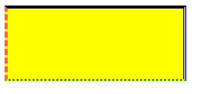
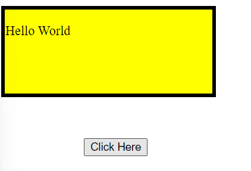
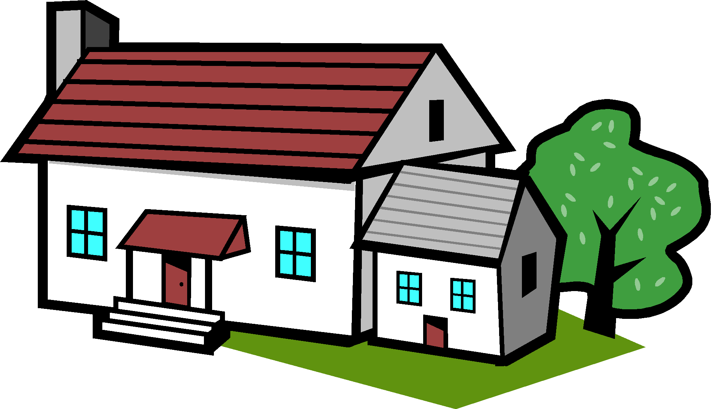
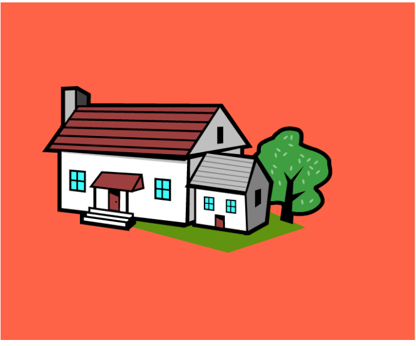
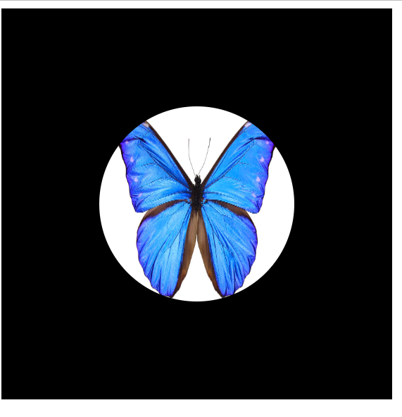

# Border, Margin, Padding

## Border

You can used following properties to give border to specific Location 👇.

```html
  border-top: solid 5px black;
  border-bottom: dotted 3px green;
  border-left: dashed 5px tomato;
  border-right: double 5px blue;
```

**💻Example :**
```html
<!DOCTYPE html>
<html >
<head>
    <title> CSS  </title>
    <style>
      .container{
        height: 100px;
        width: 250px;
        background-color: yellow;
        border-top: solid 5px black;
        border-bottom: dotted 3px green;
        border-left: dashed 5px tomato;
        border-right: double 5px blue;
      }
    </style>
</head>
<body> 
    <div class="container">

    </div>
</body>
</html>
   
```
**⚙️ Output :**

 

## Margin 

Margin is used to create Distance outside of the elements.

**All side Margin**

```html
  margin: 20px
```
**Margin at specific Location**

```html
  margin-left: 50px;
  margin-top: 50px;
  margin-right: 100px;
  margin-bottom: 100px'
```

## Negative margin 

```html
  margin-left: -5px
```

**💻Example :**
```html
<!DOCTYPE html>
<html >
<head>
    <title> CSS  </title>
    <style>
      .container{
        height: 100px;
        width: 250px;
        background-color: yellow;
        border: solid 5px black;
      }
      
      .btn{
        margin-top: 50px;
        margin-left: 100px;
      }
    </style>
</head>
<body> 
    <div class="container">
      <p> Hello World </p>
    </div>
    <button class="btn">Click Here </button>
</body>
</html>
```
**⚙️ Output :**




## Padding 

Padding is used to create distance inside the elements.


**💻Example :**
```html
<!DOCTYPE html>
<html >
<head>
    <title> CSS  </title>
    <style>
      .container{
        background-color: tomato;
        padding-left: 50px;
        padding-top: 100px;
        padding-bottom: 100px;
      }

    .img{
      height: 200px;
    }
    </style>
</head>
<body> 
    <div class="container">
        
    </div>
</body>
</html>
```
**⚙️ Output :**



## Image in Circle

**💻Example :**

```html
<!DOCTYPE html>
<html >
<head>
    <title> CSS  </title>
    <style>
      .container{
        background-color: black;
        width: 300px;
        height: 300px;
        padding: 50px;
      }

    .img{
      height: 200px;
      width: 200px;
      border-radius: 50%;
      padding: 50px;
    }
    </style>
</head>
<body> 
    <div class="container">
        
    </div>
</body>
</html>
   
```
**⚙️ Output :**




**💻Example :**

```html
<!DOCTYPE html>
<html >
<head>
    <title> CSS  </title>
    <style>
      .container{
           background-color: #80b3ff;
           width: 350px;
           padding: 20px;
           border-bottom: solid 5px #021e49;
           margin-top:50px;
      }

      .contact{
        font-size: 20px;
        margin-left: 10px;
      }

      .img{
        height: 50px;
        width: 50px;
      }
    </style>
</head>
<body> 
    <div class="container">
       
      <span class="contact"> Contact Us: +91-7821011979</span>
    </div>
</body>
</html>
   
```
**⚙️ Output :**


