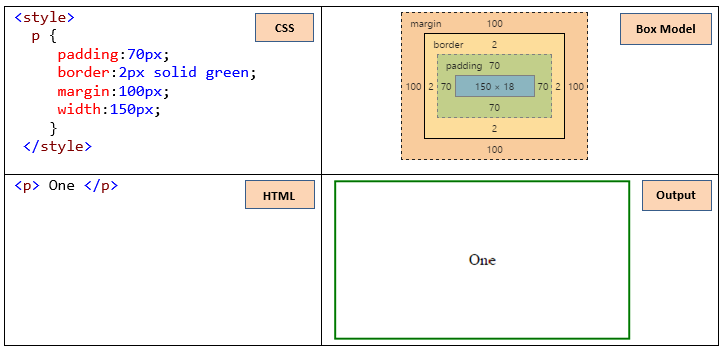
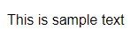
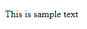
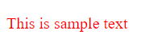
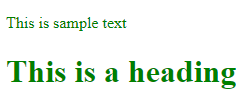
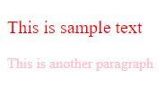
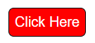

#  Box-Model, font-family, Types of CSS Integration

## Box-Model

The CSS box model means space occupied by actual HTML elements. It consists of: margins, borders, padding and the actual content.



## Font-family

There are five types of font families in CSS:
1. serif
2. sans serif 
3. monospace
4. cursive 
5. fantasy
 
**Syntax :**

```html
font-family: serif;

font-family: sans-serif;

font-family: monospace;

font-family: cursive;

font-family: fantasy;
``` 

**💻Example :**
```html
<!DOCTYPE html>
<html lang="en">
<head>
    <title>font-family</title>
    <style>
        p{
            font-family:"Arial";
        }
    </style>
</head>
<body>
    <p>This is sample text</p>
</body>
</html>
```
**⚙️ Output :**



**💻Example :**

```html
<!DOCTYPE html>
<html lang="en">
<head>
    <title>font-family</title>
    <style>
        p{
            font-family:"Times New Roman";
        }
    </style>
</head>
<body>
    <p>This is sample text</p>
</body>
</html>
```
**⚙️ Output :**



## There are three ways to add CSS

1. Document level / Internal CSS
2. Inline CSS => single element
3. External CSS

## Document level

```CSS  
Document level css used <style> element in the <head> section
```

**💻Example :**

```html
<!DOCTYPE html>
<html lang="en">
<head>
    <title>document level</title>
    <style>
        p {
            color: red;
        }
    </style>
</head>
<body>
    <p>This is sample text</p>
</body>
</html>
```
**⚙️ Output :**



**💻Example :**
```html
<!DOCTYPE html>
<html lang="en">
<head>
    <title>second document</title>
    <style>
        .g{
            color: green
        }
    </style>
</head>
<body>
    <p class="g">This is sample text</p>
    <h1 class="g">This is a heading</h1>
</body>
</html>
```
**⚙️ Output :**



## Inline CSS

**💻Example :**
```html
<!DOCTYPE html>
<html lang="en">
<head>
    <title>second document</title> 
</head>
<body>
    <p style="color: red; font-size: 20px;">This is sample text</p>
    <p style="color: pink;">This is another paragraph</p>
</body>
</html>
```
**⚙️ Output :**



## External CSS

HTML code

**💻Example :**
```html
<!DOCTYPE html>
<html lang="en">
<head>
    <title>First Document</title>
    <link rel="stylesheet" href="style.css"/>
</head>
<body>
    <button>Click Here</button>
</body>
</html>
```
CSS code

**💻Example :**

```css
button{
    background-color: red;
    color: white;
    padding: 5px;
    border-radius: 5px;
    border: 1px solid black;
}

```

**⚙️ Output :**



HTML code

**💻Example :**
```html
<!DOCTYPE html>
<html lang="en">
<head>
    <title>First Document</title>
    <link rel="stylesheet" href="style.css"/>
</head>
<body>
    <button class="mybutton">Click Here</button>
</body>
</html>
```
CSS code

**💻Example :**

```css
.mybutton{
    background-color: green;
    color: white;
    padding: 5px;
    border-radius: 15px;
    border: 1px dashed white;
}
```

**⚙️ Output :**


## 🏠 HomeWork

>1️⃣ Implement CSS using document level, inline and external with different selectors.
