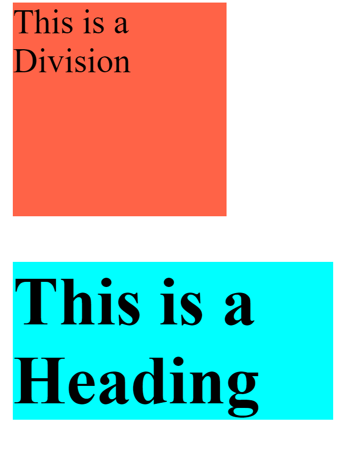
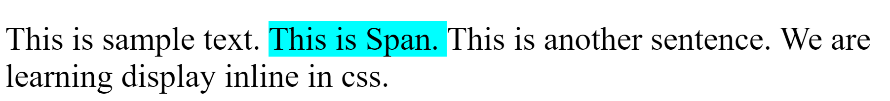
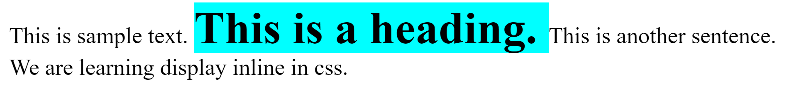
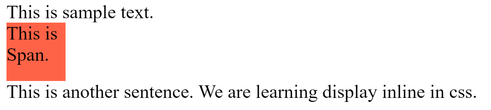
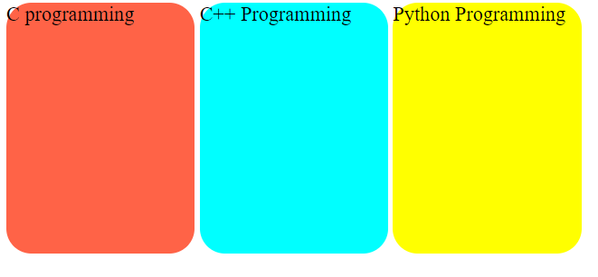

# Display block, inline and inline-block 

## Display 

Display is used to To Control the Layout.

**Display 2 Properties**

1. Block 
2. Inline

## Block elements 

Properties of block elements 

1. Start From new line.
2. Takes Full width of screen.
3. We can specify height and width.

```html
1. <div>
2. <h1>, <h2>, <h3>, <h4>, <h5>, <h6>
3. <p>
4. <form>
```

**💻Example :**
```html
<!DOCTYPE html>
<html >
<head>
    <title> Display-Block  </title>
    <style>
        .a{
            background-color: tomato;
            width: 100px;
            height: 100px;
        }

        .b{
            background-color: aqua;
            width: 150px;
        }
    </style>
</head>
<body> 
    <div class="a">
        This is a Division
    </div>

    <h1 class="b">
        This is a Heading
    </h1>
</body>
</html> 
```
**⚙️ Output :**

 

## Inline Elements 

Properties of inline elements 

1. Does not Start from new line.
2. Takes required width for content.
3. We can not specify height and width. (only we can give height and width for image in inline element.)

```html
1. <span>
2.  <a>
3. 
```

**💻Example :**
```html
<!DOCTYPE html>
<html >
<head>
    <title> Display-Inline  </title>
    <style>
        .a{
            background-color: aqua;
        }
    </style>
</head>
<body> 
   <p> This is sample text. <span class="a"> This is Span. </span> This is another sentence. We are learning display inline in css.</p>
</body>
</html>
```
**⚙️ Output :**




**💻Example :**
```html
<!DOCTYPE html>
<html >
<head>
    <title> Display-Inline  </title>
    <style>
        .a{
            background-color: aqua;
            display: inline;
        }
    </style>
</head>
<body> 
    This is sample text. <h1 class="a"> This is a heading. </h1> This is another sentence. We are learning display inline in css.
</body>
</html>
```
**⚙️ Output :**



**💻Example :**

```html
<!DOCTYPE html>
<html >
<head>
    <title> Display-Inline  </title>
    <style>
        .a{
            background-color: tomato;
            display: block;
            height: 50px;
            width: 50px;
        }
    </style>
</head>
<body> 
    This is sample text. <span class="a"> This is Span. </span> This is another sentence. We are learning display inline in css.
</body>
</html>
```
**⚙️ Output :**



## Inline-Block Property

1. You can give Height + width.
2. Start with same line.

**💻Example :**

```html
<!DOCTYPE html>
<html >
<head>
    <title> Display-Inline  </title>
    <style>
       .c{
        background-color: tomato;
        width: 150px;
        height: 200px;
        display: inline-block;
        border-radius: 20px;
       }

       .cpp{
        background-color: aqua;
        width: 150px;
        height: 200px;
        display: inline-block;
        border-radius: 20px;
       }

       .python{
        background-color: yellow;
        width: 150px;
        height: 200px;
        display: inline-block;
        border-radius: 20px;
       }
    </style>
</head>
<body> 
    <div class="c">
        C programming
    </div>

    <div class="cpp">
        C++ Programming
    </div>

    <div class="python">
        Python Programming
    </div>
</body>
</html>
```
**⚙️ Output :**




