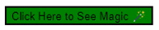
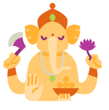
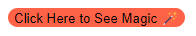

# Hover effect and positions

## Hover

The hover selector selects an element when the cursor is over it. Note: The hover selector works on all aspects, not just links.

**💻Example :**
```html
<!DOCTYPE html>
<html lang="en">
<head>
    <title>Document</title>
    <style>
        .btn{
            background-color:tomato;
        }
        .btn:hover{
            background-color: green;
        }
    </style>
</head>
<body>
    <button class="btn">Click Here to See Magic 🪄</button>
</body>
</html>
```
**⚙️ Output :**




**💻Example :**
```html
<!DOCTYPE html>
<html lang="en">
<head>
    <title>Document</title>
    <style>
        .btn{
            background-color:tomato;
        }
        .btn:hover{
            background-color: green;
            border-radius: 25px;
            color: white;
        }
    </style>
</head>
<body>
    <button class="btn">Click Here to See Magic 🪄</button>
</body>
</html>
```
**⚙️ Output :**


**💻Example :**
```html
<!DOCTYPE html>
<html lang="en">
<head>
    <title>Document</title>
    <style>
        .btn{
            background-color:tomato;
        }
        .btn:hover{
            background-color: green;
            border-radius: 25px;
            color: white;
            cursor: pointer;
        }
    </style>
</head>
<body>
    <button class="btn">Click Here to See Magic 🪄</button>
</body>
</html>
```
**⚙️ Output :**


**💻Example :**

```html
<!DOCTYPE html>
<html lang="en">
<head>
    <title>Document</title>
    <style>
        .img{
            width: 100px;
            height: 100px;
        }
        .img:hover{
            width: 200px;
            height: 200px;
        }
    </style>
</head>
<body>
    
</body>
</html>
```
**⚙️ Output :**





**💻Example :**

```html
<!DOCTYPE html>
<html lang="en">
<head>
    <title>Document</title>
    <style>
        .btn{
            background-color:tomato;
            cursor: pointer;
            border-radius: 25px;
        }
        .btn:hover{
            background-color: green;
            border-radius: 0px 25px 0px 25px;
            color: white;
        }
    </style>
</head>
<body>
    <button class="btn">Click Here to See Magic 🪄</button>
</body>
</html>
```
**⚙️ Output :**


**💻Example :**

```html
<!DOCTYPE html>
<html lang="en">
<head>
    <title>Document</title>
    <style>
        .btn{
            background-color:tomato;
            cursor: pointer;
            border-radius: 25px;
            border: none;
        }
        .btn:hover{
            background-color: green;
            border-radius: 0px 25px 0px 25px;
            color: white;
            border: 2px solid black;
        }
    </style>
</head>
<body>
    <button class="btn">Click Here to See Magic 🪄</button>
</body>
</html>
```
**⚙️ Output :**




## Positions

There are five different types of positions in css

1. Relative
2. fixed
3. absolute
4. sticky
5. static


## Relative
position: relative;
 
Relative to nearest element or original position.

In relative position we use left, right, top, bottom properties. In which left and top properties are more dominant.

**💻Example :**

```html
<!DOCTYPE html>
<html lang="en">
<head>
    <title>Document</title>
</head>
<style>
    .parent{
        width: 100%;
        height: 100vh;
        background-color: gold;
    }
    .child{
        height: 200px;
        width: 200px;
        background-color: green;
    }
</style>
<body>
    <div class="parent">
        <div class="child">

        </div>
    </div>
</body>
</html>
```
**⚙️ Output :**


**💻Example :**

```html
<!DOCTYPE html>
<html lang="en">
<head>
    <title>Document</title>
</head>
<style>
    .parent{
        width: 100%;
        height: 100vh;
        background-color: gold;
    }
    .child{
        height: 200px;
        width: 200px;
        background-color: green;
        position: relative;
        left: 200px;
        top: 200px;
    }
</style>
<body>
    <div class="parent">
        <div class="child">

        </div>
    </div>
</body>
</html>
```
**⚙️ Output :**


**💻Example :**

```html
<!DOCTYPE html>
<html lang="en">
<head>
    <title>Document</title>
</head>
<style>
    .parent{
        width: 1200px;
        height: 100vh;
        background-color: gold;
        margin-left: 200px;
    }
    .child{
        height: 200px;
        width: 200px;
        background-color: green;
        position: relative;
        left: 200px;
        top: 200px;
    }
</style>
<body>
    <div class="parent">
        <div class="child">

        </div>
    </div>
</body>
</html>
```
**⚙️ Output :**


## Fixed

Fixed is set with respect to viewport.

Viewport => Visible area on the browser.

**💻Example :**

```html
<!DOCTYPE html>
<html lang="en">
<head>
    <title>Document</title>
</head>
<style>
    .child{
        height: 200px;
        width: 200px;
        background-color: green;
        position: fixed;
        right: 0;
        bottom: 0;
    }
</style>
<body>
    <div class="child">
    </div>
</body>
</html>
```
**⚙️ Output :**


**💻Example :**

```html
<!DOCTYPE html>
<html lang="en">
<head>
    <title>Document</title>
</head>
<style>
    .child{
        height: 200px;
        width: 200px;
        background-color: green;
        position: fixed;
        right: 0;
        bottom: 200px;
    }
</style>
<body>
    <div class="child">
        <span>Subscribe Now</span>
    </div>
</body>
</html>
```
**⚙️ Output :**


**💻Example :**

```html
<!DOCTYPE html>
<html lang="en">
<head>
    <title>Document</title>
</head>
<style>
    .child{
        height: 200px;
        width: 200px;
        background-color: green;
        position: fixed;
        right: 0;
        bottom: 200px;
    }
</style>
<body>
    <div class="child">
        <span>Subscribe Now</span>
    </div>
    <br/><br/><br/><br/><br/><br/><br/><br/><br/><br/><br/>
    <br/><br/><br/><br/><br/><br/><br/><br/><br/><br/><br/>
    <br/><br/><br/><br/><br/><br/><br/><br/><br/><br/><br/>
    <br/><br/><br/><br/><br/><br/><br/><br/><br/><br/><br/>
    <br/><br/><br/><br/><br/><br/><br/><br/><br/><br/><br/>
    <br/><br/><br/><br/><br/><br/><br/><br/><br/><br/><br/>
    <br/><br/><br/><br/><br/><br/><br/><br/><br/><br/><br/>
    <h1>End</h1>

</body>
</html>
```
**⚙️ Output :**


**💻Example :**

```html
<!DOCTYPE html>
<html lang="en">
<head>
    <title>Document</title>
</head>
<style>
    .child{
        height: 200px;
        width: 200px;
        background-color: green;
        position: fixed;
        right: 0;
        bottom: 200px;
    }
</style>
<body>
    <div class="child">
        <span>Subscribe Now</span>
    </div>
    <br/><br/><br/><br/><br/><br/><br/><br/><br/><br/><br/>
    <br/><br/><br/><br/><br/><br/><br/><br/><br/><br/><br/>
    <span>One</span>
    <br/><br/><br/><br/><br/><br/><br/><br/><br/><br/><br/>
    <br/><br/><br/><br/><br/><br/><br/><br/><br/><br/><br/>
    <span>Two</span>
    <br/><br/><br/><br/><br/><br/><br/><br/><br/><br/><br/>
    <br/><br/><br/><br/><br/><br/><br/><br/><br/><br/><br/>
    <span>Three</span>
    <br/><br/><br/><br/><br/><br/><br/><br/><br/><br/><br/>
    <h1>End</h1>

</body>
</html>
```
**⚙️ Output :**


**💻Example :**

```html
<!DOCTYPE html>
<html lang="en">
<head>
    <title>Document</title>
</head>
<style>
    .child{
        height: 200px;
        width: 200px;
        background-color: green;
        position: fixed;
        right: 300px;
        bottom: 0;
    }
</style>
<body>
    <div class="child">
        <span>Subscribe Now</span>
    </div>
    <br/><br/><br/><br/><br/><br/><br/><br/><br/><br/><br/>
    <br/><br/><br/><br/><br/><br/><br/><br/><br/><br/><br/>
    <span>One</span>
    <br/><br/><br/><br/><br/><br/><br/><br/><br/><br/><br/>
    <br/><br/><br/><br/><br/><br/><br/><br/><br/><br/><br/>
    <span>Two</span>
    <br/><br/><br/><br/><br/><br/><br/><br/><br/><br/><br/>
    <br/><br/><br/><br/><br/><br/><br/><br/><br/><br/><br/>
    <span>Three</span>
    <br/><br/><br/><br/><br/><br/><br/><br/><br/><br/><br/>
    <h1>End</h1>

</body>
</html>
```
**⚙️ Output :**


## Absolute

This element is positioned relative to the first (non-static) ancestor element.

**💻Example :**

```html
<!DOCTYPE html>
<html lang="en">
<head>
    <title>Document</title>
</head>
<style>
    .btn{
        background-color:tomato;
        position: absolute;
        right: 0;
        top: 100px;
    }
    .container{
        background-color: green;
        height: 200px;
        width: 500px;
        position: relative;
    }
</style>
<body>
    <div class="container">
        <button class="btn">Click Here</button>
    </div>
</body>
</html>
```
**⚙️ Output :**


**💻Example :**

```html
<!DOCTYPE html>
<html lang="en">
<head>
    <title>Document</title>
</head>
<style>
    .btn{
        background-color:tomato;
        position: absolute;
        right: 0;
        top: 100px;
    }
    .container{
        background-color: green;
        height: 200px;
        width: 500px;
        position: relative;
        margin-top: 200px;
    }
</style>
<body>
    <div class="container">
        <button class="btn">Click Here</button>
    </div>
</body>
</html>
```
**⚙️ Output :**


## Sticky

**💻Example :**

```html
<!DOCTYPE html>
<html lang="en">
<head>
    <title>Document</title>
</head>
<style>
    .nav{
        background-color: tomato;
        padding: 10px;
        position: sticky;
        top: 0;
    }
</style>
<body>
    <h2>One</h2>
    <br/><br/><br/><br/><br/><br/><br/><br/>
    <br/><br/><br/><br/><br/><br/><br/><br/>
    <div class="nav">
        Home, About, Contact
    </div>
    <h2>Two</h2>
    <br/><br/><br/><br/><br/><br/><br/><br/>
    <br/><br/><br/><br/><br/><br/><br/><br/>
    <h2>Three</h2>
    <br/><br/><br/><br/><br/><br/><br/><br/>
    <br/><br/><br/><br/><br/><br/><br/><br/>
    <h2>Four</h2>
    <br/><br/><br/><br/><br/><br/><br/><br/>
    <br/><br/><br/><br/><br/><br/><br/><br/>
</body>
</html>
```
**⚙️ Output :**


