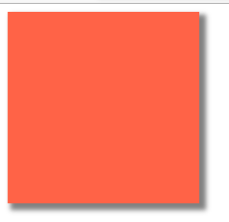
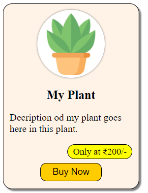

# Box-shadow and Card design

## Box Shadow 

The box-shadow adds shadow effects around an element's frame.

**Syntax:**
```html
box-shadow: 5px 5px 5px 2px #808080;


Explanation:

         h-shadow v-shadow  blur spread  color
             |       |      |      |       |
box-shadow: 5px    5px     5px    2px   #808080;
```

**💻Example :**
```html
<!DOCTYPE html>
<html >
<head>
    <title> Box Shadow  </title>
    <style>
        .box {
            height: 200px;
            width: 200px;
            background-color: tomato;
            box-shadow: 5px 5px 5px 2px #808080;
        }
    </style>
</head>
<body> 
   <div class="box">

   </div>
</body>
</html>
```
**⚙️ Output :**

 

**💻Example :**
```html
<!DOCTYPE html>
<html >
<head>
    <title> Box Shadow  </title>
    <style>
        .card {
            height: 280px;
            width: 200px;
            background-color: #fff2e6;
            box-shadow: 3px 3px 2px #808080;
            border-radius: 15px;
            border: 0.5px solid black;
            padding: 10px;
        }
        .card-img-container {
            background-color: white;
            margin: auto;
            padding: 5px;
            box-shadow: 0px 0px 3px #808080;
            width: 100px;
            height: 100px;
            border-radius: 50%;
        }

        .card-img {
            height: 100px;
            width: 100px;
            display: block;
            margin: auto;
        }

        .card-title {
            text-align: center;
            font-size: 20px;
        }

        .card-price-tag{
            text-align: center;
            width: 100px;
            background-color: yellow;
            display: block;
            padding: 2px;
            font-size: 15px;
            border-radius: 20px;
            border: 1px solid black;
            position: absolute;
            right: 0;
        }

        .card-price-tag-parent{
            position: relative;
        }

        .buy-button-container{
            position: relative;
            top: 30px;
            text-align: center;
        }

        .btn-buy-now{
            background-color: #ffcc00;
            border: 1px solid black;
            border-radius: 10px;
            padding: 5px;
            font-size: 15px;
            width:100px;
        }

        .btn-buy-now:hover{
            background-color: tomato;
        }

    </style>
</head>
<body> 
   <div class="card">
     <div class="card-img-container">
        
     </div>
       <h2 class="card-title"> My Plant </h2>
       <p> Decription od my plant goes here in this plant.</p>
       <div class="card-price-tag-parent">
        <span class="card-price-tag"> Only at ₹200/-</span>
        <div class="buy-button-container">
            <button class="btn-buy-now">Buy Now </button>
        </div>
       </div>
   </div>
</body>
</html>
```
**⚙️ Output :**


