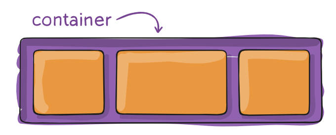
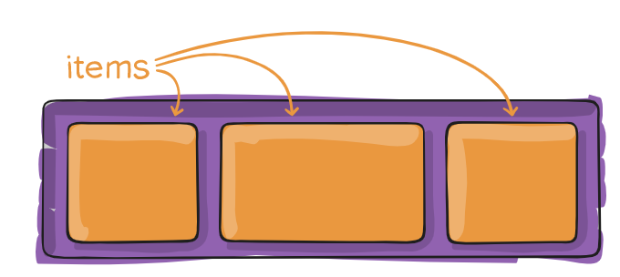

# Flexbox

## What is Flexbox?

flexbox stands for flexible box. It allows to create simple and layouts using different properties like `flex-direction`, `justify-content`, `align-items`, `flex-wrap`, `align-content` etc.

## To create flexbox layout we need to do following things

1. Create a *container* element with `display: flex` property.
   
2. Add flex *items* to the container.
    

