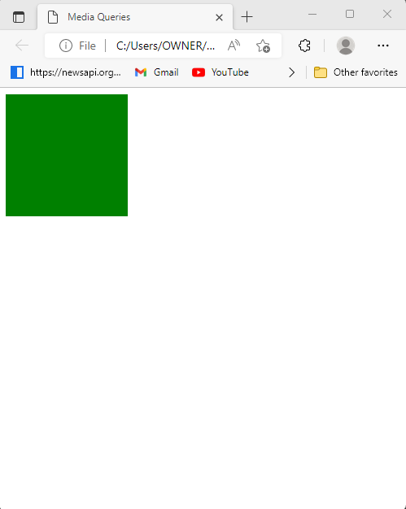
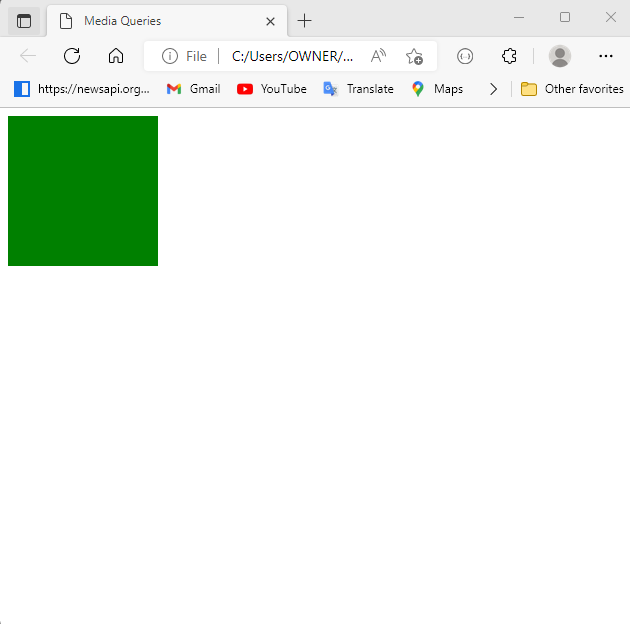
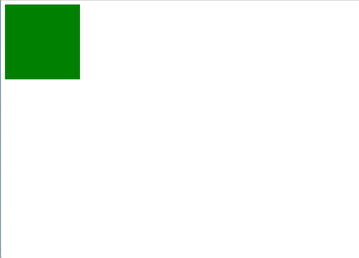
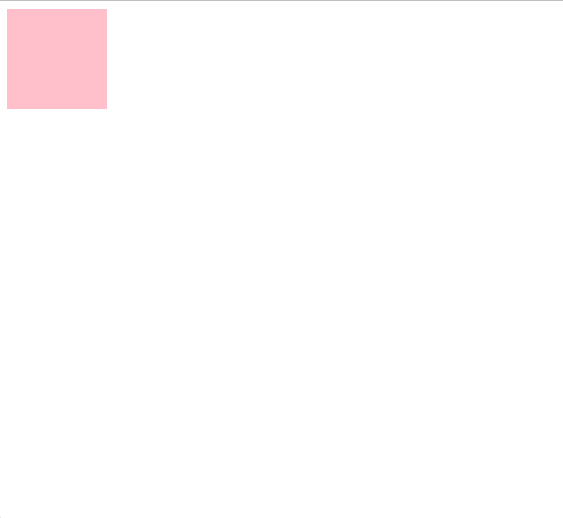

# Media Queries

## Responsive design using media query

Media Queries allow you to create responsive websites on all screen sizes, from desktop to mobile.

## Device Size

```css
1. Small mobile device  <600px
2. Normal mobile device >600px
3. Tablets              >768px
4. Laptops              >992px
5. TV/Large desktops    >1200px
```
**Syntax:**
```html
@media screen and (min-width:600px)
{

}

Explanation:-
@media => role
screen => type
(min-width:600px) => media feature

min-width => at least
max-width => less than this
```

**💻Example :**
```html
<!DOCTYPE html>
<html lang="en">
<head>
    <title>Media Queries</title>
    <style>
        .box{
            height: 350px;
            width: 350px;
            background-color: tomato;
        }
        @media screen and (max-width: 768px){
            .box{
                height: 150px;
                width: 150px;
                background-color: green;
            }
        }
    </style>
</head>
<body>
    <div class="box"></div>
</body>
</html>
```
**⚙️ Output :**




**💻Example :**
```html
<!DOCTYPE html>
<html lang="en">
<head>
    <title>Media Queries</title>
    <style>
        .box{
            height: 350px;
            width: 350px;
            background-color: tomato;
        }
        @media screen and (min-width: 600px) and (max-width: 768px) {
            .box{
                height: 150px;
                width: 150px;
                background-color: green;
            }
        }
    </style>
</head>
<body>
    <div class="box"></div>
</body>
</html>
```
**⚙️ Output :**




**💻Example :**
```html
<!DOCTYPE html>
<html lang="en">
<head>
    <title>Media Queries</title>
    <style>
        .box{
            height: 350px;
            width: 350px;
            background-color: tomato;
        }
        @media screen and (max-width: 600px){
            .box{
                height: 100px;
                width: 100px;
                background-color: pink;
            }
        }

        @media screen and (min-width: 601px) and (max-width: 768px){
            .box{
                height: 150px;
                width: 150px;
                background-color: green;
            }
        }

        @media screen and (min-width: 769px) and (max-width: 992px){
            .box{
                height: 200px;
                width: 200px;
                background-color: blue;
            }
        }
    </style>
</head>
<body>
    <div class="box"></div>
</body>
</html>
```
**⚙️ Output :**





