# Introduction to Git & GitHub

## GitHub 

**GitHub** => It is a Website which allows us to use git.

## Git 

**Git** => Git is a software is also known as Version Control System.

## 📝 Steps to Create Account in Github 

1. Open GitHub Website 👉 [Click Here to Open Github Website](https://github.com)
2. Click Sing up 
3. Enter Your Email 
4. Create password
5. Enter username 
6. Click the Create an account button. 
7. Complete the CAPTCHA puzzle.
8. Click the Verify email address button in the message from GitHub.


**💻 Use Of Github** => To store Codebase 

## 📁 Repository (Repo)

It is a Folder where we can upload Code for specific Project.

## 📝 Steps to Create Repository 

1. In the upper-right corner of github page, use the  + drop-down menu, and select New repository.


2. Enter name for your repository. For example, "Sample".

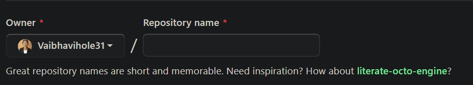

3. Choose a repository visibility.(Private / Public)

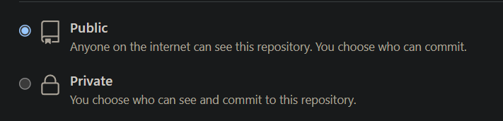

4. Click Create repository.

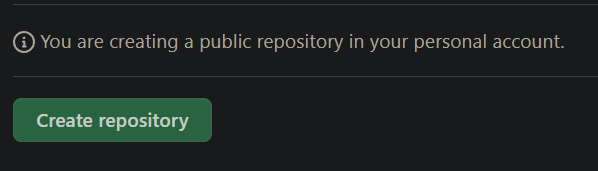

5. Upload Your Files. 

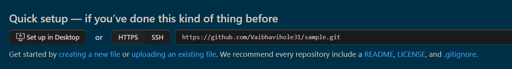

6. Choose Your File.

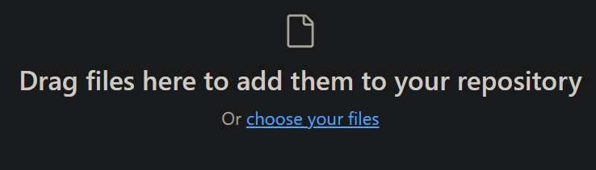

7. Click Commit Changes Button. 

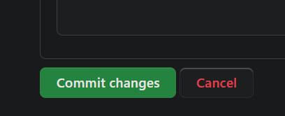

8. You can See your repository then click Your Profile .

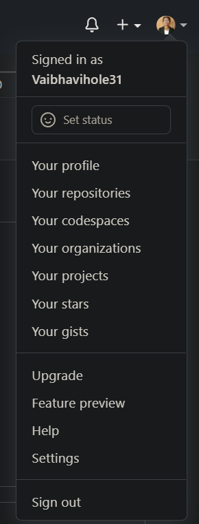

9. Then Click Repository menu.

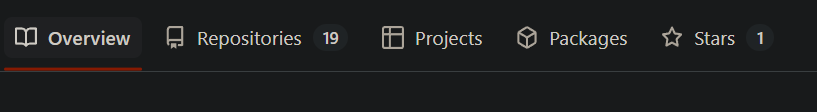

10. Then click your repository Name.

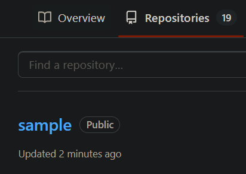

# Git Add, Commit, Push and Pull Commands

1. **ls** => List Folder and Files in Current working folder

2. **cd** => Change Directory

3. **pwd** => Current working directory

4. **```cd <foldername>```** => Change Directory 

5. **cd ..** => Go Back to previous directory

6. **```Git Clone <repo url>```** => Make a clone or copy of that repository 

7. **```ctrl + ~```** => To open Terminal

8. **git status** =>  Git status command displays the state of the working directory

9. **```git add <filename>```** => Add your file

10. **```git commit -m "<message>"```** => Commit your changes before you can push anything.

11. **git push** => The git push command is used to upload local repository content to your repository

12. **git pull** => The git pull command is used download content from a your repository

13. **git config --global user.name "RTC 4U"** => Globally Set User

14. **git config --global user.email "roadtocode4u@gmail.com"** => Globally Set Email

15. **git init** => To create a new repo, you use the git init command. Git init is a one-time command you use during a new repository initial setup.

## 🤔 How to push your code to GitHub using git commands?

Step 1 - Create a new GitHub Repository

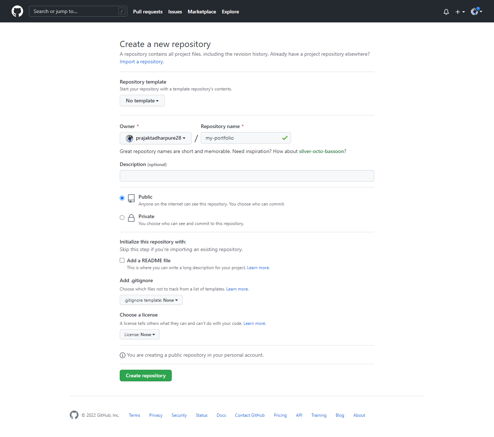

Step 2 - Initialize Git repository

```
git init
```
Step 3 - Add files in your local repository. 

```
git add index.html
```

Step 4 - Commit the file that you have add in your repository.

```
git commit -m "first commit"
```

Step 5 - Add remote origin

```
git remote add origin https://github.com/prajaktadharpure28/my-portfolio.git
```

Step 6 - Push to GitHub

```
git push -u origin main
```
## CI/CD Pipeline

CI/CD pipeline

CI => Continuous Integration <br>
CD => Continuous Deployment

pipeline => A pipeline is a series of steps that must be taken in order to deliver a new version of the software.

## 🤔 How to host or publish Website on Netlify ?

## 📝 Steps to Create Account in Netlify 

1. Open Netlify Website 👉 [Click Here to Open  Netlify Website](https://www.netlify.com/)
2. Click on Sign up 
3. Click on sign up with GitHub


4. Authorize Netlify

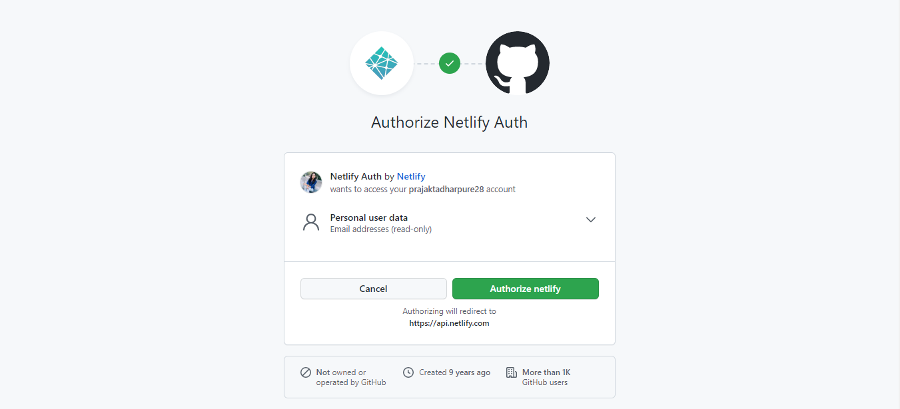

5. Fill netlify sign up questions

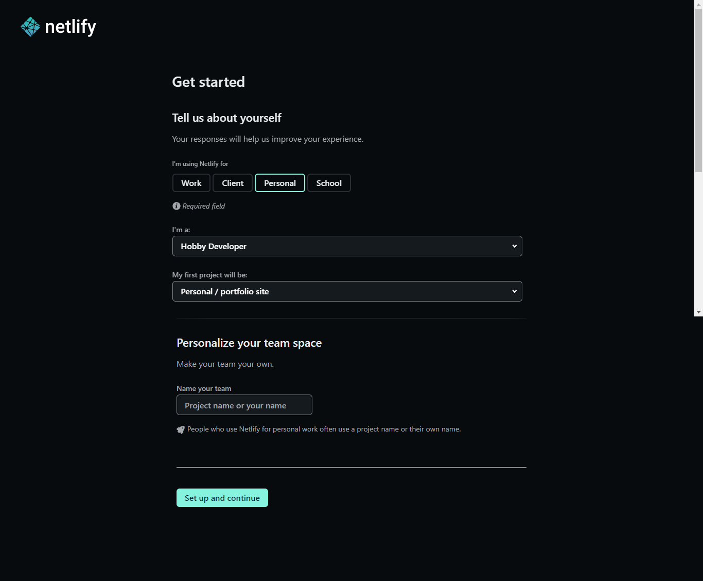

6. Click on Setup and continue


 
7. Skip this step for now.

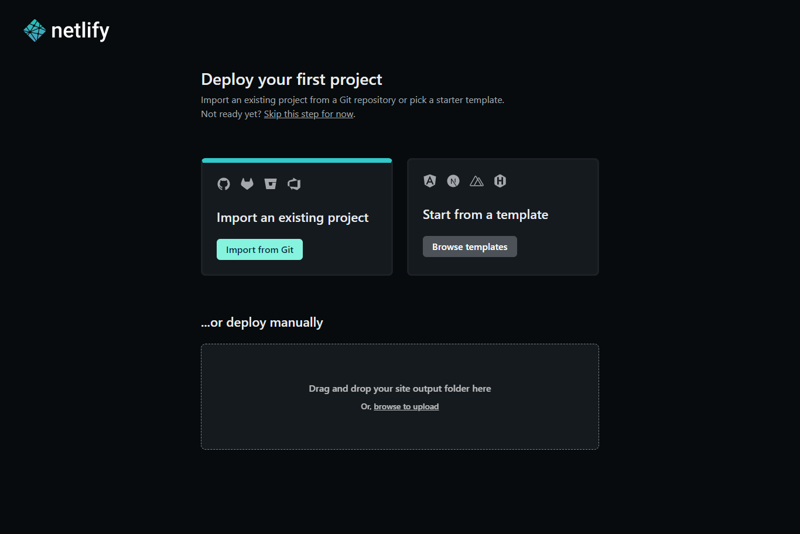

8. Import from Git 

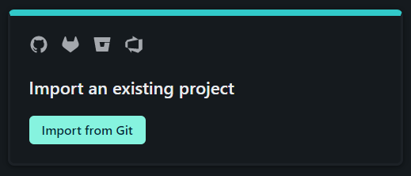

9. Connect to Git provider

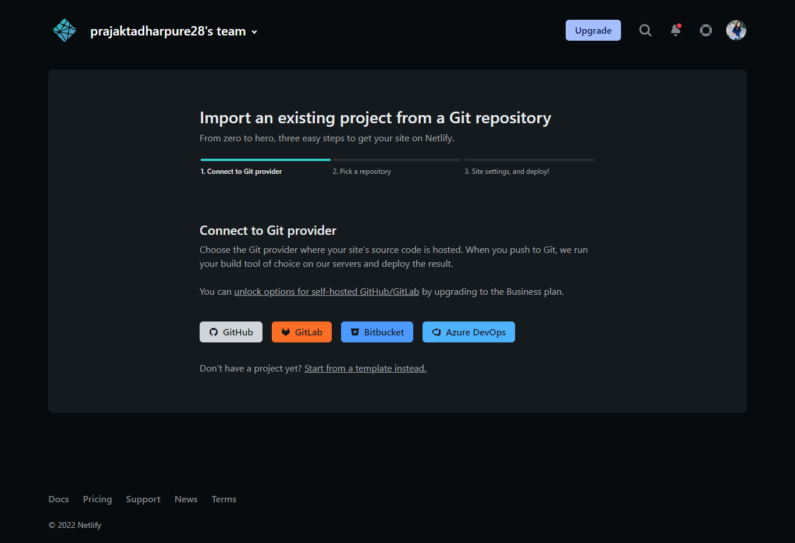

10. Authorize Netlify

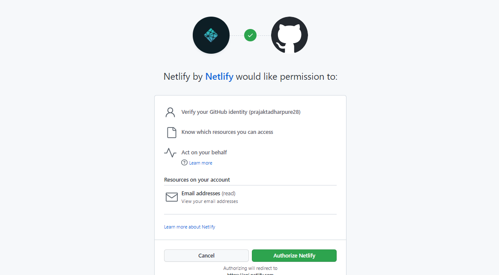

11. Install Netlify

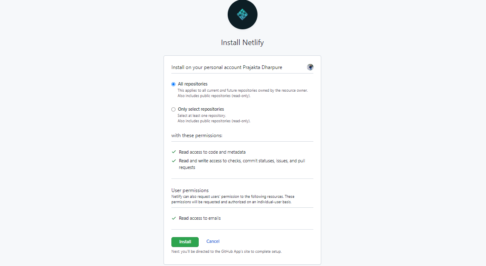

12. Select repository from GitHub

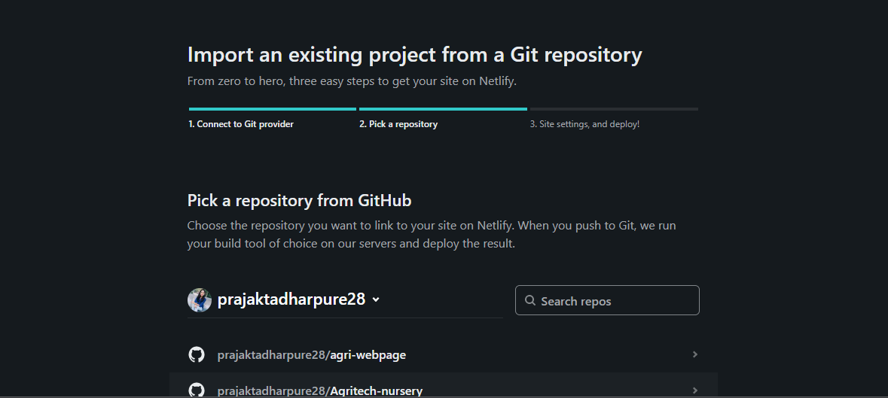

13. Select branch


14. Deploy site


15. Step of deploying site 

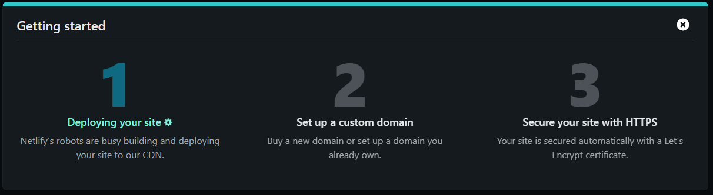

16. Publish your website

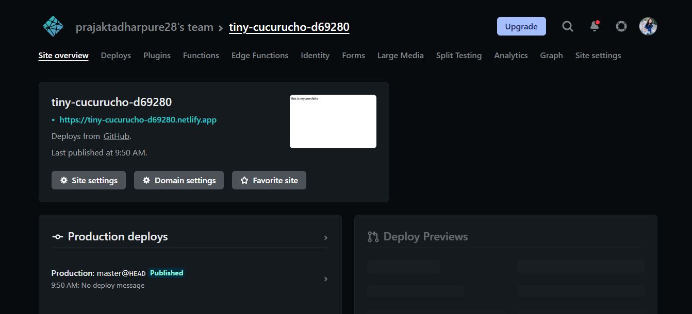

Your new website is live, and you can view it by clicking on the green link.

Your URL looks random now, but you can edit it by clicking the Site Settings button and then clicking on the Change Site Name button.

17. 🤔 How to change site name ?


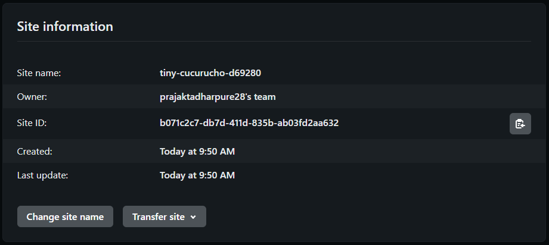


Congratulations, your first website is published now! Now we will learn how to publish a website using GitHub.

1. Go to your website repository

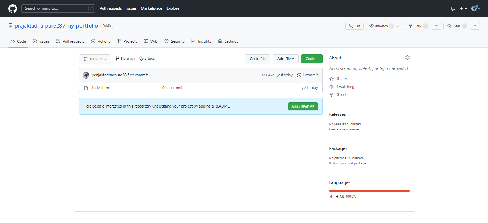

2. Select the settings icon

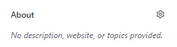

3. Add your website URL in the website section and then save the changes.

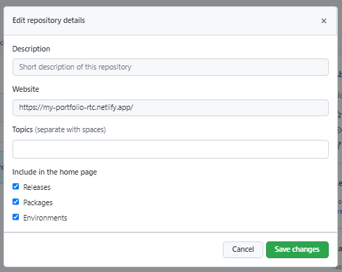

4. All Done

