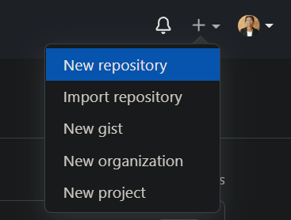

# Introduction to Git & GitHub

## GitHub 

**GitHub** => It is a Website which allows us to use git.

## Git 

**Git** => Git is a software is also known as Version Control System.

## 📝 Steps to Create Account in Github 

1. Open GitHub Website 👉 [Click Here to Open Github Website](https://github.com)
2. Click Sing up 
3. Enter Your Email 
4. Create password
5. Enter username 
6. Click the Create an account button. 
7. Complete the CAPTCHA puzzle.
8. Click the Verify email address button in the message from GitHub.

**💻 Use Of Github** => To store Codebase 

## 📁 Repository (Repo)

It is a Folder where we can upload Code for specific Project.

## 📝 Steps to Create Repository 

1. In the upper-right corner of github page, use the  + drop-down menu, and select New repository.

2. Enter name for your repository. For example, "Sample".

3. Choose a repository visibility.(Private / Public)

4. Click Create repository.

5. Upload Your Files. 

6. Choose Your File.

7. Click Commit Changes Button. 

8. You can See your repository then click Your Profile .

9. Then Click Repository menu.

10. Then click your repository Name.

