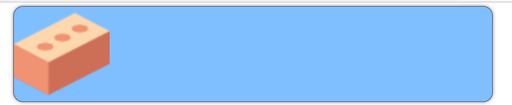

# Background Image and Gradient 

**Background**

    1. color
    2. image
    3. gradient


**Background Image**

```background-image: url('path');```

**💻Example :**
```html
<!DOCTYPE html>
<html >
<head>
    <title> Background Image </title>
    <style> 
      .card{
         background-color: #80bfff;
         height: 200px;
         width: 1000px;
         border-radius: 20px;
         box-shadow: 0px 0px 8px gray;
         margin-left: auto;
         margin-right: auto;
         border: 1px solid black;
         background-image: url('cat.png');
      }
    </style>
</head>
<body> 
   <div class="card">
      
   </div>
</body>
</html>
```
**⚙️ Output :**

 


**💻Example :**
```html
<!DOCTYPE html>
<html >
<head>
    <title> Background Image </title>
    <style> 
      .card{
         background-color: #80bfff;
         height: 200px;
         width: 1000px;
         border-radius: 20px;
         box-shadow: 0px 0px 8px gray;
         margin-left: auto;
         margin-right: auto;
         border: 1px solid black;
         background-image: url('brick.png');
      }
    </style>
</head>
<body> 
   <div class="card">
      
   </div>
</body>
</html>

 
```
**⚙️ Output :**

  

**Background Image Properties**

```
background-repeat: repeat;
background-repeat: no-repeat;
background-repeat: repeat-x;
background-repeat: repeat-y;
```

**💻Example :**
```html
<!DOCTYPE html>
<html >
<head>
    <title> Background Image </title>
    <style> 
      .card{
         background-color: #80bfff;
         height: 200px;
         width: 1000px;
         border-radius: 20px;
         box-shadow: 0px 0px 8px gray;
         margin-left: auto;
         margin-right: auto;
         border: 1px solid black;
         background-image: url('brick.png');
         background-repeat: no-repeat;
      }
    </style>
</head>
<body> 
   <div class="card">
      
   </div>
</body>
</html>

```
**⚙️ Output :**


**💻Example :**
```html
<!DOCTYPE html>
<html >
<head>
    <title> Background Image </title>
    <style> 
      .card{
         background-color: #80bfff;
         height: 200px;
         width: 1000px;
         border-radius: 20px;
         box-shadow: 0px 0px 8px gray;
         margin-left: auto;
         margin-right: auto;
         border: 1px solid black;
         background-image: url('brick.png');
         background-repeat: repeat-x;
      }
    </style>
</head>
<body> 
   <div class="card">
      
   </div>
</body>
</html>
```
**⚙️ Output :**


**💻Example :**
```html
<!DOCTYPE html>
<html >
<head>
    <title> Background Image </title>
    <style> 
      .card{
         background-color: #80bfff;
         height: 200px;
         width: 1000px;
         border-radius: 20px;
         box-shadow: 0px 0px 8px gray;
         margin-left: auto;
         margin-right: auto;
         border: 1px solid black;
         background-image: url('brick.png');
         background-repeat: repeat-y;
      }
    </style>
</head>
<body> 
   <div class="card">
      
   </div>
</body>
</html>
```
**⚙️ Output :**


**Background Position**

```
background-position : left bottom;
background-position : left top;
background-position : center top;
background-position : right top;
background-position : center bottom;
background-position : right bottom;
background-position : center center;
```

**💻Example :**
```html
<!DOCTYPE html>
<html >
<head>
    <title> Background Image </title>
    <style> 
      .card{
         background-color: #80bfff;
         height: 200px;
         width: 1000px;
         border-radius: 20px;
         box-shadow: 0px 0px 8px gray;
         margin-left: auto;
         margin-right: auto;
         border: 1px solid black;
         background-image: url('mountain.png');
         background-repeat: no-repeat;
         background-position: center bottom;
      }
    </style>
</head>
<body> 
   <div class="card">
      
   </div>
</body>
</html>
```
**⚙️ Output :**


**💻Example :**
```html
<!DOCTYPE html>
<html >
<head>
    <title> Background Image </title>
    <style> 
      .card{
         background-color: #80bfff;
         height: 200px;
         width: 1000px;
         border-radius: 20px;
         box-shadow: 0px 0px 8px gray;
         margin-left: auto;
         margin-right: auto;
         border: 1px solid black;
         background-image: url('mountain.png');
         background-repeat: no-repeat;
         background-position: right bottom;
      }
    </style>
</head>
<body> 
   <div class="card">
      
   </div>
</body>
</html>
```
**⚙️ Output :**


**💻Example :**
```html
<!DOCTYPE html>
<html >
<head>
    <title> Background Image </title>
    <style> 
      .card{
         background-color: #80bfff;
         height: 200px;
         width: 1000px;
         border-radius: 20px;
         box-shadow: 0px 0px 8px gray;
         margin-left: auto;
         margin-right: auto;
         border: 1px solid black;
         background-image: url('mountain.png');
         background-repeat: no-repeat;
         background-position: center center;
      }
    </style>
</head>
<body> 
   <div class="card">
      
   </div>
</body>
</html>
```
**⚙️ Output :**


**Background-size**
```
background-size : contain;
background-size : cover;
```

**💻Example :**
```html
<!DOCTYPE html>
<html >
<head>
    <title> Background Image </title>
    <style> 
      .card{
         background-color: #80bfff;
         height: 200px;
         width: 1000px;
         border-radius: 20px;
         box-shadow: 0px 0px 8px gray;
         margin-left: auto;
         margin-right: auto;
         border: 1px solid black;
         background-image: url('brick.png');
         background-repeat: no-repeat;
         background-size: contain;
      }
    </style>
</head>
<body> 
   <div class="card">
      
   </div>
</body>
</html>
```
**⚙️ Output :**



**💻Example :**
```html
<!DOCTYPE html>
<html >
<head>
    <title> Background Image </title>
    <style> 
      .card{
         background-color: #80bfff;
         height: 200px;
         width: 1000px;
         border-radius: 20px;
         box-shadow: 0px 0px 8px gray;
         margin-left: auto;
         margin-right: auto;
         border: 1px solid black;
         background-image: url('cat.png');
         background-repeat: no-repeat;
         background-size: cover;
      }
    </style>
</head>
<body> 
   <div class="card">
      
   </div>
</body>
</html>

```
**⚙️ Output :**


**Gradient**

**💻Example :**
```html
<!DOCTYPE html>
<html >
<head>
    <title> Background Image </title>
    <style> 
      .card{
         background-color: #80bfff;
         height: 200px;
         width: 1000px;
         border-radius: 20px;
         box-shadow: 0px 0px 8px gray;
         margin-left: auto;
         margin-right: auto;
         background-image: linear-gradient(to right, red,blue);
      }
    </style>
</head>
<body> 
   <div class="card">
      
   </div>
</body>
</html>
```
**⚙️ Output :**


