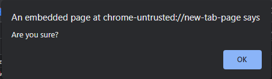

# Lecture-34 Introduction to JavaScript

## 🤔What is JavaScript ?

JavaScript is a dynamic programming language, a scripting language used to develop web applications, games, and more. It allows us to implement dynamic features on web pages that cannot do with just HTML and CSS.

Brendan Eich invented JavaScript in 1995.


## Brendan Eich


**💻Example :**
```html
console.log("Hello World")
```
**⚙️ Output :**

>Hello World

**💻Example :**
```html
alert("Are you sure?")
```
**⚙️ Output :**

  


You can Add JavaScript in Html elements then use this script tag. 👇

```html
<script>

</script>
```

**💻Example :**
```html
<!DOCTYPE html>
<html>
<head>
   <script>
    alert("Hello From JavaScript");
   </script>
</head>
<body>
    
</body>
</html>
```
**⚙️ Output :**


**💻Example :**
```html
<!DOCTYPE html>
<html>
<head>
   <script>
    alert("Bye Bye");
   </script>
</head>
<body>
    
</body>
</html>
```
**⚙️ Output :**


**💻Example :**
```html
<!DOCTYPE html>
<html>
<head>
   <script>
    alert("Hello From JavaScript");
    alert("Bye Bye");
   </script>
</head>
<body>
    
</body>
</html>
```
**⚙️ Output :**


## 🤔How to declare variable in javascript?

variable is used to store data.

There are four Ways to declare variable in javascript:

1. var
2. let
3. const

## let
Let keyword used to declare variables in JavaScript.
Variables defined using let cannot be re-declared.


**💻Example :**
```html
<!DOCTYPE html>
<html>
<head>
   <script>
    let age = 20;
    document.write(age);
   </script>
</head>
<body>
    
</body>
</html>
```
**⚙️ Output :**

>20

**💻Example :**

```html
<!DOCTYPE html>
<html>
<head>
   <script>
    let age = 20;
    age = 50;
    document.write(age);
   </script>
</head>
<body>
    
</body>
</html>
```
**⚙️ Output :**

>50

**💻Example :**
```html
<!DOCTYPE html>
<html>
<head>
   <script>
    let age = 20;
    document.write("Age: " + age);
   </script>
</head>
<body>
    
</body>
</html>
```
**⚙️ Output :**

>Age: 20

**💻Example :**
```html
<!DOCTYPE html>
<html>
<head>
   <script>
    let age;
    document.write("Age: " + age);
   </script>
</head>
<body>
    
</body>
</html>
```
**⚙️ Output :**

>Age: undefined

## const

**💻Example :**
```html
<!DOCTYPE html>
<html>
<head>
   <script>
    const age = 22;
    document.write("Age: " + age);
   </script>
</head>
<body>
    
</body>
</html>
```
**⚙️ Output :**

>Age: 22

**💻Example :**
```html
<!DOCTYPE html>
<html>
<head>
   <script>
    let val1 = 10;
    let val2 = 20;
    let sum = val1 + val2;
    document.write("Sum :" + sum);
   </script>
</head>
<body>
    
</body>
</html>
```
**⚙️ Output :**

>Sum :30

## Difference between var, let and const
### var

* The scope of the var variable is the functional scope.

* It can be updated and re-declared in scope.

* It can be declared without initialization.

* It can be accessed without initialization because its default value is undefined.

### let

* Let allow us to declare a variable that is limited to the scope of a block.

* In let first we declare variable and second time we used so there is no need to write second time.

* It can be declared without initialization.

* It cannot accessed without initialization, or a "reference error" will be raised.

### const

* The scope of the const variable is block scope.

* It cannot be updated or re-declared in scope.

* It cannot be accessed without initialization because it cannot be declared without initialization.
## 🏠 HomeWork

>1️⃣  Write a JavaScript program to perform arithmetic operators.
