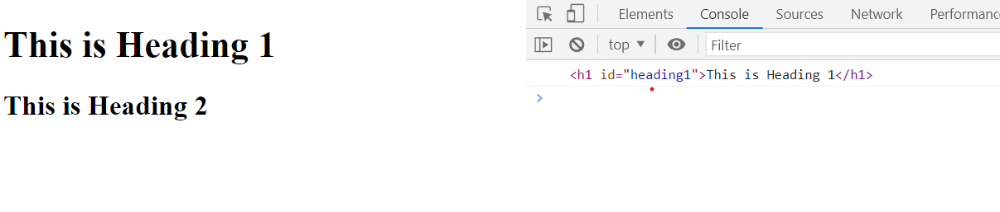
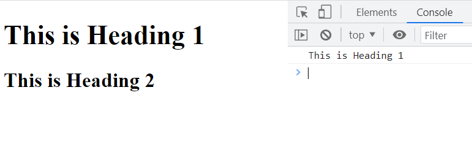
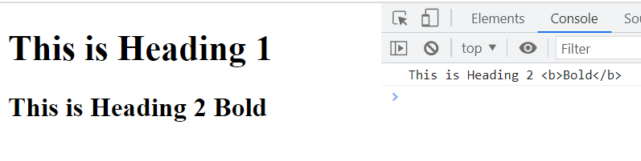
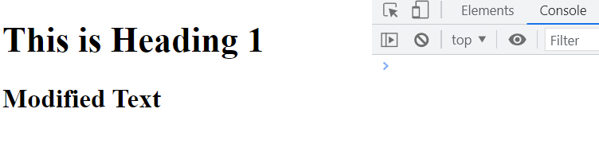
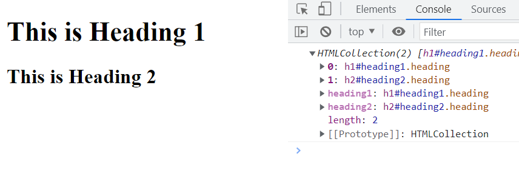
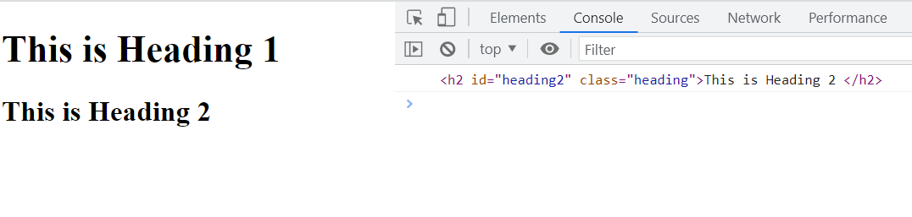
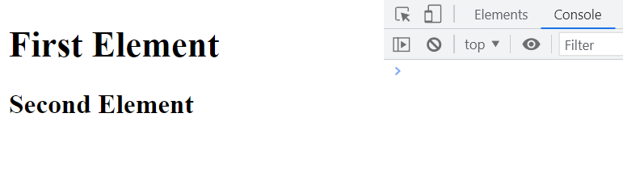
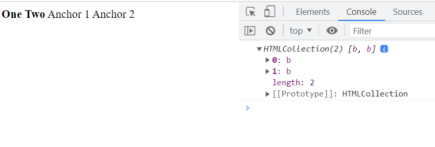
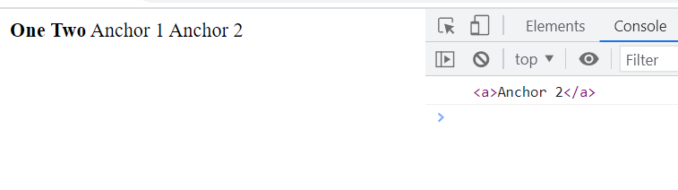

## Element Selectors in Javascript

**Case**

1. Camel Case 
   
   ex: HelloWorldBye

   ex: helloWorldBye

2. Snake case 

    ex : hello_world

**Element Selectors in Javascript**

```html
1. getElementById()
2. getElementsByClassName()
3. getElementsByTagName()
````

**getElementById()**

**💻Example :**
```html
<!DOCTYPE html>
<html>
<head>
    <title> Javscript </title>
</head>

<body>
    <h1 id="heading1">This is Heading 1</h1>

    <h2 id="heading2">This is Heading 2</h2>

    <script>
      const tag = document.getElementById("heading1");
     console.log(tag);
    </script>
</body>
</html>
```
**⚙️ Output :**

 

**Properties**
1. innerHTML
2. innerText

**💻Example :**
```html
<!DOCTYPE html>
<html>
<head>
    <title> Javscript </title>
</head>

<body>
    <h1 id="heading1">This is Heading 1</h1>

    <h2 id="heading2">This is Heading 2</h2>


    <script>
      const tag = document.getElementById("heading1");
     console.log(tag.innerText);
    </script>
</body>
</html>
```
**⚙️ Output :**

  

**💻Example :**
```html
<!DOCTYPE html>
<html>
<head>
    <title> Javscript </title>
</head>

<body>
    <h1 id="heading1">This is Heading 1</h1>

    <h2 id="heading2">This is Heading 2 <b>Bold</b> </h2>


    <script>
      const tag = document.getElementById("heading2");
     console.log(tag.innerHTML);
    </script>
</body>
</html>
```
**⚙️ Output :**



**💻Example :**
```html
<!DOCTYPE html>
<html>
<head>
    <title> Javscript </title>
</head>

<body>
    <h1 id="heading1">This is Heading 1</h1>

    <h2 id="heading2">This is Heading 2 </h2>

    <script>
      const tag = document.getElementById("heading2");
      tag.innerHTML = "Modified Text"
    </script>
</body>
</html>
```
**⚙️ Output :**



**getElementsByClassName()**

**💻Example :**
```html
<!DOCTYPE html>
<html>
<head>
    <title> Javscript </title>
</head>

<body>
    <h1 id="heading1" class="heading">This is Heading 1</h1>

    <h2 id="heading2" class="heading">This is Heading 2 </h2>

    <script>
      const tags = document.getElementsByClassName("heading");
      console.log(tags);
    </script>
</body>
</html>
```
**⚙️ Output :**



**💻Example :**
```html
<!DOCTYPE html>
<html>
<head>
    <title> Javscript </title>
</head>

<body>
    <h1 id="heading1" class="heading">This is Heading 1</h1>

    <h2 id="heading2" class="heading">This is Heading 2 </h2>

    <script>
      const tags = document.getElementsByClassName("heading");
      console.log(tags[1]);
    </script>
</body>
</html>
```
**⚙️ Output :**



**💻Example :**
```html
<!DOCTYPE html>
<html>
<head>
    <title> Javscript </title>
</head>

<body>
    <h1 id="heading1" class="heading">This is Heading 1</h1>

    <h2 id="heading2" class="heading">This is Heading 2 </h2>

    <script>
      const tags = document.getElementsByClassName("heading");
      tags[0].innerHTML = "First Element";
      tags[1].innerHTML = "Second Element";
    </script>
</body>
</html>
```
**⚙️ Output :**



**getElementsByTagName()**

**💻Example :**
```html
<!DOCTYPE html>
<html>
<head>
    <title> Javscript </title>
</head>

<body>
    
    <b>One</b>
    <b>Two</b>
    <a>Anchor 1</a>
    <a>Anchor 2</a>

    <script>
      const tags = document.getElementsByTagName("b");
      console.log(tags);
    </script>
</body>
</html>
```
**⚙️ Output :**



**💻Example :**
```html
<!DOCTYPE html>
<html>
<head>
    <title> Javscript </title>
</head>

<body>
    
    <b>One</b>
    <b>Two</b>
    <a>Anchor 1</a>
    <a>Anchor 2</a>

    <script>
      const tags = document.getElementsByTagName("a");
      console.log(tags[1]);
    </script>
</body>
</html>
```
**⚙️ Output :**



