## Events in Javascript

JavaScript interacts with HTML through events when the browser manipulates the page. When a page loads, it's called an event. When user clicks on a button, that click is also an event.

**Types of events in javascript**

* onClick
* onChange
* onmouseover
* onmouseout
* onkeydown
* onload

**onClick**

The onClick event occurs when the user clicks on an element.

**💻Example :**
```html
<!DOCTYPE html>
<html>
<head>
    <script>

    </script>
</head>
<body>
    <button onClick="console.log('Button is clicked..')">Click Me</button>
</body>
</html>
```
**⚙️ Output :**

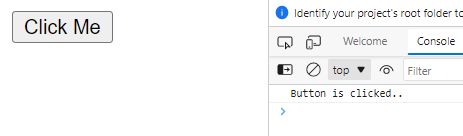


**function**

The function is a block of code that is executed when the event occurs.

**Syntax :**

```javascript

function functionName() {
    // code to be executed
}

```

**💻Example :**
```javascript
function clickMe()
{
    console.log('Clicked..')
}

clickMe()
clickMe()
clickMe()
```

**⚙️ Output :**

> Clicked..<br>
Clicked..<br>
Clicked..

**💻Example :**
```html
<!DOCTYPE html>
<html>
<head>
    <script>
        function clickMe() 
        {
            console.log('Clicked..');
        }
    </script>
</head>
<body>
    <button onClick="clickMe()">Click here</button>
</body>
</html>
```

**⚙️ Output :**

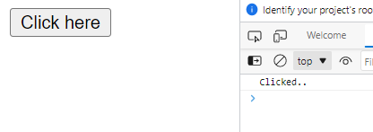


**💻Example :**
```html
<!DOCTYPE html>
<html>
<head>
    <script>
        let count = 0;
        function clickMe() 
        {
            count++;
            console.log('Clicked '+count+' times...')
        }
    </script>
</head>
<body>
    <button onClick="clickMe()">Click here</button>
</body>
</html>
```

**⚙️ Output :**

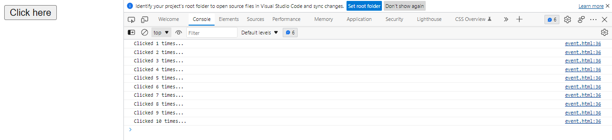

**💻Example :**
```html
<!DOCTYPE html>
<html>
<head>
    <script>
        let count = 0;
        function clickMe() 
        {
            count++;
            document.getElementById('counter').innerHTML = count;
        }
    </script>
</head>
<body>
    <h1 id="counter">0</h1>

    <button onClick="clickMe()">Tap Me</button>
</body>
</html>
```

**⚙️ Output :**

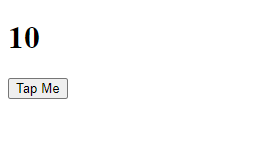

**💻Example :**
```html
<!DOCTYPE html>
<html>
<head>
    <script>
        let count = 0;
        function clickMe() 
        {
            count++;
            document.getElementById('counter').innerHTML = count;
        }

        function reset() 
        {
            count = 0;
            document.getElementById('counter').innerHTML = count;
        }
    </script>
</head>
<body>
    <h1 id="counter">0</h1>

    <button onClick="clickMe()">Tap Me</button>
    <button onClick="reset()">Reset to Zero</button>
</body>
</html>
```

**⚙️ Output :**

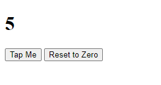

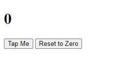

**💻Example :**
```html
<!DOCTYPE html>
<html>
<head>
    <script>
        let count = 0;
        function inc()
        {
            count++;
            document.getElementById('counter').innerHTML = count;
        }

        function reset() 
        {
            count = 0;
            document.getElementById('counter').innerHTML = count;
        }

        function dec()
        {
            count--;
            document.getElementById('counter').innerHTML = count;
        }
    </script>
</head>
<body>
    <h1 id="counter">0</h1>

    <button onClick="inc()">+</button>
    <button onClick="reset()">Reset to Zero</button>
    <button onClick="dec()">-</button>
</body>
</html>
```

**⚙️ Output :**

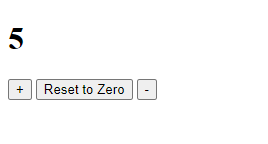

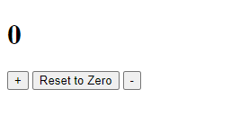

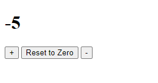

**onChange**

The onChange event occurs when the value of an element has been changed.

**💻Example :**
```html
<!DOCTYPE html>
<html>
<head>
    <script>
        
    </script>
</head>
<body>
    <input type="text" onchange="console.log('changed')" onclick="console.log('clicked')" placeholder="Enter Full name" />
</body>
</html>
```

**⚙️ Output :**

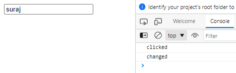

**💻Example :**
```html
<!DOCTYPE html>
<html>
<head>
    <script>
        
    </script>
</head>
<body>
    <input type="text" onchange="console.log('changed')" placeholder="Enter Full name" />
</body>
</html>
```

**⚙️ Output :**

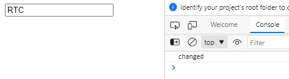

**onkeydown**

The onkeydown event occurs when the user is pressing a key.

**💻Example :**
```html
<!DOCTYPE html>
<html>
<head>
    <script>

    </script>
</head>
<body>
    <input type="text" onkeydown="console.log('key down')" placeholder="Enter Full name" />
</html>
```

**⚙️ Output :**

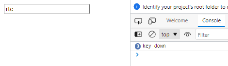

**keypress**

The keypress event occurs when the user presses a key.

**💻Example :**
```html
<!DOCTYPE html>
<html>
<head>
    <script>
        
    </script> 
</head>
<body>
    <input type="text" onkeypress="console.log('key press')" placeholder="Enter Full name" />   
</html>
```

**⚙️ Output :**

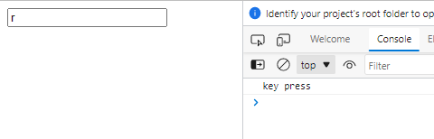

**onkeydown vs onkeypress**

The onkeydown event occurs when the user is pressing a key.

The onkeypress event occurs when the user presses a key.

**💻Example :**
```html
<!DOCTYPE html>
<html>
<head>
    <script>
        
    </script> 
</head>
<body>
    <input type="text" onkeypress="console.log('key press')"
    onkeydown="console.log('key down')" 
    placeholder="Enter Full name" />
</html>
```

**⚙️ Output :**

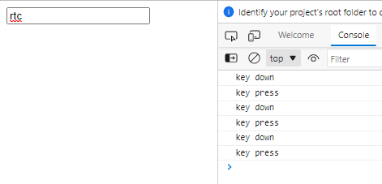

**onkeyup**

The onkeyup event occurs when the user releases a key.

**💻Example :**
```html
<!DOCTYPE html>
<html>
<head>
    <script>
        
    </script> 
</head>
<body>
    <input type="text" onkeypress="console.log('key press')"
    onkeydown="console.log('key down')" 
    onkeyup="console.log('key up')"
    placeholder="Enter Full name" />
</html>
```

**⚙️ Output :**

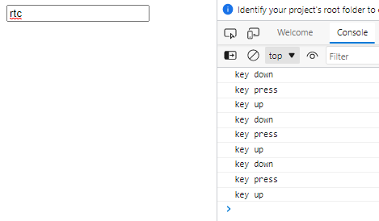

**onload**

The onload event occurs when an object has been loaded.

**💻Example :**
```html
<!DOCTYPE html>
<html>
<head>
    <script>
        
    </script>
</head>
<body onload="console.log('webpage loading is completed')">
    <h1></h1>
</html>
```

**⚙️ Output :**

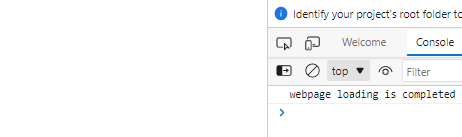

**MOUSE EVENTS**

**onmouseover**

The onmouseover event occurs when the pointer is moved onto an element.

**💻Example :**
```html
<!DOCTYPE html>
<html>
<head>
    <script>
        
    </script>
</head>
<body>
    <button 
    onmouseover="console.log('mouse comes in')">
    Mouse Events
    </button>
</html>
```

**⚙️ Output :**

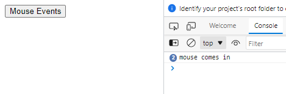

**onmouseout**

The onmouseout event occurs when a user moves the mouse pointer out of an element.

**💻Example :**
```html
<!DOCTYPE html>
<html>
<head>
    <script>
        
    </script>
</head>
<body>
    <button 
    onmouseout="console.log('mouse goes out')">
    Mouse Events
    </button>
</html>
```

**⚙️ Output :**

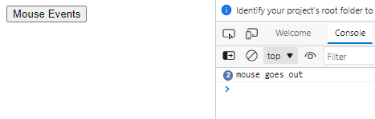

**💻Example :**
```html
<!DOCTYPE html>
<html>
<head>
    <script>
        
    </script>
</head>
<body>
    <button 
    onmouseover="console.log('mouse comes in')"
    onmouseout="console.log('mouse goes out')">
    Mouse Events
    </button>
</html>
```

**⚙️ Output :**

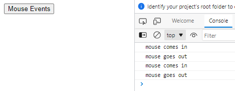

**show**

The show method displays the selected elements.

**💻Example :**
```html
<!DOCTYPE html>
<html lang="en">
<head>
    <script>
        function showData()
        {
            let userName = document.getElementById("fullName").value;

            document.querySelector('h2').innerHTML = "Hello, "+userName;
        }
    </script>
</head>
<body>
    <input type="text" placeholder="Enter Your Name" id="fullName" />

    <br/><br/>

    <button onclick="showData()">Show</button>

    <br/>
    <h2></h2>
</body>
</html>
```

**⚙️ Output :**

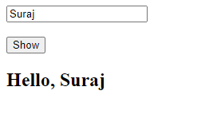

**onkeypress**

The onkeypress event occurs when the user presses a key.

**onkeyup**

The onkeyup event occurs when the user releases a key.

**💻Example :**
```html
<!DOCTYPE html>
<html lang="en">
<head>
    <script>
        function showData()
        {
            let userName = document.getElementById("fullName").value;

            document.querySelector('h2').innerHTML = "Hello, "+userName;
        }
    </script>
</head>
<body>
    <input type="text" placeholder="Enter Your Name" id="fullName" 
    onkeyup="showData()" />

    <br/><br/>
    
    <h2></h2>
</body>
</html>
```

**⚙️ Output :**

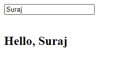