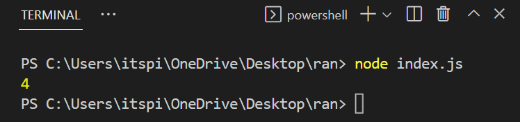

## Node JS

Node js is a JavaScript runtime environment.

**💻Example :**
```html
let a = 5;
let b = 10
let ans = a + b;
console.log(ans);
```
**⚙️ Output :**

  

**💻Example :**
```html
console.log('Hello STudents...');
```
**⚙️ Output :**


## Array in Javascript

It is collection of data.
It is used store multiple values in a single variable.

```html
const arr = ['a','b']
```

**💻Example :**
```html
const students = ["Aniket","Jayashree","Pranali","Avishkar"]
console.log(students);
```
**⚙️ Output :**


**Javascript Arrays allows us to store values of different datatypes**

```html
const arr = ["Aniket",0.5, 15,"Avishkar"]
console.log(arr);
```
**⚙️ Output :**


**Accessing Specific element in array**

```html
const arr = ["Aniket",0.5, 15,"Avishkar"]
console.log(arr[0]);
```

**⚙️ Output :**


## Methods 

**Push()**

It adds elements from end.

```html
arrayname.push(elements)
```

**💻Example :**
```html
const arr = []

arr.push("sakshi")
arr.push("Shwete")
console.log(arr);

arr.push("Mukesh")
arr.push("Ankit")
console.log(arr);
```
**⚙️ Output :**


**pop()**

It removes last elements from an array

**💻Example :**
```html
const arr = ["Satyam","Dhirendra","Avishkar","Rupal"]
console.log(arr);

arr.pop()
console.log(arr);
```
**⚙️ Output :**


**Length**

Counts total elements in a array.

Javascript arrays are autogrowing.

```html
const arr = ["Satyam","Dhirendra","Avishkar","Rupal"]

console.log(arr.length);
```

**⚙️ Output :**



**Reverse**

```html
const arr = ["Satyam","Dhirendra","Avishkar","Rupal"]

console.log(arr);

arr.reverse()

console.log(arr);
```

**⚙️ Output :**

