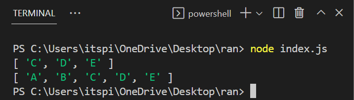

## Node JS

Node js is a JavaScript runtime environment.

**💻Example :**
```html
let a = 5;
let b = 10
let ans = a + b;
console.log(ans);
```
**⚙️ Output :**

  

**💻Example :**
```html
console.log('Hello STudents...');
```
**⚙️ Output :**


## Array in Javascript

It is collection of data.
It is used store multiple values in a single variable.

```html
const arr = ['a','b']
```

**💻Example :**
```html
const students = ["Aniket","Jayashree","Pranali","Avishkar"]
console.log(students);
```
**⚙️ Output :**


**Javascript Arrays allows us to store values of different datatypes**

```html
const arr = ["Aniket",0.5, 15,"Avishkar"]
console.log(arr);
```
**⚙️ Output :**


**Accessing Specific element in array**

```html
const arr = ["Aniket",0.5, 15,"Avishkar"]
console.log(arr[0]);
```

**⚙️ Output :**


## Methods 

**Push()**

It adds elements from end.

```html
arrayname.push(elements)
```

**💻Example :**
```html
const arr = []

arr.push("sakshi")
arr.push("Shwete")
console.log(arr);

arr.push("Mukesh")
arr.push("Ankit")
console.log(arr);
```
**⚙️ Output :**


**pop()**

It removes last elements from an array

**💻Example :**
```html
const arr = ["Satyam","Dhirendra","Avishkar","Rupal"]
console.log(arr);

arr.pop()
console.log(arr);
```
**⚙️ Output :**


**Length**

Counts total elements in a array.

Javascript arrays are autogrowing.

```html
const arr = ["Satyam","Dhirendra","Avishkar","Rupal"]

console.log(arr.length);
```

**⚙️ Output :**


**Reverse**

```html
const arr = ["Satyam","Dhirendra","Avishkar","Rupal"]

console.log(arr);

arr.reverse()

console.log(arr);
```

**⚙️ Output :**


**tostring()**

toString() method convert array to string.

**💻Example :**
 
```html
const arr = ["Satyam", "Dhirendra", "Avishkar"]

console.log(arr);

console.log(arr.toString());
```
**⚙️ Output :**


**join**

It is similar to toString() method but we can specify seperator.

**💻Example :**

```html
const arr = ["satyam", "dhirendra", "avishkar"]

console.log(arr);

console.log(arr.join(","));
```

**⚙️ Output :**


**💻Example :**

```html
const arr = ["satyam", "dhirendra", "avishkar"]

console.log(arr);

let arrStr = arr.join("$")
console.log(arrStr);

console.log(arr);
```

**⚙️ Output :**


**shift**

Shift method removes the starting elements.

**💻Example :**

```html
const arr = ["satyam", "dhirendra", "avishkar"]

console.log(arr);

arr.shift()

console.log(arr);
```

**⚙️ Output :**


**unshift**

unshift method add the elements in the starting.

**💻Example :**

```html
const arr = ["satyam", "dhirendra", "avishkar"]

console.log(arr);

arr.unshift("shital")
console.log(arr);

arr.unshift("utkarsha")
console.log(arr);
```

**⚙️ Output :**


**update**

**💻Example :**

```html
const arr = ["satyam", "dhirendra", "avishkar"]

console.log(arr);

arr[1] = "Rupal"

console.log(arr);
```

**⚙️ Output :**


**splice**

```html
splice(index, no.of elements to delete, elements to insert)
```

**💻Example :**

```html
const arr = ["Mouse", "Laptop", "Keyborad", "USB", "Pen Drive"]

console.log(arr);

arr.splice(2, 2)

console.log(arr);
```

**⚙️ Output :**


**💻Example :**

```html
const arr = ["Mouse", "Laptop", "Keyborad", "USB", "Pen Drive"]

console.log(arr);

arr.splice(2, 2, "Monitor", "Mouse Pad")

console.log(arr);
```

**⚙️ Output :**


**💻Example :**

```html
const arr = ["Mouse", "Laptop", "Keyborad", "USB", "Pen Drive"]

console.log(arr);

arr.splice(2, 0, "Monitor")

console.log(arr);
```

**⚙️ Output :**


**slice**

**💻Example :**

```html
const arr = ["A", "B", "C", "D", "E"]

let pieceArray = arr.slice(2)
console.log(pieceArray);

console.log(arr);
```

**⚙️ Output :**



**💻Example :**

```html
const arr = ["A", "B", "C", "D", "E"]

let pieceArray = arr.slice(1,4)
console.log(pieceArray);

```

**⚙️ Output :**


