## JSON 

```html
Javascript Object Notations
```
Use of json => Data Protability

## object => 

```html
{
    <key1>:<value>,
    <key2>:<value>
}
```
key is always in string formate. 
value are number, string, boolean, array formate.

**💻Example :**
```html
const colors = {
    red: '#ff0000',
    green: '#00ff00',
    blue: '#0000ff'
}

console.log(colors);
```
**⚙️ Output :**

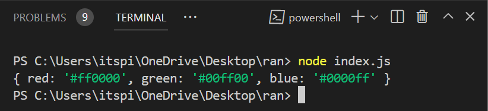  

**💻Example :**
```html
const colors = {
    red: '#ff0000',
    green: '#00ff00',
    blue: '#0000ff'
}

console.log(colors['red']);
```
**⚙️ Output :**

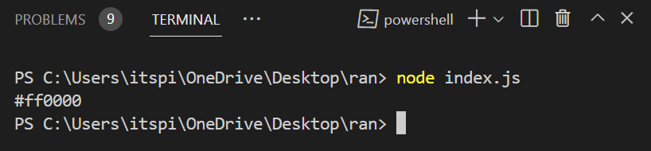

**💻Example :**
```html
const students = {
    "Amit": 123,
    "Dikshita": 456,
    "Jayashri": 789,
    "Shubham":211
}

console.log(students["Amit"]);
```
**⚙️ Output :**

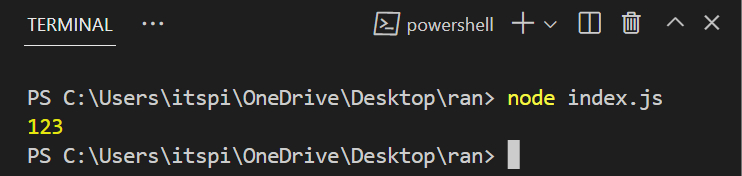

```html
const students = {
    name: 'John',
    age: 25,
    isActive: true,
    courses: ['html','css','js']
}

console.log(students['age']);
```
**⚙️ Output :**

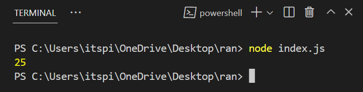

```html
const students = {
    name: 'John',
    age: 25,
    isActive: true,
    courses: ['html','css','js']
}

console.log(students['courses'][0]);
```

**⚙️ Output :**

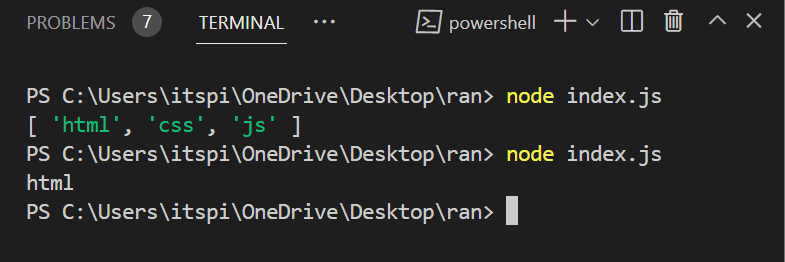

**💻Example :**
```html
const student = {
    name: 'John',
    age: 25,
    isActive: true,
    courses: ['html','css','js']
}

const studentCourses = student["courses"]
studentCourses.push("icp")
console.log(studentCourses);
```
**⚙️ Output :**

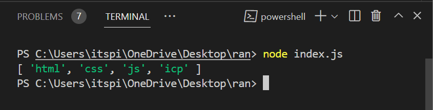

**💻Example :**
```html
const students = [{
    name: "Chandrabhan",
    age: 23,
    courses: ["React","Node","Mongodb"]
},
{
    name: "Mukesh",
    age: 25,
    courses: ["C","C++","Java"]
},
{
    name: "Punam",
    age: 25,
    courses: ["Python","Django","flask"]
}
]
console.log(students[0]);
```
**⚙️ Output :**

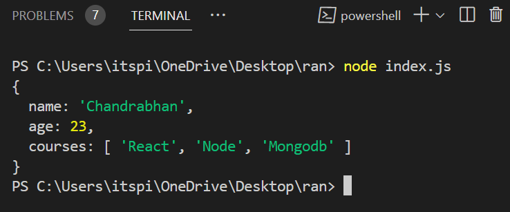

**💻Example :**

```html
const students = [{
    name: "Chandrabhan",
    age: 23,
    courses: ["React","Node","Mongodb"]
},
{
    name: "Mukesh",
    age: 25,
    courses: ["C","C++","Java"]
},
{
    name: "Punam",
    age: 25,
    courses: ["Python","Django","flask"]
}
]
console.log(students[0]["courses"]);
```

**⚙️ Output :**

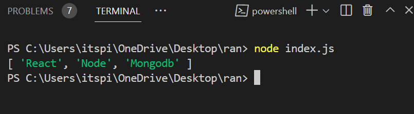

**💻Example :**

```html
const students = [{
    name: "Chandrabhan",
    age: 23,
    courses: ["React","Node","Mongodb"]
},
{
    name: "Mukesh",
    age: 25,
    courses: ["C","C++","Java"]
},
{
    name: "Punam",
    age: 25,
    courses: ["Python","Django","flask"]
}
]

students.forEach((students) =>{
    console.log(`Hello ${students['name']}`);
})
```

**⚙️ Output :**

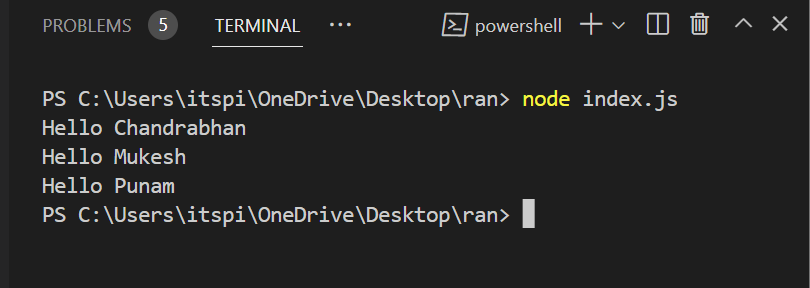

**💻Example :**
 
```html
const courses = [{
    title: "Javascript",
    price: 100,
    instructor: "Suraj",
    duration: "2 Month",
    timing: "7 PM",
    isStarted: true
},
{
    title: "React",
    price: 100,
    instructor: "Anand",
    duration: "2 Month",
    timing: "8 PM",
    isStarted: true
},
{
    title: "MongoDB",
    price: 100,
    instructor: "Pinki",
    duration: "2 Month",
    timing: "9 PM",
    isStarted: true
}
]

courses.map((element)=>{
    console.log(element);
})
```
**⚙️ Output :**

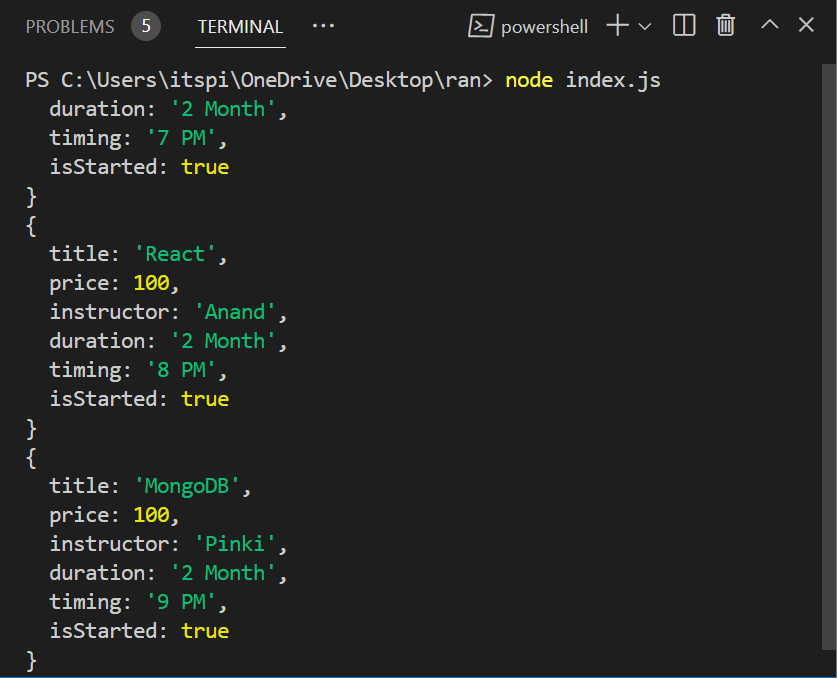

**💻Example :**

```html
const courses = [{
    title: "Javascript",
    price: 100,
    instructor: "Suraj",
    duration: "2 Month",
    timing: "7 PM",
    isStarted: true
},
{
    title: "React",
    price: 100,
    instructor: "Anand",
    duration: "2 Month",
    timing: "8 PM",
    isStarted: true
},
{
    title: "MongoDB",
    price: 100,
    instructor: "Pinki",
    duration: "2 Month",
    timing: "9 PM",
    isStarted: true
}
]

courses.map((courses)=>{
    console.log(courses['instructor']);
})
```

**⚙️ Output :**

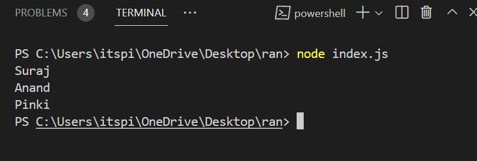

**💻Example :**

```html
const courses = [{
    title: "Javascript",
    price: 100,
    instructor: "Suraj",
    duration: "2 Month",
    timing: "7 PM",
    isStarted: true
},
{
    title: "React",
    price: 100,
    instructor: "Anand",
    duration: "2 Month",
    timing: "8 PM",
    isStarted: false
},
{
    title: "MongoDB",
    price: 100,
    instructor: "Pinki",
    duration: "2 Month",
    timing: "9 PM",
    isStarted: false
}
]

courses.map((course) => {
    if (course['isStarted'] == true) {
        console.log(`${course['title']} is live`);
    }
    else {
        console.log(`${course['title']} not live`);
    }
})
```

**⚙️ Output :**

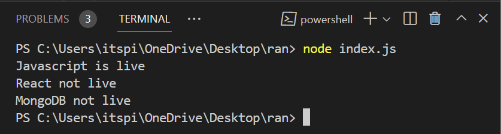

