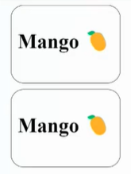
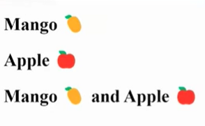

## React Components

Components let split the UI into independent, reusable code, and think about each code in isolation.

**Syntax :**

```js
function Home() {
  return 
    <div>
      <h1>Home</h1>
    </div>
}
export default Home;
```

**Example :**

src/App.js

```js
function App() {
  return (<h2>App Component</h2>);
}
export default App;
```

src/index.js

```js
import ReactDom from "react-dom/client";

import App from "./App.js";

const root = ReactDom.createRoot(document.getElementById("root"));

root.render(<App />);
```

**Output :**

> App Component

**Example :**

App.js

```js
function App() {
  return (
    <div>
      <h1>App Component</h1>
      <h2>Another App Component</h2>
    </div>
    );
}

export default App;
```

index.js

```js
import ReactDom from "react-dom/client";

import App from "./App.js";

const root = ReactDom.createRoot(document.getElementById("root"));

root.render(<App />);
```

**Output :**

> App Component<br>
> Another App Component

**Example :**

src/App.js

```js
import Mango from "./Mango.js";

function App() {
  return (
    <>
        <Mango />
    </>
    );
}

export default App;
```

src/index.js

```js
import ReactDom from "react-dom/client";

import App from "./App.js";

const root = ReactDom.createRoot(document.getElementById("root"));

root.render(<App />);
```

src/Mango.js

```js

function Mango() {
  return (
    <>
        <h1>Mango 🥭</h1>
    </>
    );
}

export default Mango;
```

**Output :**

> Mango 🥭

**Example :**

src/App.js

```js
import Mango from "./Mango.js";
import Apple from "./Apple.js";

function App() {
  return (
    <>
        <Mango />
        <Apple />
    </>
    );
}

export default App;
```

src/index.js

```js
import ReactDom from "react-dom/client";

import App from "./App.js";

const root = ReactDom.createRoot(document.getElementById("root"));

root.render(<App />);
```

src/Mango.js

```js

function Mango() {
  return (
    <>
        <h1>Mango 🥭</h1>
    </>
    );
}

export default Mango;
```

src/Apple.js

```js

function Apple() {
  return (
    <>
        <h1>Apple 🍎</h1>
    </>
    );
}

export default Apple;
```

**Output :**

> Mango 🥭<br>
> Apple 🍎

**Example :**

src/App.js

```js
import Mango from "./Mango.js";
import Apple from "./Apple.js";

function App() {
  return (
    <>
        <Mango />
        <Mango />
        <Mango />
        <Apple />
        <Apple />
        <Apple />
    </>
    );
}

export default App;
```

src/index.js

```js
import ReactDom from "react-dom/client";

import App from "./App.js";

const root = ReactDom.createRoot(document.getElementById("root"));

root.render(<App />);
```

src/Mango.js

```js

function Mango() {
  return (
    <>
        <h1>Mango 🥭</h1>
    </>
    );
}

export default Mango;
```

src/Apple.js

```js

function Apple() {
  return (
    <>
        <h1>Apple 🍎</h1>
    </>
    );
}

export default Apple;
```

**Output :**

> Mango 🥭<br>
> Mango 🥭<br>
> Mango 🥭<br>
> Apple 🍎<br>
> Apple 🍎<br>
> Apple 🍎

**🤔 How to apply CSS in React Components :**

**Example :**

src/App.js

```js
import Mango from "./Mango.js";

function App() {
  return (
    <>
        <Mango />
        <Mango />
    </>
    );
}

export default App;
```

src/index.js

```js
import ReactDom from "react-dom/client";

import App from "./App.js";

const root = ReactDom.createRoot(document.getElementById("root"));

root.render(<App />);
```

src/Mango.js

```js
import "./Mango.css";

function Mango() {
  return (
    <>
    <div className="mango-container">
        <h1>Mango 🥭</h1>
    </div>
    </>
    );
}

export default Mango;
```

src/Mango.css

```css

.mango-container {
    height: 200px;
    width: 150px;
    border: 1px solid black;
    padding: 10px;
    margin: 10px;
    border-radius: 20px;
}
```

**Output :**



**Example :**

src/App.js

```js
import MyFruits, {Mango, Apple} from "./Fruits.js";

function App() {
  return (
    <>
    <Mango />
    <Apple />
    <MyFruits />
    </>
    );
}

export default App;
```

src/index.js

```js
import ReactDom from "react-dom/client";

import App from "./App.js";

const root = ReactDom.createRoot(document.getElementById("root"));

root.render(<App />);
```

src/Fruits.js

```js
export function Apple() {
  return (
    <>
    <h1>Apple 🍎</h1>
    </>
    );
}

export function Mango() {
  return (
    <>
    <h1>Mango 🥭</h1>
    </>
    );
}

export default function MyFruits() {
  return (
    <>
    <h1>Mango 🥭 and Apple 🍎</h1>
    </>
    );
}

```

**Output :**




