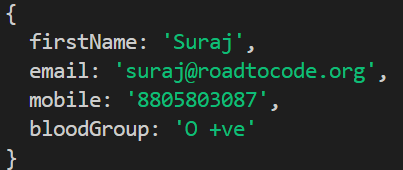

# JSX and Props

### Destructuring

```
Destructuring is really a simple concept its break your structure in small small pieces.
```

**Example:**

```js
    const student = {
        firstName: "Suraj",
        email: "suraj@roadtocode.org",
        mobile: "8805803087",
        bloodGroup: "O +ve"
    }
    console.log(student);
```



**Example:**

```js
    const student = {
        firstName: "Suraj",
        email: "suraj@roadtocode.org",
        mobile: "8805803087",
        bloodGroup: "O +ve"
    }
    console.log(student.firstName);
```

**Example:**

```js
    const student = {
        firstName: "Suraj",
        email: "suraj@roadtocode.org",
        mobile: "8805803087",
        bloodGroup: "O +ve"
    }
    const firstName = student.firstName;
    const bloodGroup = student.bloodGroup;

    console.log(firstName,bloodGroup);
```


**Example:**

```js
    const student = {
        firstName: "Suraj",
        email: "suraj@roadtocode.org",
        mobile: "8805803087",
        bloodGroup: "O +ve"
    }
    const {firstName, bloodGroup} = student;

     console.log(firstName); //suraj
     console.log(bloodGroup); //O +ve

```

### What is JSX

```
Javascript xml

Extension to javascript syntax
```

```js
 function App()
 {
    return(
        <>
        <h1>Hello {user}</h1>
    )
 }
```

**{user} => JSX Expression**

```js
 function App()
 {
    return(
        <>
        <h1>Hello {5+5}</h1>
    )
 }
```

### Props 

```
Passing Parameters to component
```

**Example:**

**FileName => Student.js**
```js
function Student(props) 
{
    return(
        <div>
        <h1> Hello Student {studentName} </h1>
        </div>
    )
}
```

**FileName => App.js**

```js
function App()
{
    return(
        <>

        <Student studentName="Shyam"/>
        <Student studentName="Shraddha"/>
        <Student studentName="Satyam"/>
        <Student studentName="Shweta"/>
        </>
    )
}
```


