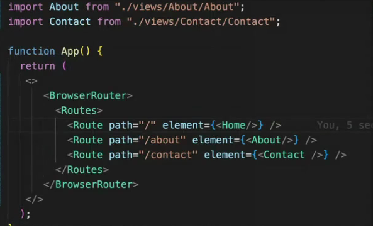

# react-router-dom

```
react routes -> path
 
  |-------- about
  |
  |
Home------- contact
  |
  |
  |-------- team     
```

### Library
```
 npm install react-router-dom
```


### Steps :
```
1. npm i react-router-dom
```
```
2. create views folder
```


```
3. setup routes 

import { BrouserRouter,Routes, Route} from "react-router-dom";


 BrouserRouter
 |
 |----> Tracks changes in url

 Routes
 |
 |---> Register valid routes


 /about          About

 /contact         Contact

 Route
 |
 |---> To define single route
```
output:



### Link
```js
 <Link to=""> About </Link>
```


**Example 1:**

```js
   import "./About.css";
   import {Link} from "react-router-dom";

   function About(){
    return(
        <div classname="about-container">
        <h1 className="about-heading">This is About Page</h1>

        <Link to="">Home</Link>
        <Link to="/contact">contact</Link>
        <Link to="/about">About</Link>
        </div>
    )
   }
   export default About
```


**Example 2:**

```js
   import "./Home.css";
   import {Link} from "react-router-dom";

   function Home(){
    return(
        <div classname="home-container">
        <h1 className="home-heading">This is Home Page</h1>

        <Link to="">Home</Link>
        <Link to="/contact">contact</Link>
        <Link to="/about">About</Link>
        </div>
    )
   }
   export default Home
```


**Example 3:**

```js
   import "./contact.css";
   import {Link} from "react-router-dom";

   function Contact(){
    return(
        <div classname="contact-container">
        <h1 className="contact-heading">This is Contact Page</h1>

        <Link to="">Home</Link>
        <Link to="/contact">contact</Link>
        <Link to="/about">About</Link>
        </div>
    )
   }
   export default Contact
```


