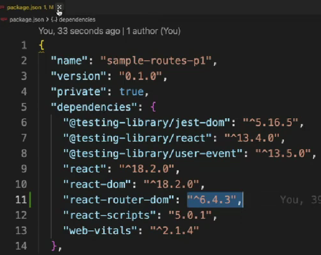
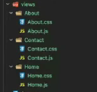
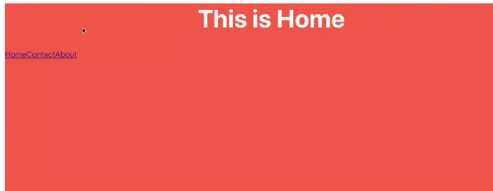

# react-router-dom
1. React router dom is a library in which a user is directed to different pages based on their action or request.
2. React router is mainly used for developing Single Page Web Applications.
3. React router is used to define multiple routes in the application.

```
react routes -> path
 
  |-------- about
  |
  |
Home------- contact
  |
  |
  |-------- team     
```

### Cammand Installation :
```
 npm install react-router-dom
```


### Steps to use react router library :
```
1. npm i react-router-dom
```
```
2. create views folder
```


```
3. setup routes 

import { BrouserRouter,Routes, Route} from "react-router-dom";


 BrouserRouter
 |
 |----> Tracks changes in url

 Routes
 |
 |---> Register valid routes


 /about          About

 /contact         Contact

 Route
 |
 |---> To define single route
```
Your final code view like this :
```js
import { BrowserRouter, Routes, Route } from "react-router-dom";
import Home from "./views/Home/Home";
import Contact from "./views/Contact/Contact";
import About from "./views/About/About";

export default function App() {
  return (
    <BrowserRouter>
      <Routes>
       <Route path ="/" element={<Home/>}/>
       <Route path ="/about" element={<About/>}/>
       <Route path ="/contact" element={<Contact/>}/>
      </Routes>
    </BrowserRouter>
  );
}
```

### Anchor Tag
describtion:

```js
<a href="/about">About</a>
```

### Link Tag
describtion:
```js
 <Link to="/about"> About </Link>
```


**Example 1:**

```js
   import "./About.css";
   import {Link} from "react-router-dom";

   function About(){
    return(
        <div classname="about-container">
        <h1 className="about-heading">This is About Page</h1>

        <Link to="">Home</Link>
        <Link to="/contact">contact</Link>
        <Link to="/about">About</Link>
        </div>
    )
   }
   export default About
```


**Example 2:**

```js
   import "./Home.css";
   import {Link} from "react-router-dom";

   function Home(){
    return(
        <div classname="home-container">
        <h1 className="home-heading">This is Home Page</h1>

        <Link to="">Home</Link>
        <Link to="/contact">contact</Link>
        <Link to="/about">About</Link>
        </div>
    )
   }
   export default Home
```


**Example 3:**

```js
   import "./contact.css";
   import {Link} from "react-router-dom";

   function Contact(){
    return(
        <div classname="contact-container">
        <h1 className="contact-heading">This is Contact Page</h1>

        <Link to="">Home</Link>
        <Link to="/contact">contact</Link>
        <Link to="/about">About</Link>
        </div>
    )
   }
   export default Contact
```


