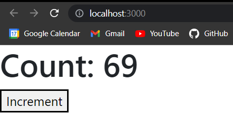

# useState

### What is useState?

useState is a hook or a function that allows you to have state variables in functional components. It returns an array with two values. The first value is the state variable and the second value is a function to update the state variable.

### How to use useState?

```js
    const [stateVariable, setStateVariable] = useState(initialValue);
```

### Example:

```js
    const [count, setCount] = useState(0);
```

### What is the difference between state and props?

State is a variable that is used to store data in a component. Props is a variable that is used to pass data to a component.

### Example:

```js
    function App()
    {
        const [count, setCount] = useState(0);
        return(
            <>
            <h1>Count: {count}</h1>
            <button onClick={() => setCount(count + 1)}>Increment</button>
            </>
        )
    }
```
#### Output:




