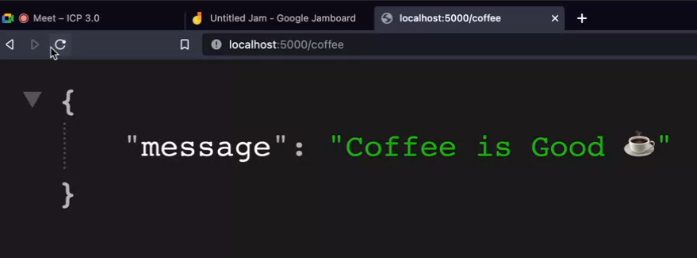

# Introduction to Backend

## What is Backend?
```
Backend is the part of the application that is not visible to the user. It is the part of the application that is responsible for storing and retrieving data from the database.
```
## What is Frontend?
```
Frontend is the part of the application that is visible to the user. It is the part of the application that is responsible for displaying data to the user.
```
## What is Full Stack?
```
Full Stack is the combination of both frontend and backend.
```

## What is Node.js?
```
Node.js is a JavaScript runtime environment that allows us to run JavaScript on the server.
```
## What is Express.js?
```
Express.js is a web application framework for Node.js. It is used to build web applications and APIs.
```
## What is MongoDB?

```
MongoDB is a NoSQL database. It is a document-oriented database.
```


## **MVC** or **Model View Controller**

**MVC** is a software design pattern that divides the application into three parts as follows:

```
View => Visibile Things => Frontend

Model => Backend

Controller => Control The things

```

## APIs

 API stand for **Application Program Interface**. It is a set of rules that allow two software programs to communicate with each other.

 <hr/>

# Let's take an example of a hotel.
### **Frontend**

<!-- explain frontend with hotel example -->

The frontend of the hotel is the part that is visible to the customer. It is the part of the hotel that is responsible for displaying the menu and taking orders from the customer.


### **API**

The API of the hotel is the part that acts as an intermediary between the frontend and the backend. It is the part of the hotel that is responsible for taking the order from the customer and passing it to the kitchen.

 
    
### **Backend**

The backend of the hotel is the part that is not visible to the customer i.e the kitchen. It is the part of the hotel that is responsible for getting the order from the customer and preparing the food.


<hr/>

**Steps of Create simple Node App**

Open your terminal and follow the steps:

**Step 1** => Create a folder and open it in your terminal. Then run the following command to create a package.json file.

```
npm init -y
```
   
   i) Create File **index.js**

   ii) Add a start script in package.json file. 

```
"start": "node index.js"
```

**Step 2** => Create a dependency for Express. Run the following command in your terminal.

```
npm install express
```

**Add ECMAScript modules in package.json file**
```
 "type": "module"
```

**Step 3** => import Express in index.js file. 

```
import express from "express";
```

**Step 4** => Create a Express app by calling express function.

```
const app = express();
```

**Step 5** => Create a middleware for parsing JSON data. Middleware is a function that has access to the request and response objects.

```
app.use(express.json());
```

**Step 6** => Create a server and listen to port 5000.
```
app.listen(5000, ()=>{
    console.log("server is runnig on port 5000");
})
```
**Step 7**=> Start the server by running the following command in your terminal.

```
npm start
```

**💻 Simple Node App**

**filename = index.js**


```html
import express from "express";

const app = express();
app.use(express.json());

app.listen(5000, ()=>{
    console.log("server is running on port 5000");
})
```

### **Output**


## **Simple API**

Here we are creating a simple API that will return a string when we hit the route **/ping**.

```
app.get('/ping', (req,res)=>{
    res.send("pong");
})
```

**filename = index.js**
```html
import express from "express";

const app = express();
app.use(express.json());

app.get('/ping', (req,res)=>{
    res.send("pong");
})

app.listen(5000, ()=>{
    console.log("server is runnig on port 5000");
})
```

### **Output**
As we can see in the output, we are getting a string **pong** when we hit the route **/ping**.


**filename = index.js**
Here we are creating a simple food API that will return a string when we hit the route **/coffee** and **/pizza**.

```

```html
import express from "express";

const app = express();
app.use(express.json());

app.get('/ping', (req,res)=>{
    res.send("pong");
})

app.get('/coffee', (req,res)=>{
    res.send("Coffee is ready..☕ ")
})

app.get('/pizza', (req,res)=>{
    res.send("pizza is ready..🍕 ")
})

app.listen(5000, ()=>{
    console.log("server is runnig on port 5000");
})
```

### **Output**
As we can see in the output, we are getting a string "Coffee is ready.☕" when we hit the route **/coffee** and "Pizza is ready.🍕 " when we hit the route **/pizza**.


## Nodemon

Nodemon is a dependency for keeping track of server changes and automatically restarts our app.

**Command to install Nodemon dependency**

```html
npm i nodemon
```

## **Send route response in JSON Format**

we have to send the response in JSON format. To do that we can use the following code.


```
app.get('/coffee', (req,res)=>{
    res.send({
        message: "Coffee is Good"
    });
})
```

 **💻 Example :**
```html
import express from "express";

const app = express();
app.use(express.json());

app.get('/coffee', (req,res)=>{
    res.send({
        name: "cooffe",
        price: 2.5
    });
})

app.listen(5000, ()=>{
    console.log("server is runnig on port 5000");
})

```
### **Output**



## Get and Post Method


**Get Method**

Get method is used to get the data from the server. It is used to read the data from the server.

**Post Method**

Post method is used to create the data on the server. It is used to create the data on the server.

### Example of post method


```html
app.post('/coffee', (req,res)=>{
    res.send({
        name: 'coffee is being made'
    });
})
```

## Reading parameter from request body

In the above example we are sending the data in the request body. To read the data from the request body we can use the following code.

```js
app.post('/coffee', (req,res)=>{

    // console.log(req.body);

    const tableNumber  = req.body.tableNumber;
    const coffeeType = req.body.coffeeType

    res.send({
        orderDetails: `Table ${tableNumber} ordered a ${coffeeType}
    }); 
})
```

### **Output:**


**response in JSON format:**


