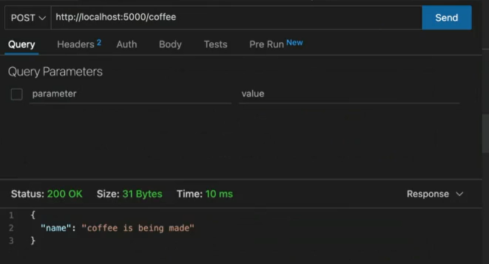
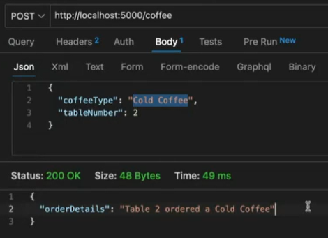

# Nodemon, GET and POST methods, reading body of POST Request

## **Nodemon**

Nodemon is a utility that will monitor for any changes in your source and automatically restart your server. It is Perfect for development, so, it is often reffered to as a dev dependancy. Install it globally using npm:

```bash
npm install -g nodemon
```
### **What is a dev dependancy?**

A dev dependancy is a package that is only needed for development. It is not needed for the application to run in production. For example, nodemon is only needed for development, it is not needed for the application to run in production. So, it is a dev dependancy.

### *To add nodemon as a dev dependancy*

```bash
npm install --save-dev nodemon
```

### *To add nodemon to your package.json*

```bash
npm install nodemon
```

### *To add nodemon to the scripts section of package.json*

```json
"scripts": {
    "start": "node index.js",
    "dev": "nodemon index.js"
  },
```
Use the command `npm run dev` to run the application using nodemon.

## **GET and POST methods**

### **GET**

GET is used to request data from a specified resource. 
1. GET requests can be cached which means that the same request can be made multiple times without sending the same data to the server.
2. GET requests remain in the browser history
3. GET requests can be bookmarked. Which means that you can bookmark a GET request in the browser.
4. GET requests should never be used when dealing with sensitive data like passwords.
5. GET requests have length restrictions. Which means that a GET request should not be used to send a lot of data to the server.
6. GET requests should be used only to retrieve data.
7. GET requests are only used to request data (not modify).

## Example of GET request

```javascript
const express = require('express');
const app = express();

app.get('/ping', (req, res) => {
    res.send('pong 🏓');
});

app.listen(5000, () => console.log('Listening on port 5000...'));
```
### Output

```bash
Listening on port 5000...
```
```bash
In the browser, go to `http://localhost:5000/ping` and you will see the output `pong 🏓`.
```


### **POST**

**POST is used to send data to a server to create/update a resource.**
1. POST requests are never cached.
2. POST requests do not remain in the browser history.
3. POST requests cannot be bookmarked.
4. POST requests have no restrictions on data length.
5. POST requests are used to send data to the server to create/update a resource.
6. POST requests are only used to send data (not retrieve).
7. You can not make a POST request using the browser. You need to use a tool like Postman or Thunder Client.

You can use ECMAScript or common JS to send a POST request. We will use ECMA Script 6 as it is the latest version of JavaScript.

### To add ECMAScript to your project make the following changes to your package.json file.

```json
"scripts": {
    "start": "node index.js",
    "dev": "nodemon index.js"
  },
  "type": "module",
```
You can now use ECMAScript in your project.

You will need to install express to use the POST method. Install express using the following command:

```bash
npm install express
```

Express is a web application framework for Node.js. It is used to build web applications and APIs. 

### Example of POST request

```javascript
import express from 'express';
const app = express();

app.use(express.json());

app.post('/coffee', (req, res) =>{
    res.json({
        message: 'Your coffee is being made'
    });
});

app.listen(5000, () => console.log('Listening on port 5000...'));
```
### Output

```bash
Listening on port 5000...
```
```bash
In the Thunder Client, make a POST request to `http://localhost:5000/coffee` and you will see the output `Your coffee is being made`.
```



### **Reading the body of a POST request**

To read the body of a POST request, you need to use the `express.json()` middleware. The `express.json()` middleware is a built-in middleware function in Express. It parses incoming requests with JSON payloads and is based on body-parser.

### Sending data in the body of a POST request

You can send the data in the body of the POST in various formats like JSON, XML, Text, etc.
The most common format is JSON. You can also send the data in the body of the POST request in the form of a query string.

### Performing operations on the data sent in the body of a POST request

You can perform operations on the data sent in the body of a POST request. For example, you can save the data in a database or do some other operation on the data to give a response.

### Example of POST request with data in the body

```javascript
import express from 'express';
const app = express();

app.use(express.json());

app.post('/coffee', (req, res) =>{
 
    const tableNumber = req.body.tableNumber;
    const coffeeType = req.body.coffeeType;

    res.json({
      orderDetails: `Table ${tableNumber} ordered a ${coffeeType}`
    });
});

app.listen(5000, () => console.log('Listening on port 5000...'));
```
### In the Thunder Client, make a POST request to `http://localhost:5000/coffee` with the following data in the body.

```json
{
    "tableNumber": 7,
    "coffeeType": "Cappuccino"
}
```
### Output



### Conclusion:

In this article, we learned about nodemon, GET and POST methods, and reading the body of a POST request. We also learned how to send data in the body of a POST request and how to perform operations on the data sent in the body of a POST request.