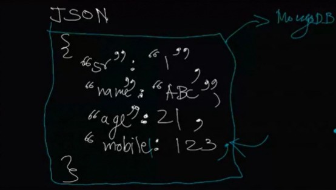
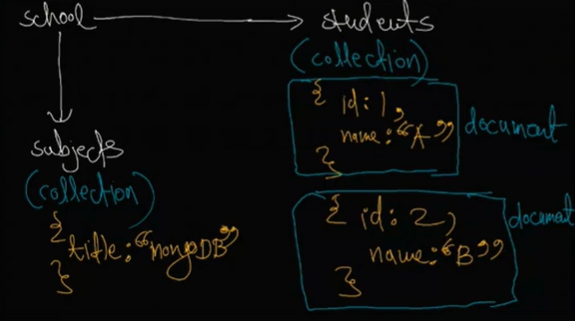
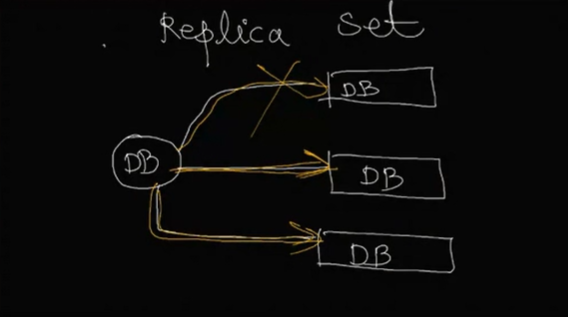
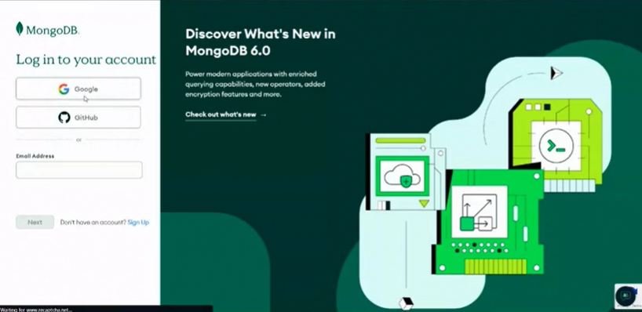
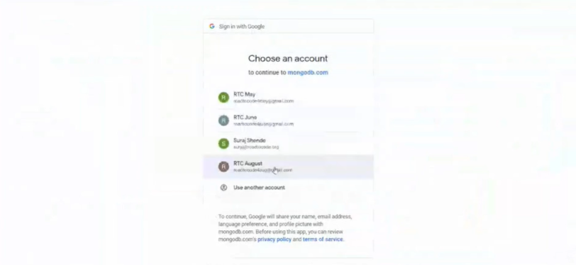
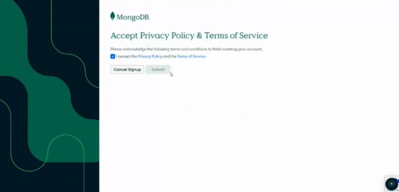
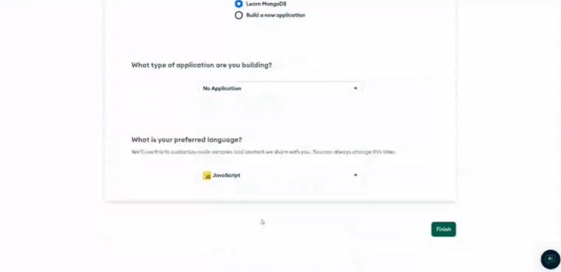
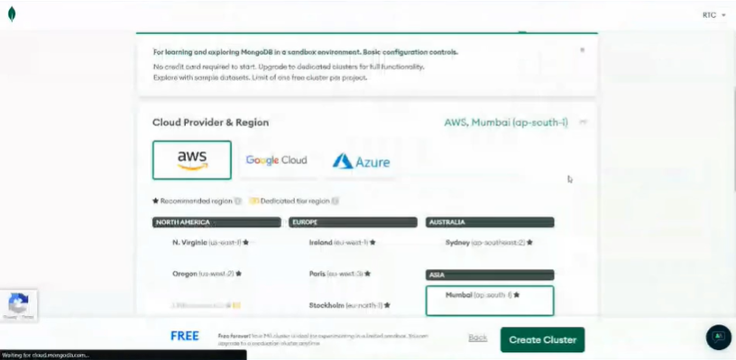
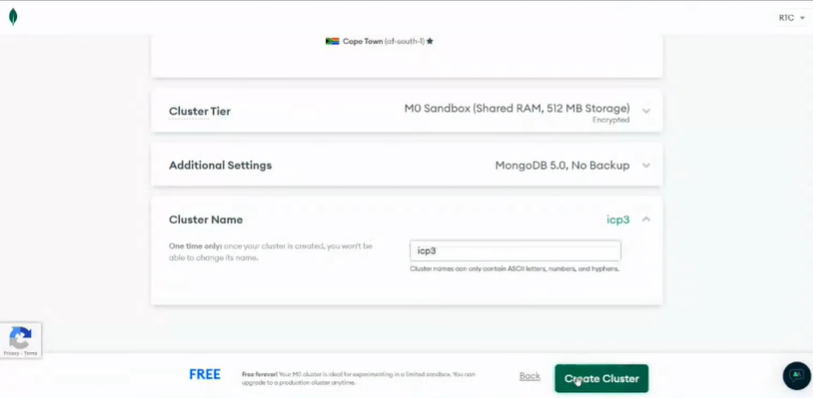
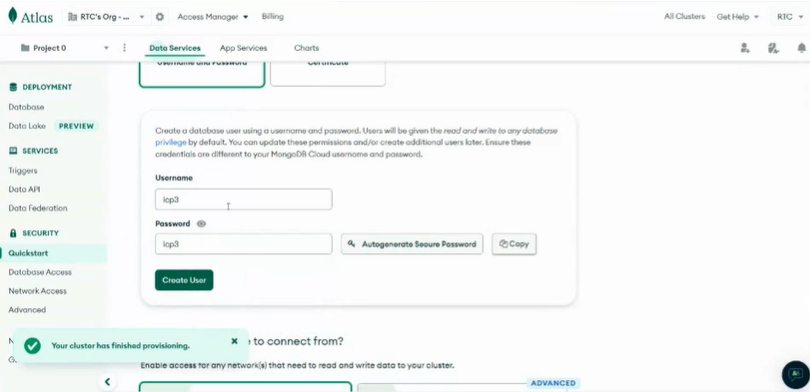

## Introduction to MongoDB

### Database Management System

A database management system (DBMS) is a software that allows you to store, modify and extract data from a database.

### JSON

JSON stands for JavaScript Object Notation. It is a lightweight data-interchange format. JSON format only supports string, number, boolean, array, object, null.

**Syntax :**

```json 
{
    "sr": 1,
    "name": "Suraj",
    "age": 22,
    "mobile": 1234567890,
}
```



### BSON

BSON stands for Binary JSON. It is a fast and its store data in optimized way. It is a binary representation of JSON.

### Difference between JSON and BSON

JSON 

- JSON is a text-based format.
- JSON is human-readable.
- JSON is language-independent.
- JSON is a subset of JavaScript.

- JSON supports string, number, boolean, array, object, null.

BSON

- BSON is a binary-based format.

- BSON is not human-readable.

- BSON is language-independent.

- BSON is a superset of JSON.

- BSON supports Date, ObjectID, Binary Data.

### Database

A database is a collection of data. 


**Example :**

Database : Student



### MongoDB

MongoDB is a document-based, NoSQL database. It is a cross-platform document-oriented database program. It is a free and open-source database.

## Replica Set

Replica set is exact same copy of data. It is used for traffic handling and data redundancy.

**💻Example :**



## 🤔 How to create account on MongoDB Atlas?

1. Go to [MongoDB Atlas](https://www.mongodb.com/) and click on **Sign In**.


2. Click on **Login with Google**.



3. Select your Google account and click on **Continue**.



4. Accept the terms and conditions and click on **Accept**.



5. Welcome to MongoDB Atlas. 

6. Select the question and answer and click on **Finish**.



7. Choose Shared Clusters and click on **Create a Cluster**.


8. Select the cloud provider AWS and a region and click on **Create Cluster**.



9. Wait for the cluster to be created.



10. Create a username and password and click on **Create User**.



11. Click on **Choose a connection method**.

12. Click on **Connect your application**.


