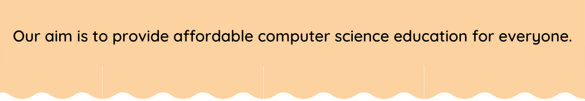

<!-- HEADER -->
<p align="center">
  
</p>

# For Loop ,Break and Continue in Python

## Range ()
 To Genreate range of numbers.

**Syntax:**
 ```python
 range(start, stop, step)
```
**Start :**

An integer number specifying at which position to start. Default is 0

**Stop :**

An integer number specifying at which position to stop.

**step :**

An integer number specifying the incrementation. Default is 1

**💻Example:**
```python
MyNumber=range(10)
print(MyNumber)
```
**💻Example:**
```python
MyNumber=range(2,10)
print(MyNumber)
```

**💻Example:**
```python
MyNumber=range(10,20,2)
print(MyNumber)
```
## For Loop 

For loops are used when you have a block of code which you want to repeat a fixed number of times.

**Syntax :**
```python
for var_name in range(10)
```
**💻Example :**

```python
for i in range(5):
  print("Hello World !!")
```
**⚙️ Output:**
>Hello World !!    
Hello World !!   
Hello World !!   
Hello World !!   
Hello World !!

**💻Example :**

```python
for i in range(4):
  print(i,") Copying Adhar card ")
```
**⚙️ Output:**
>0 ) Copying Adhar card    
1 ) Copying Adhar card     
2 ) Copying Adhar card     
3 ) Copying Adhar card 

**💻Example :**
```python
n=int(input("How many times do you want to copy Adharcard ? "))
for i in range(n):
  print(i,") Copying AdharCard")
```
**⚙️ Output:**
>How many times do you want to copy Adharcard ? 2         
0 ) Copying AdharCard    
1 ) Copying AdharCard

**💻Example :**
```python
for i in range(5,7):
  print("This is Task-1")
  print("This is Task-2")
```
**⚙️ Output:**
>This is Task-1    
This is Task-2     
This is Task-1    
This is Task-2

**💻Example :**
```python
for i in range(5,50,5):
  print(i)
```
**⚙️ Output:**
>5  
10   
15   
20        
25      
30    
35     
40   
45

**💻Example :**
```python
n=int(input("Enter n:"))
for i in range(0,n,2): 
  print(i)
```
**⚙️ Output:**
>Enter n:5   
0    
2    
4

**Program :**
> Write a program to print even numbers uo to 20.
```python
n=int(input("Enter n :"))
for n in range(n):
  if n%2==0:
    print(n)
```
**⚙️ Output:**
>Enter n :10   
0     
2   
4   
6   
8

## Break Or Continue

### Break

The break keyword is used to break out a for loop.

**💻Example :**
```python
for val in range(10):
    if val == 5:
        break
    print(val)
```
**⚙️ Output:**
>0    
1   
2    
3   
4

### Continue

Continue keyword to end the current iteration in a loop, but continue with the next.

**💻Example :**
```python
for val in range(10):
    if val == 5:
        continue
    print(val)
```
**⚙️ Output:**
>0    
1     
2    
3    
4   
6    
7    
8   
9
## 🏠 HomeWork

>1️⃣ Write a program to print Odd numbers up to 20.

<details>
  <summary>👁 Show Answer</summary>

  <p>
  
  ```python
n=int(input("Enter n:"))
for i in range(n+1):
    if(i%2!=0):
        print(i)
  ```

  </p>

</details>

>2️⃣Write a program to factorial to n numbers.
<details>
  <summary>👁 Show Answer</summary>

  <p>
  
  ```python
  number = int(input(" Please enter any Number : "))
fact = 1

for i in range(1, number + 1):
    fact = fact * i
print( fact)
  ```

  </p>

</details>

## 🔗 Some Useful Links

## 📖 References

<!-- FOOTER -->
<p align="center">
  
</p>  