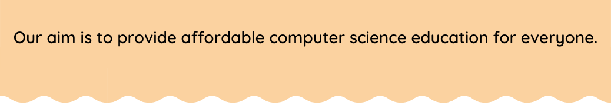

<!-- HEADER -->
<p align="center">
  
</p>

# Function in Python

## Function 

A function is a block of code which only runs when it is called.You can pass data, known as parameters, into a function.In Python a function is defined using the def keyword.

**Syntax :**
```python
python
def function_name():
```

**Example:**
```python
def greeting():
  print("good evening")
  print("good night")
  print("good morning")
greeting()
greeting()
```
**⚙️ Output:**
>good evening   
good night   
good morning  
good evening   
good night  
good morning

**Example:**
```python
def fun(val1):
  print("input :",val1)
fun(10)
fun(20)
fun(30)
```

**⚙️ Output:**
>input : 10  
input : 20    
input : 30 

**Example:**
>Write a program to find square of number using Function().

```python
def cal_square(num):
  square=num*num
  print("square :",square)
cal_square(10)
```

**⚙️ Output:**
>square : 100

## Return Values

 To let a function return a value, use the return statement.

 **Example:**
 ```python
def cal_square(num):
  sq=num*num
  return sq
ans=cal_square(5)
print(ans)
 ```
**⚙️ Output:**
>25

### Take Value from User

 **Example:**

```python
def cal_square():
  num=int(input("Enter Num :"))
  sq=num*num
  return sq
ans=cal_square()
print(ans)
```

**⚙️ Output:**
>Enter Num :5    
25

### One or More Parameter pass

**Example:**
```python
def add_two(num1,num2):
  sum=num1+num2
  print(sum)
add_two(5,5)
```

**⚙️ Output:**
>10

**Example:**
```python
def add_two(num1,num2):
  sum=num1+num2
  diff=num1-num2
  return sum,diff
a,b=add_two(10,10)
print(a)
print(b)
```
**⚙️ Output:**
>20

## 🏠 HomeWork
> 1️⃣ Write a program to find simple interest using function all cases .

💡 HINT : Simple Interest = (P x T x R)/100  
           Where,    
              P is the principle amount    
              T is the time and   
              R is the rate  

  <details>
  <summary>👁 Show Answer</summary>

  <p>
  
  ```python
 def cal_si():              #No argument no return
  p=int(input("Enter Principle :"))
  r=int(input("Enter Rate :"))
  t=int(input("Enter Time :"))
  si=p*r*t/100
  print(si)
cal_si()
  ```

  </p>

</details>
              
## 🔗 Some Useful Links

## 📖 References


<!-- FOOTER -->
<p align="center">
  
</p>