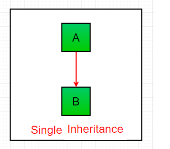

<!-- HEADER -->
<p align="center">
  
</p>

# Inheritance in Python

## Inheritance=
Inheritance means deriving properties of one class into another class.

The class whose properties are being derived is called as **Parent Class** or **Super Class** or **Base class** . And class which derives the properties of base class is called as **Child Class** or **Sub Class** or **Derived Class**.

**Syntax :**
```python
class BaseClass:
    .....
    .....
class DerivedClass(BaseClass):
    .....
    .....
```

## Types of Inheritance

* Single Inheritance
* Multilevel Inheritance
* Multiple Inheritance
* Hierarchical Inheritance

## Single Inheritance

Single inheritance means,when a derived class derives one base class.



**💻 Example :**
```python
class A:
  def showA(self):
    print("I am showA")
class B(A):
  def showB(self):
    print(" I am showB")

obj=B()
obj.showA()
```

**⚙️ Output:**
>I am showA

## Multilevel Inheritance

Multilevel Inheritance means When a derived class become base class of another class .


**💻 Example :**
```python
class A:
  def showA(self):
    print("This is show A")

class B(A):
  def showB(self):
    print("This is show B")

class C(B):
  def showC(self):
    print("This is show C")

obj=C()
obj.showA()
obj.showB()
obj.showC()
```
**⚙️ Output:**
>This is show A   
This is show B   
This is show C

## Multiple Inheritance

When a class can be derived from more than one base class this type of inheritance is called multiple inheritance.


**💻 Example :**
```python
class Mother:
  def showMotherName(self):
    print("Mother Name is ABC")

class Father:
  def shoWFatherName(self):
    print("Father Name is XYZ")

class child(Mother,Father):
  def showChildName(self):
    print("I am Child")

obj=child()
obj.shoWFatherName()
obj.showMotherName()
obj.showChildName()
```
**⚙️ Output:**
>Father Name is XYZ   
Mother Name is ABC    
I am Child

## Hierarchical Inheritance

 When more than one derived classes are created from a single base this type of inheritance is called hierarchical inheritance.

 

 **💻 Example :**

```python
class Parent:
  def showParent(self):
    print("Mother Name : PQR")
    print("Father Name : XYZ")

class A(Parent):
  def showName(self):
    print("A")

class B(Parent):
  def showName(self):
    print("B")

objA=A()
objA.showName()
objA.showParent()

objB=B()
objB.showName()
objB.showParent()
```

**⚙️ Output:**
>A   
Mother Name : PQR    
Father Name : XYZ   
B   
Mother Name : PQR     
Father Name : XYZ  
## 🔗 Some Useful Links

## 📖 References

<!-- FOOTER -->
<p align="center">
  
</p>  