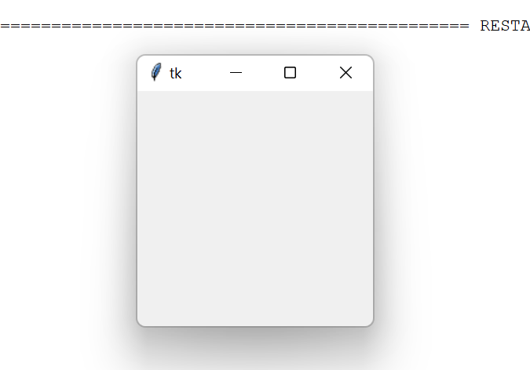
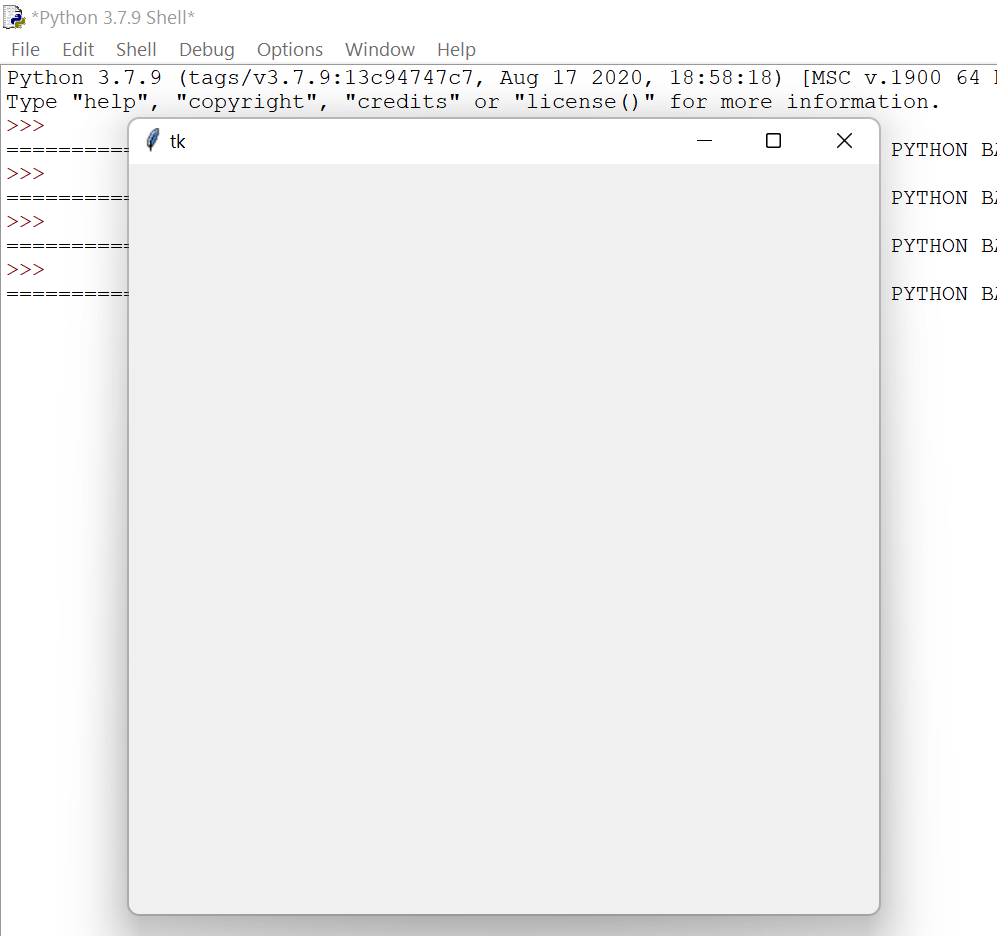
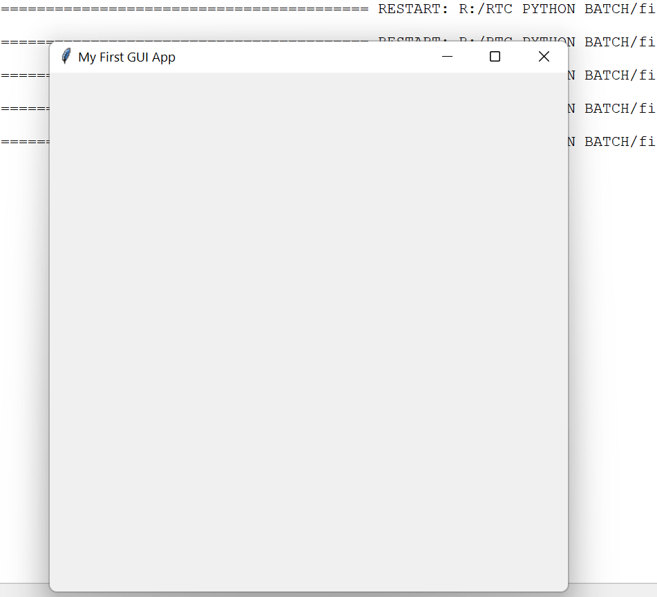
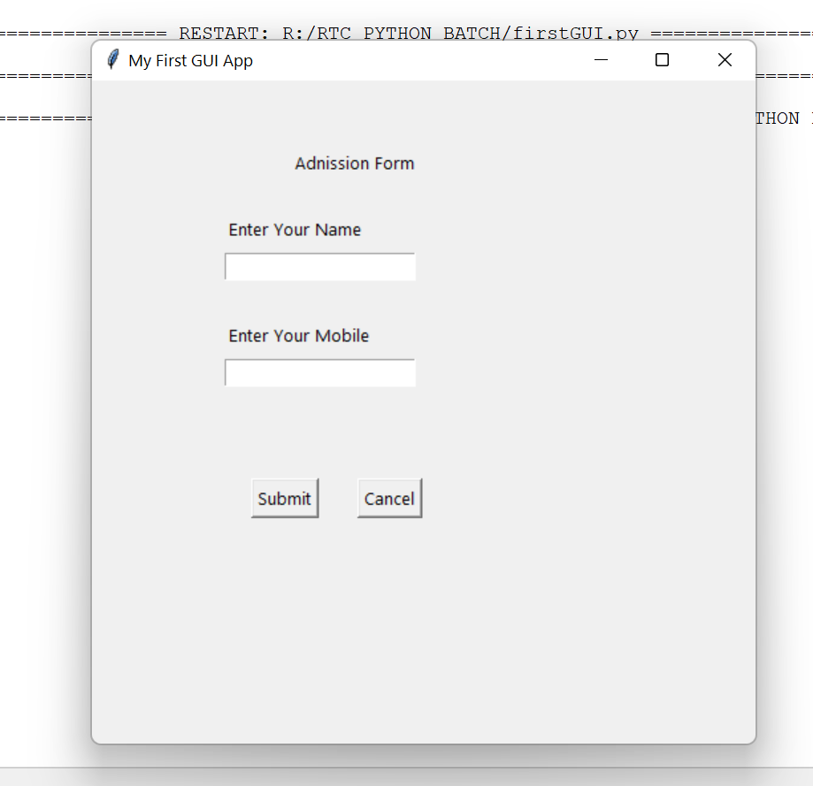

<!-- HEADER -->
<p align="center">
  
</p>

# Introduction to TKinter in Python

**GUI= Graphical User Interface**

**CMD= Command Line Interface**

## Tkinter :

Tkinter is the most commonly used library for developing GUI (Graphical User Interface) in Python.

**💻Install Python on Windows :**

1 To install Python, firstly You need to go  official site `https://www.python.org/`.

2 Then go to Download and click on the latest version.

3 Once the Python distribution download is completed, then double-click on the executable downloaded software, and then click on Run.

4 Click on install and Setup.

5 Once the installation is done, click on the Close button. And now, Python is successfully installed.

**🧠 Save Python file `.py` Extension**
 

## To Create Frame 

**💻Example :**

```python
from tkinter import *
top=Tk()
top.mainloop()
```
**⚙️ Output :**


## Set Size in window 

**Syntax :**
```python
top.geometry("widthxheigth")
```
**💻Example :**
```python
from tkinter import *
top=Tk()
top.geometry("500x500")
top.mainloop()
```
**⚙️ Output :**


## Set title in window 

**Syntax :**
```python
top.title("Name")
```
**💻Example :**
```python
from tkinter import *
top=Tk()
top.geometry("500x500")
top.title("My First GUI App")
top.mainloop()
```
**⚙️ Output :**


* Label = To dispay information
* Input box= To take input from user
* Button= To trigger Some Action

**Program :**
```python
from tkinter import *
top=Tk()
top.geometry("500x500")
top.title("My First GUI App")

lablell = Label(top,text="Adnission Form").place(x=150,y=50)

lablel2= Label(top,text="Enter Your Name").place(x=100,y = 100)
entryl= Entry(top).place(x=100, y=130)
                                                    
lable13 =Label(top,text="Enter Your Mobile").place(x=100,y = 180)
entry2 = Entry(top).place(x=100,y=210)
                                                       
button = Button(top,text="Submit").place(x=120,y=300)
button = Button(top,text="Cancel").place(x=200,y=300)

top.mainloop()
```

**⚙️ Output :**

## 🔗 Some Useful Links

## 📖 References

<!-- FOOTER -->
<p align="center">
  
</p> 