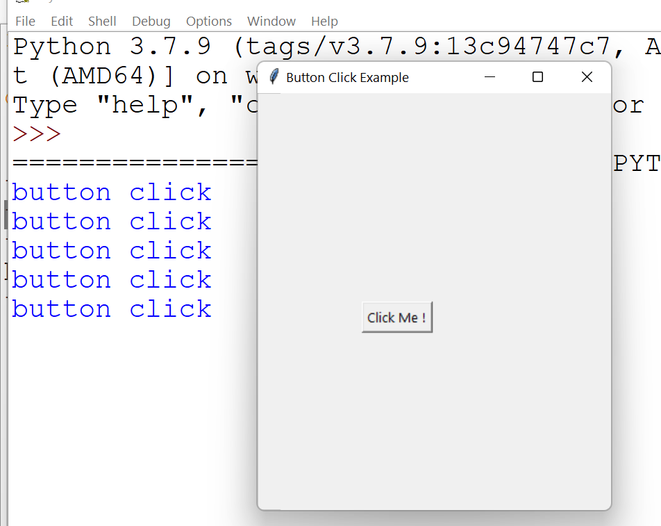
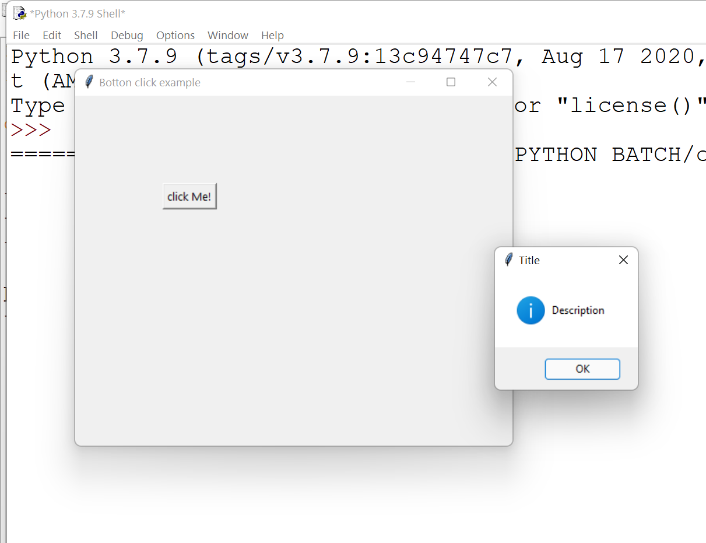
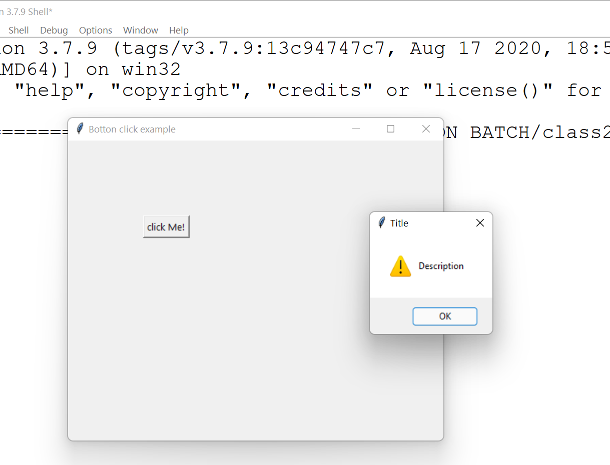
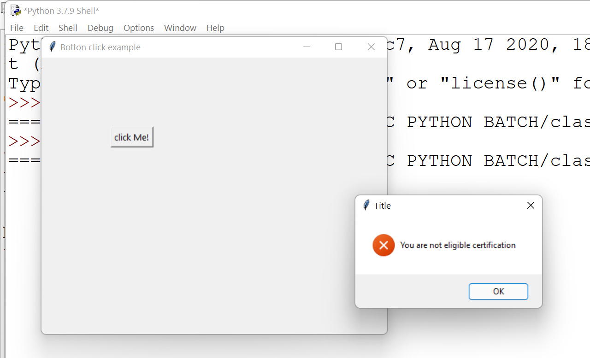
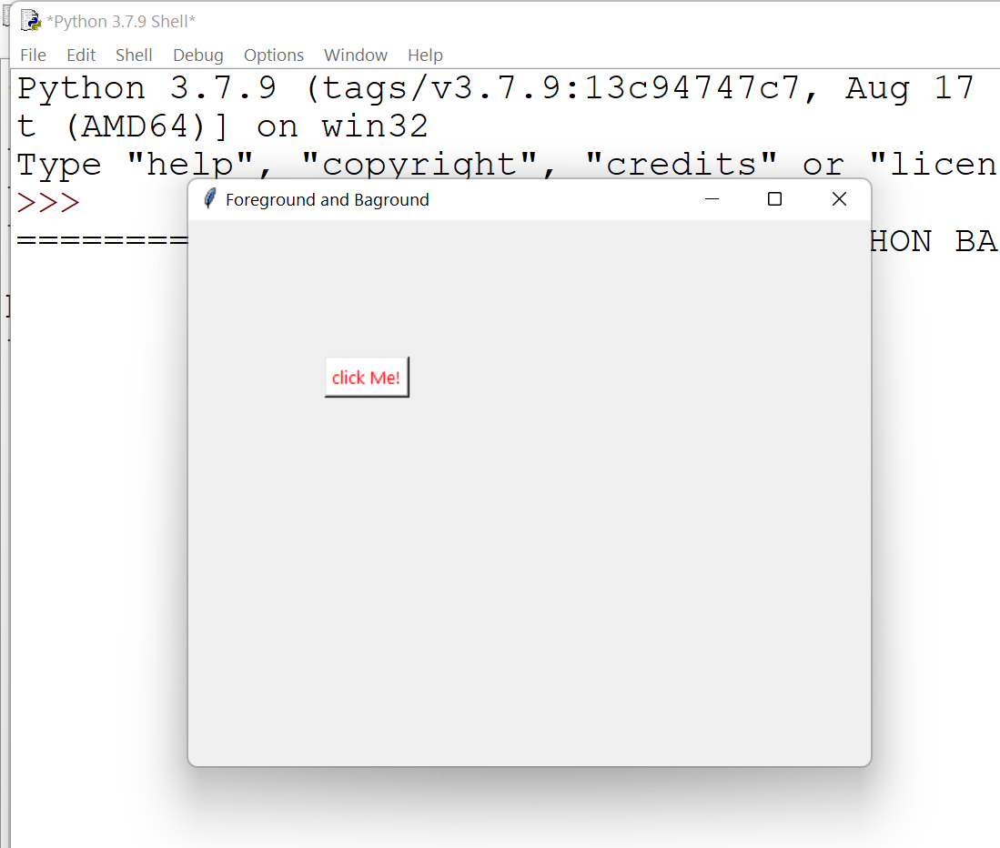
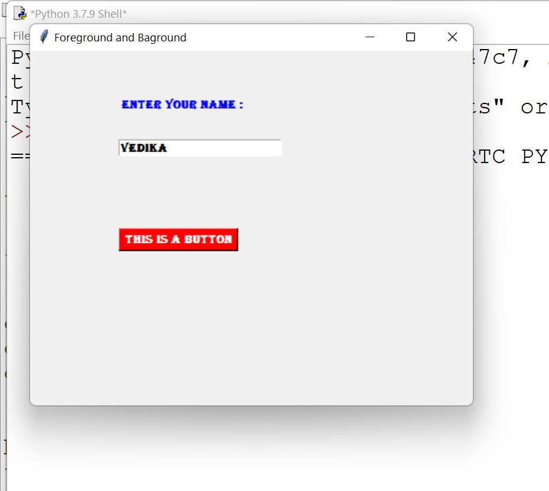

<!-- HEADER -->
<p align="center">
  
</p>

# TKinter in Python


## Tkinter :

**💻Example :**

```python
from tkinter import *

def fun():
    print("button click")
    
top=Tk()
top.geometry("500x400")
top.title('Button Click Example')
btn1=Button(top,text="Click Me !",command=fun).place(x=100,y=200)
top.mainloop()
```
**⚙️ Output :**



## Three Types alters

**💻Example :**

```python
from tkinter import *
from tkinter import messagebox

def fun():
    messagebox.showinfo('Title','Description')

top=Tk()
top.geometry("500x400")
top.title('Botton click example')

btn1=Button(top,text="click Me!",command=fun).place(x=100,y=100)
top.mainloop()
```
**⚙️ Output :**


**💻Example :**

```python
from tkinter import *
from tkinter import messagebox

def fun():
    messagebox.showwarning('Title','Description')

top=Tk()
top.geometry("500x400")
top.title('Botton click example')

btn1=Button(top,text="click Me!",command=fun).place(x=100,y=100)
top.mainloop()
```
**⚙️ Output :**


**💻Example :**

```python
from tkinter import *
from tkinter import messagebox

def fun():
    messagebox.showerror('Title','You are not eligible certification')

top=Tk()
top.geometry("500x400")
top.title('Botton click example')

btn1=Button(top,text="click Me!",command=fun).place(x=100,y=100)
top.mainloop()

```
**⚙️ Output :**


**💻Example :**

```python
from tkinter import *

top=Tk()
top.geometry("500x400")
top.title('Foreground and Baground')

btn1=Button(top,text="click Me!",fg="red",bg="white").place(x=100,y=100)
top.mainloop()

```
**⚙️ Output :**


**💻Example :**

```python
from tkinter import *

top=Tk()
top.geometry("500x400")
top.title('Foreground and Baground')

btn1=Button(top,text="click Me!",fg="red",bg="white",activeforeground="blue",activebackground="yellow").place(x=100,y=100)
top.mainloop()

```
**💻Example :**

```python
from tkinter import *

top=Tk()
top.geometry("500x400")


top.title('Foreground and Baground')

lbl1=Label(top,text="Enter Your Name :",font="Algerian 10 bold",fg="blue").place(x=100,y=50)


el=Entry(top,width=20)
el.config(font="Algerian 10 bold")
el.place(x=100,y=100)


btn1=Button(top,text="This is a Button",bg="red",fg="white",font="Algerian 10 bold").place(x=100,y=200)
top.mainloop()

```

**⚙️ Output :**


## 🔗 Some Useful Links

## 📖 References

<!-- FOOTER -->
<p align="center">
  
</p> 