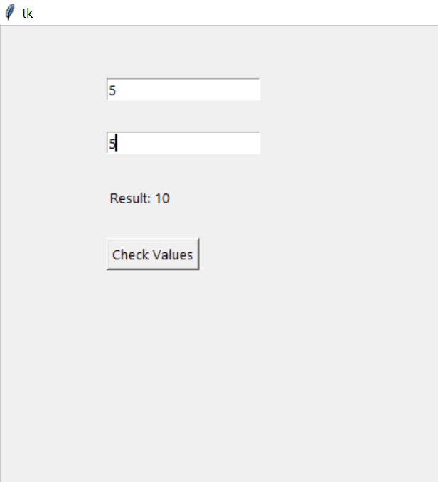

<!-- HEADER -->
<p align="center">
  
</p>

# TKinter UI for addition of two numbers


**💻 Example :**
```python
from tkinter import *
from functools import partial

def fun (a,b,l1):
    sum=int(a.get())+ int(b.get())
    l1.config(text="Result: %d"%sum)

top=Tk()
top.geometry("800x500")

a=StringVar()
b=StringVar()

e1=Entry(top,textvariable=a).place(x=100,y=50)
e2=Entry(top,textvariable=b).place(x=100,y=100)

l1=Label(top)
l1.place(x=100,y=150)

fun=partial(fun,a,b,l1)
b1=Button(top,text="Check Values",command=fun).place(x=100,y=200)


top.mainloop()

```

**⚙️ Output:**
> 


## 🔗 Some Useful Links

## 📖 References

<!-- FOOTER -->
<p align="center">
  
</p>  